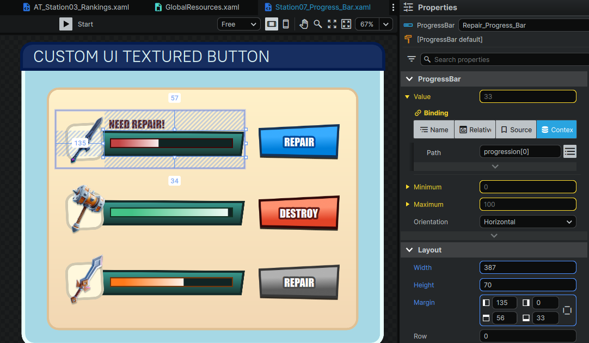

# Module 2 - Bindings and Events

Data binding in NoesisGUI allows you to connect UI elements in XAML to properties and data in your TypeScript scripts. This enables dynamic updates: when your script changes a value, the UI updates automatically, and vice versa.

Note

 All code examples in this tutorial are complete and ready to test. The examples located in Module 2 demonstrate binding and event concepts - no additional code is required.

## Common Data Binding Patterns

### Property Binding



Connects a UI element’s property (like Text or Value) to a value in your data context.

**XAML Example:**

```
<TextBlock Text="{Binding Path=resultText}" />
<ProgressBar Value="{Binding Path=progression[0]}" />
```