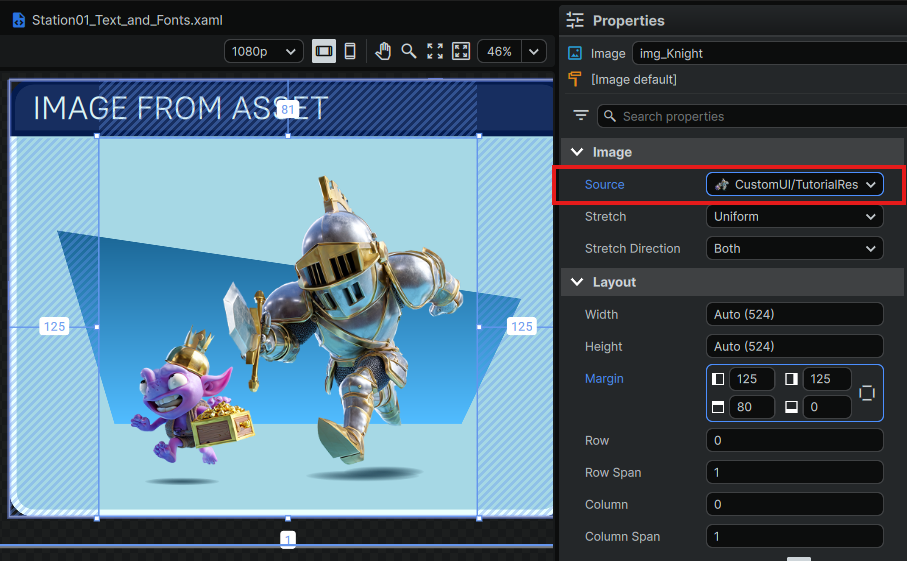
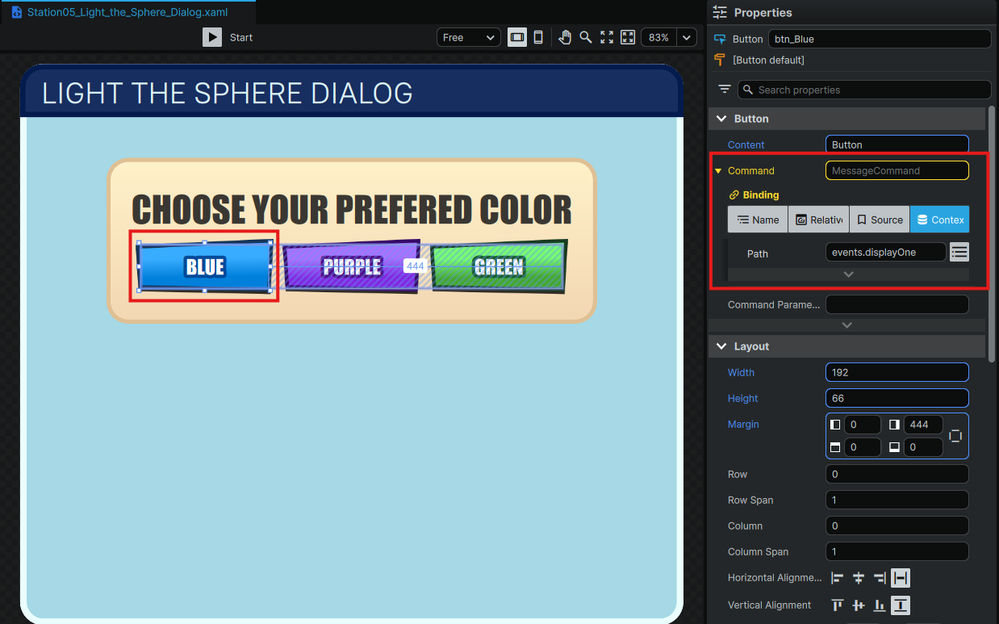

# [Module 2 - Bindings and Events](#module-2---bindings-and-events)

Data binding in NoesisGUI allows you to connect UI elements in XAML to properties and data in your TypeScript scripts. This enables dynamic updates: when your script changes a value, the UI updates automatically, and vice versa.

> [!Note]
>
> All code examples in this tutorial are complete and ready to test. The examples located in Module 2 demonstrate binding and event concepts - no additional code is required.

## [Common Data Binding Patterns](#common-data-binding-patterns)

### [Property Binding](#property-binding)


Connects a UI element’s property (like Text or Value) to a value in your data context.

**XAML Example:**

```xml
<TextBlock Text="{Binding Path=resultText}" />
<ProgressBar Value="{Binding Path=progression[0]}" />
```

---

### [ItemsSource Binding](#itemssource-binding)



Binds a collection in your data context to a list UI element.

**XAML Example:**

```xml
<ListBox ItemsSource="{Binding Path=questList}" />
```

---

### [Command Binding](#command-binding)



Binds a UI event (like a button click) to a function in your data context.

**XAML Example:**

```
<Button
 
Command
=
"{Binding Path=events.acceptEvent}"
 
/>


<!-- Creator can pass a parameter into command callback -->


<Button
 
Command
=
"{Binding Path=events.acceptEvent}"
 
CommandParameter
=
"Confirm"
 
/>


<!-- Creator can pass a parameter into command callback -->


<Button
 
Command
=
"{Binding Path=events.acceptEvent}"
 
CommandParameter
=
"Confirm"
 
/>
```

## [Events](#events)

Events in NoesisGUI are actions triggered by user interaction (like button clicks, toggles, etc.). In XAML, you bind these events to commands defined in your TypeScript data context.

### [Steps to Connect an Event](#steps-to-connect-an-event)

**1. Define an event handler in TypeScript:**

In your TypeScript component, add a function that will handle the event. Then, include it in your data context’s events object.

```
private
 dataContext 
=
 
{

    events
:
 
{

        acceptEvent
:
 
()
 
=>
 
this
.
acceptEventTriggered
(),

        cancelEvent
:
 
()
 
=>
 
this
.
cancelEventTriggered
()

    
}


};
```

**2. Bind the event in XAML:**

In your XAML file, bind the UI element’s Command property to the event you defined in your data context.

```xml
<Button Content="Accept" Command="{Binding Path=events.acceptEvent}" />
<Button Content="Cancel" Command="{Binding Path=events.cancelEvent}" />
```

**3. Handle the event in TypeScript:**

Inside your event handler, update any properties in your data context and call your UI update method so the changes are reflected in the UI.

```
private
 acceptEventTriggered
():
 
void
 
{

    
this
.
dataContext
.
resultText 
=
 
"Accepted!"
;

    
this
.
updateUI
();


}
```

## [Image Resource bindings](#image-resource-bindings)

Noesis resource bindings enable you to reference asset resources such as images in your UI by binding them to properties in your data context. When a resource is set as a binding value, it is converted to a qualified resource path string, making it easy to display and switch assets dynamically.

### [XAML example: Binding an image resource](#xaml-example-binding-an-image-resource)

You can bind an image resource to the `Source` property of an `<Image>` element. You can also bind other UI properties, such as slider values, to your data context.

```
<Page

 
xmlns
=
"http://schemas.microsoft.com/winfx/2006/xaml/presentation"

 
xmlns:x
=
"http://schemas.microsoft.com/winfx/2006/xaml"

 
xmlns:d
=
"http://schemas.microsoft.com/expression/blend/2008"

 
xmlns:mc
=
"http://schemas.openxmlformats.org/markup-compatibility/2006"

 
mc:Ignorable
=
"d"

 
d:DesignWidth
=
"1920"

 
d:DesignHeight
=
"1080"

 
Background
=
"#FFFFFFFF"
>

 
<StackPanel>

   
<Image
 
Width
=
"1280"
 
Height
=
"720"
 
Source
=
"{Binding Path=image}"
/>

   
<Slider
 
Height
=
"300"
 
Margin
=
"40,40,40,40"
 
Maximum
=
"{Binding Path=max}"
 
IsSnapToTickEnabled
=
"True"
 
BorderBrush
=
"#FF2D9EFF"
 
FontSize
=
"50"
 
TickPlacement
=
"Both"
 
SmallChange
=
"1"
 
Delay
=
"100"
 
Value
=
"{Binding Path=selector, Mode=TwoWay}"
 
BorderThickness
=
"5,5,5,5"
/>

 
</StackPanel>


</Page>
```

### [TypeScript example: Managing resource bindings](#typescript-example-managing-resource-bindings)

Set up your data context in TypeScript to manage the image resources and slider selection:

```
import
 
{
Component
}
 
from
 
'horizon/core'
;


import
 
{
 
IUiViewModel
,
 
NoesisGizmo
 
}
 
from
 
'horizon/noesis'
;


class
 
NoesisImage
 
extends
 
Component
<
typeof
 
NoesisImage
>
 
{

 start
()
 
{

   
if
 
(
this
.
world
.
getLocalPlayer
().
id 
===
 
this
.
world
.
getServerPlayer
().
id
)
 
{

     
return
;

   
}

   
const
 entity 
=
 
this
.
entity
.
as
(
NoesisGizmo
);

   
const
 images 
=
 entity
.
getAsset
()?.
getResources
()?.
filter
(
r 
=>
 r
.
name
.
toLocaleLowerCase
().
endsWith
(
".png"
))
 
??
 
[];

   
const
 dataContext 
=
 
{

     max
:
 images
.
length 
-
 
1
,

     
set
 selector
(
value
:
 number
)
 
{

       dataContext
.
image 
=
 images
[
value
];

     
},

     image
:
 images
[
0
],

   
};

   entity
.
dataContext 
=
 dataContext
;

 
}


}


Component
.
register
(
NoesisImage
);
```

### [Explanation](#explanation)

- **XAML**: The `<Image>` element’s `Source` property is bound to the `image` property in your data context. The `<Slider>` allows you to select which image to display.
- **TypeScript**: The data context holds an array of image resources. Changing the slider updates the `selector`, which in turn updates the `image` property, causing the UI to display the selected image.

### [Use cases](#use-cases)

- **Image Galleries**: Display and switch between multiple images in your UI.
- **Dynamic Asset Loading**: Bind and update other resource types (audio, video, etc.) as needed.
- **Custom UI Themes**: Dynamically change UI assets based on user selection or context.

### [Demo](#demo)

See a working example here:


## [Two-way data binding](#two-way-data-binding)

Bidirectional binding allows UI elements to update your TypeScript data context when their value changes, and vice versa. This is essential for interactive controls like sliders, text inputs, and toggles.

### [XAML example: Two-way binding declaration](#xaml-example-two-way-binding-declaration)

Use the `Mode=TwoWay` binding mode in XAML to enable bidirectional updates. For example, a slider whose value is bound to a property called `slider`:

```
<Slider
 
Maximum
=
"100"
 
Value
=
"{Binding Path=slider, Mode=TwoWay}"
/>
```

### [TypeScript example: Handling two-way binding](#typescript-example-handling-two-way-binding)

Set up your data context in TypeScript with a getter for the initial value and a setter to handle updates from the UI:

```
const
 dataContext 
=
 
{

 
// Getter for initial value

 
get
 slider
()
 
{
 
return
 
40
;
 
},

 
// Setter to receive changes from the UI

 
set
 slider
(
value
:
 number
)
 
{

   console
.
log
(
"Slider: "
,
 value
);

   
// You can add additional logic here, e.g., update other properties or trigger actions

 
},


};


this
.
entity
.
as
(
NoesisGizmo
).
dataContext 
=
 dataContext
;
```

### [Explanation](#explanation-1)

- **XAML**: The slider’s `Value` property is bound to `slider` in your data context. With `Mode=TwoWay`, changes in the UI propagate to your TypeScript logic.
- **TypeScript**: The getter provides the initial value for the slider. The setter is called whenever the slider value changes, allowing you to react to user input.

### [Use cases](#use-cases-1)

- **Live UI Controls**: Sliders, checkboxes, and text inputs that update your logic in real time.
- **Form Data Sync**: Keep form fields and your data model synchronized.
- **Dynamic Feedback**: Instantly reflect user changes in other UI elements or trigger side effects.

### [Demo](#demo-1)

See a working example here:


