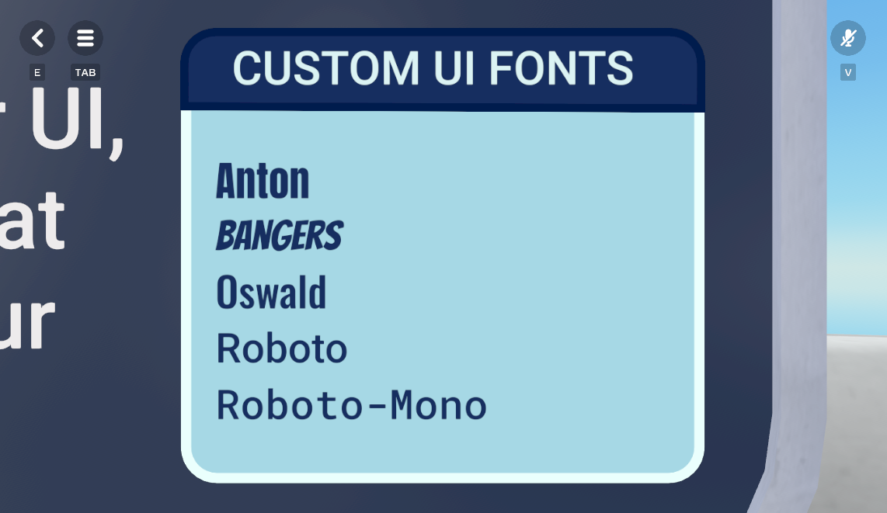
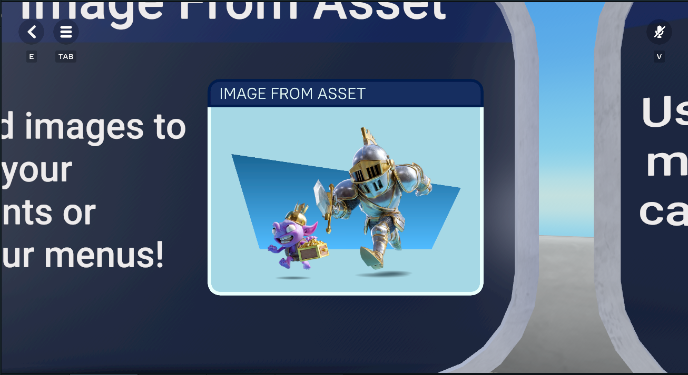
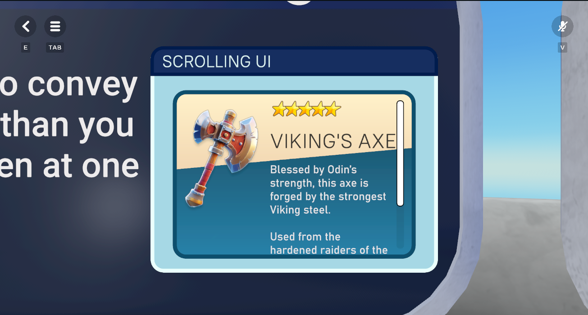

# [Module 3 - Basic Stations](#module-3---basic-stations)

This section introduces the foundational stations for learning NoesisGUI UI development in Horizon Worlds. These stations do not require Typescript to function. Each station focuses on a specific UI concept or feature.

## [Station 01 – Text and Fonts](#station-01--text-and-fonts)



This station demonstrates how to display text using various font faces and styles. It covers the use of the TextBlock element, custom fonts, font sizing, and vertical layout with StackPanel.

**XAML Example**

```xml
<StackPanel>
  <TextBlock FontFamily="Impact" FontSize="40" Foreground="#FF172E60"/>
  <StackPanel>
    <!-- Additional text elements here -->
  </StackPanel>
</StackPanel>
```

## [Station 02 – Image from Asset](#station-02--image-from-asset)



This station shows how to import and display PNG assets in NoesisGUI. It demonstrates setting image source paths, combining images with shapes, and using gradient backgrounds.

**XAML Example**

```xml
<Image Source="CustomUI/TutorialResources/knight.png"/>
```

## [Station 03 – Scrolling UI](#station-03--scrolling-ui)



This station demonstrates how to create a scrollable UI panel in NoesisGUI using only XAML. It focuses on displaying content that exceeds the visible area and allows users to scroll vertically to view all items.

**XAML Example**

```xml
<ScrollViewer VerticalScrollBarVisibility="Visible">
  <StackPanel>
    <!-- Add multiple UI elements here to demonstrate scrolling -->
  </StackPanel>
</ScrollViewer>
```

