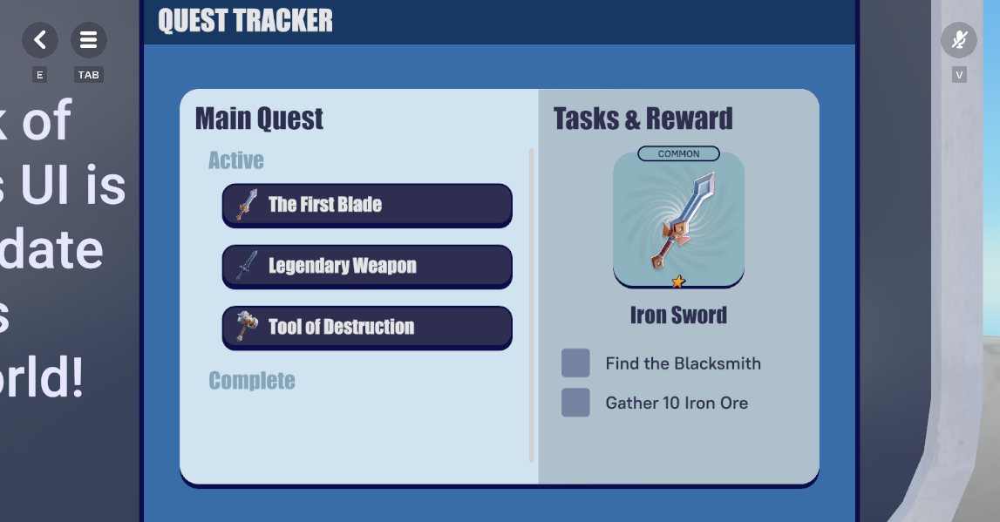
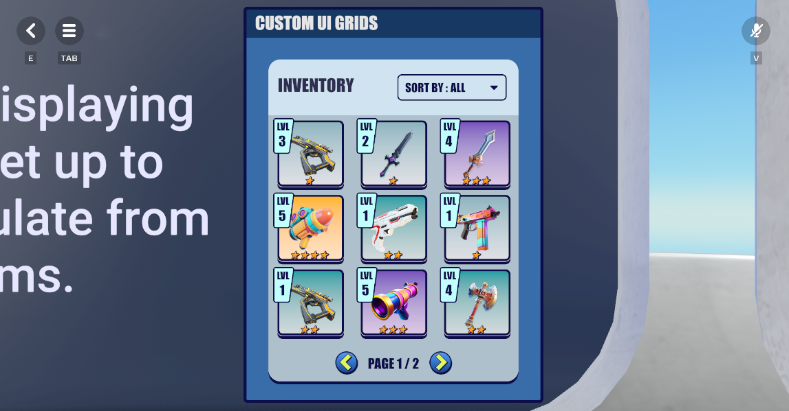
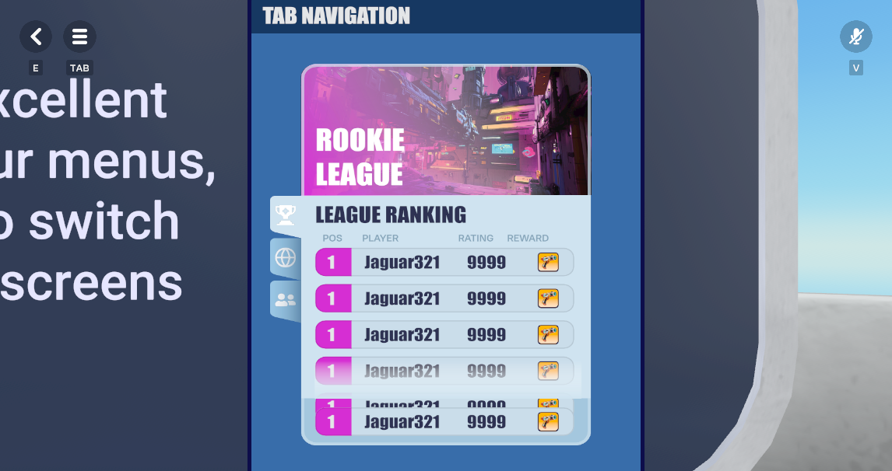

# [Module 5 – Advanced Interactive Stations](#module-5--advanced-interactive-stations)

This module covers stations that combine more advanced XAML UI with TypeScript scripting to create interactive, dynamic interfaces. These stations require both XAML files and corresponding TypeScript components.

## [Station 08 – Quest Tracker](#station-08--quest-tracker)



### [Description](#description)

This station demonstrates a complete quest tracking system with a split-pane interface. The left panel displays active and completed quests, while the right panel shows quest details, requirements, and rewards. Features custom scroll behavior, data templates, and dynamic state management.

**Files Required:**

- XAML: `AT_Station01_Quest_Tracker.xaml`
- TypeScript: `QuestTracker.ts`

### [XAML Example](#xaml-example)

```xml
<ListBox ItemsSource="{Binding Path=inProgressQuests}"
         ItemTemplate="{DynamicResource InProgressTemplate}"/>

<DataTemplate x:Key="RequirementPreview">
  <CheckBox Content="{Binding Path=description}"
            IsChecked="{Binding Path=IsCompleted}"
            Command="{Binding Path=events.requirementChecked}"/>
</DataTemplate>

<ItemsControl ItemsSource="{Binding Path=rarityStars}"
              ItemTemplate="{DynamicResource StarImageTemplate}"/>
```

### [TypeScript Integration](#typescript-integration)

```
// In QuestTracker.ts


private
 dataContext 
=
 
{

    inProgressQuests
:
 
[],
 
// Array of quest view models

    completedQuests
:
 
[],

    activePreview
:
 
null
,

    events
:
 
{

        requirementChecked
:
 
(
questId
,
 reqIndex
)
 
=>
 
this
.
toggleRequirement
(
questId
,
 reqIndex
)

    
}


};


private
 toggleRequirement
(
questId
:
 
string
,
 reqIndex
:
 number
):
 
void
 
{

    
// Mark requirement complete, update quest state, call updateUI()


}


private
 updateUI
():
 
void
 
{

    
this
.
entity
.
as
(
NoesisGizmo
).
dataContext 
=
 
this
.
dataContext
;


}
```

## [Station 09 – Item Grid](#station-09--item-grid)



### [Description](#description-1)

This station demonstrates a paginated 3×3 inventory grid showing 9 items per page from a set of 17. Features dropdown sorting (All/Level/Rarity), navigation buttons, and item cards with level badges, rarity stars, and gradient backgrounds.

**Files Required:**

- XAML: `AT_Station02_Item_Grid.xaml`
- TypeScript: `ItemGrid.ts`

### [XAML Example](#xaml-example-1)

```xml
<ComboBox SelectedIndex="{Binding Path=sortIndex}">
  <ComboBoxItem Content="ALL" Command="{Binding Path=events.sortByAllCommand}"/>
  <ComboBoxItem Content="LEVEL" Command="{Binding Path=events.sortByLevelCommand}"/>
  <ComboBoxItem Content="RARITY" Command="{Binding Path=events.sortByRarityCommand}"/>
</ComboBox>

<ListBox ItemsSource="{Binding Path=itemList}"
         ItemTemplate="{DynamicResource ItemGridItemTemplate}"
         ItemsPanel="{DynamicResource ItemsPanelGridTemplate}"/>

<StackPanel Orientation="Horizontal">
  <Button Command="{Binding Path=events.pagePreviousEvent}"/>
  <TextBlock Text="{Binding Path=currentPageNumber}"/>
  <TextBlock Text=" / "/>
  <TextBlock Text="{Binding Path=maxPageNumber}"/>
  <Button Command="{Binding Path=events.pageNextEvent}"/>
</StackPanel>
```

### [TypeScript Integration](#typescript-integration-1)

```
// In ItemGrid.ts


private
 dataContext 
=
 
{

    itemList
:
 
[],
 
// 9 items for current page

    currentPageNumber
:
 
1
,

    maxPageNumber
:
 
2
,

    sortIndex
:
 
0
,

    events
:
 
{

        sortByAllCommand
:
 
()
 
=>
 
this
.
sortItems
(
"all"
),

        sortByLevelCommand
:
 
()
 
=>
 
this
.
sortItems
(
"level"
),

        sortByRarityCommand
:
 
()
 
=>
 
this
.
sortItems
(
"rarity"
),

        pagePreviousEvent
:
 
()
 
=>
 
this
.
pageBackward
(),

        pageNextEvent
:
 
()
 
=>
 
this
.
pageForward
()

    
}


};


private
 sortItems
(
criteria
:
 
string
):
 
void
 
{

    
// Sort items, update UI


}


private
 pageForward
():
 
void
 
{

    
// Go to next page, update UI


}


private
 pageBackward
():
 
void
 
{

    
// Go to previous page, update UI


}


private
 updateUI
():
 
void
 
{

    
this
.
entity
.
as
(
NoesisGizmo
).
dataContext 
=
 
this
.
dataContext
;


}
```

## [Station 10 – Rankings](#station-10--rankings)

### [Description](#description-2)

This station demonstrates a paginated 3×3 inventory grid showing 9 items per page from a set of 17. Features dropdown sorting (All/Level/Rarity), navigation buttons, and item cards with level badges, rarity stars, and gradient backgrounds.

**Files Required:**

- XAML: `AT_Station03_Rankings (2).xaml`
- TypeScript: `Rankings.ts`

### [XAML Example](#xaml-example-2)

```xml
<TextBlock Text="{Binding Path=remaining}" FontFamily="Impact" FontSize="30"/>
<ListBox ItemsSource="{Binding Path=leaderboard}"
         ItemTemplate="{DynamicResource LeaderBoard_Entry_Template}"/>
<StackPanel DataContext="{Binding Path=reward}">
  <TextBlock Text="{Binding Path=name}" FontSize="35"/>
</StackPanel>
```

### [TypeScript Integration](#typescript-integration-2)

```
// In Rankings.ts


private
 dataContext 
=
 
{

    leaderboard
:
 
[],
 
// Array of player entries

    remaining
:
 
"05:00"
,

    reward
:
 
null
,

    events
:
 
{}


};


private
 update
(
deltaTime
:
 number
):
 
void
 
{

    
// Update timer, refresh leaderboard/reward if needed, call updateUI()


}


private
 updateUI
():
 
void
 
{

    
this
.
entity
.
as
(
NoesisGizmo
).
dataContext 
=
 
this
.
dataContext
;


}
```

## [Station 11 – Tab Navigation](#station-11--tab-navigation)



### [Description](#description-3)

This station demonstrates a three-tab ranking interface (League, World, Friends) with custom angled tab designs, icon shaders, and unique reward sets per tab. Each tab displays a leaderboard with player positions and reward icons.

**Files Required:**

- XAML: `AT_Station04_Tab_Navigation.xaml`
- TypeScript: `TabNavigation.ts`

### [XAML Example](#xaml-example-3)

```xml
<TabControl TabStripPlacement="Left">
  <TabItem Header="League" />
  <TabItem Header="World" />
  <TabItem Header="Friends" />
</TabControl>

<ListBox ItemsSource="{Binding Path=leagueRankings.playerRankings}"
         ItemTemplate="{DynamicResource LeagueRanking_ItemTemplate}"/>
```

### [TypeScript Integration](#typescript-integration-3)

```
// In TabNavigation.ts


private
 dataContext 
=
 
{

    leagueRankings
:
 
{
 playerRankings
:
 
[]
 
},

    worldRankings
:
 
{
 playerRankings
:
 
[]
 
},

    friendRankings
:
 
{
 playerRankings
:
 
[]
 
},

    events
:
 
{

        switchTab
:
 
(
tabName
)
 
=>
 
this
.
switchTab
(
tabName
)

    
}


};


private
 switchTab
(
tabName
:
 
string
):
 
void
 
{

    
// Change active tab, update UI


}


private
 updateUI
():
 
void
 
{

    
this
.
entity
.
as
(
NoesisGizmo
).
dataContext 
=
 
this
.
dataContext
;


}
```

