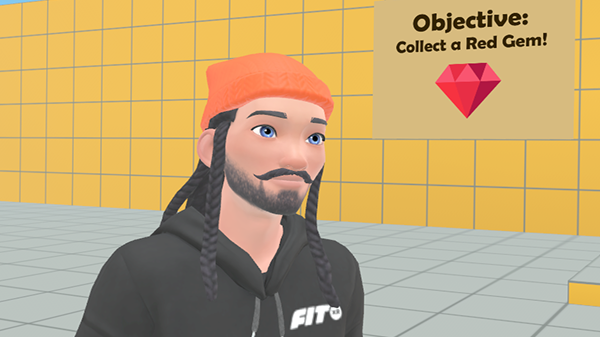
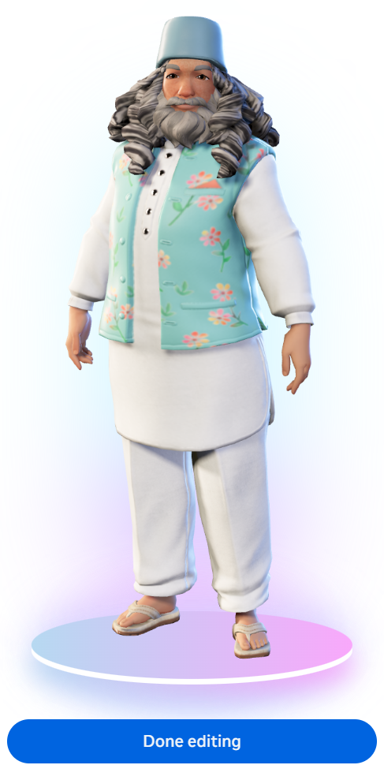
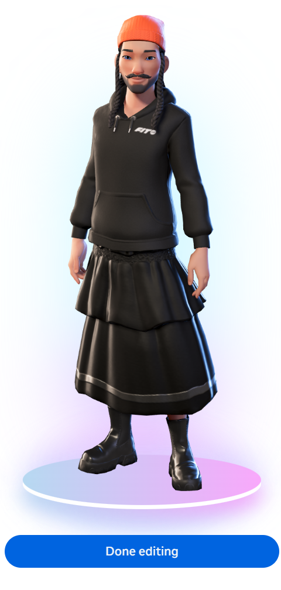

# [Module 1 - Setup](#module-1---setup)

> [!Important]
>
> This content is intended as a companion to the tutorial world of the same name, which you can access through the desktop editor. When you open the tutorial world, a copy is created for you to explore, and this page is opened so that you can follow along. For more information, see [Access Tutorial Worlds](../../Getting%20started/Getting%20started%20with%20tutorials/Access%20Tutorial%20Worlds.md).

## [Overview](#overview)

Welcome! This world extends the basic Build your first game tutorial world with the following features:

- **Scripted Avatar NPCs**: You can now deploy humanoid NPCs into your world, which are visually designed through a web interface. Additionally, you can apply scripted behaviors to the NPCs with basic APIs for:
  - Locomotion
  - Spawning and despawning
  - Grabbing entities
  - Jumping
- **Quests**: You can design one or more goals in your world, which can be used to encourage engagement and replay of the experience.
- **Voice-over**: This world also provides a simple mechanism for adding voice-over audio for your NPCs, bringing character and personality to the experience.

## [Scripted Avatar NPCs](#scripted-avatar-npcs)

This world contains two scripted avatar NPCs:

| **Village Elder**                                                                                                                       | **Traveling Merchant**                                                                                                               |
| --------------------------------------------------------------------------------------------------------------------------------------- | ------------------------------------------------------------------------------------------------------------------------------------ |
|          |  |
| The village has lost its gems! The Village Elder asks you, the player, for help in locating them. He, too, will look for them with you. | The Traveling Merchant is interested in gems, too. He will trade gems for coins and may stir things up with the Village Elder.       |

The behaviors of these NPCs is managed through the `NPCManager.ts` script. Behaviors include:

- Following NavMesh paths.
  - For the Village Elder, this pathway is a route to collect gems.
  - For the Traveling Merchant, this pathway is to collect gems and return them to their original location.
- Spawning: Both characters spawn in.
- Jumping: The Village Elder jumps for joy.
- Grabbing: Both characters can grab and drop gems.
- “Talking”: There are audio assets for both characters, which are triggered for playback based on actions tracked in `NPCManager.ts`.

For more information on how this works, see [Module 2 - Overview of Scripted Avatar NPCs](Module%202%20-%20Overview%20of%20Scripted%20Avatar%20NPCs.md).

## [Quests](#quests)

In the world are four quests. A **quest** is a world-based objective, which can be tied to player activities. For example, this world contains multiple quests for collecting gems and one for collecting a coin, which requires the player to explore the world, find the custom UI, and exchange a gem for a coin. A quest’s status is specific to an individual player.

- Quests are data entities defined for the world in the Desktop Manager.
- An instance of the Quests gizmo is deployed to allow players to track their progress toward completion of the quests.
- Quest activities are managed through the `QuestManager.ts` script.

For more information on how the quests of the world operate, see [Module 5 - Quest Manager](Module%205%20-%20Quest%20Manager.md).

For more information on the feature, see [Quests, leaderboards, and variable groups](../../../Desktop%20editor/Quests%2C%20leaderboards%2C%20and%20variable%20groups/Quests%2C%20leaderboards%2C%20and%20variable%20groups.md).

## [Limitations](#limitations)

**Note**: This world supports single player only. Code examples should work in multiplayer environments, but some modifications should be expected.

## [Prerequisites](#prerequisites)

If you have not previously used a tutorial world, you should verify that you meet the requirements for exploring these worlds. For more information, see [Tutorial Prerequisites](../../Getting%20started/Getting%20started%20with%20tutorials/Tutorial%20Prerequisites.md).

### [Build your first game](#build-your-first-game)

This world extends from the Build your first game tutorial world. Although it is not required, you may learn quite a bit by first exploring this other world. For more information, see [Module 1 - Build your first game](https://developers.meta.com/horizon-worlds/learn/documentation/tutorial-worlds/build-your-first-game/module-1-build-your-first-game).

## [Use in Your World](#use-in-your-world)

For more information on how to apply assets or scripts from this world to yours, see [Use Assets from Tutorials](https://developers.meta.com/horizon-worlds/learn/documentation/tutorial-worlds/getting-started-with-tutorials/use-assets-from-tutorials).

