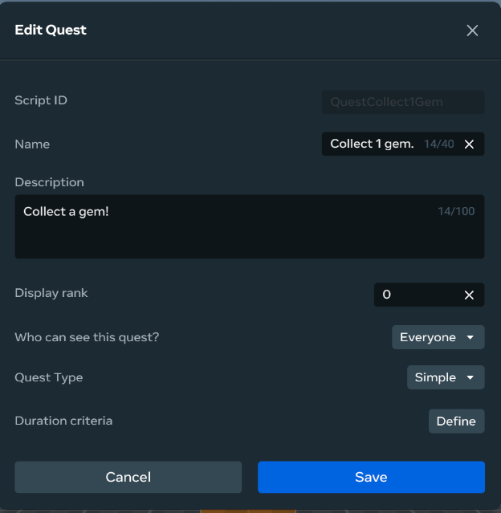
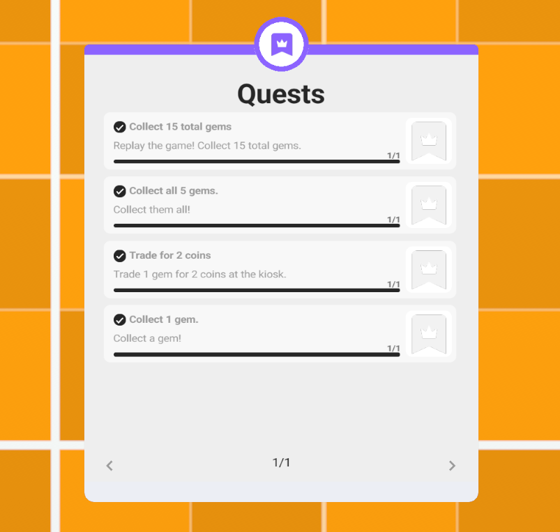
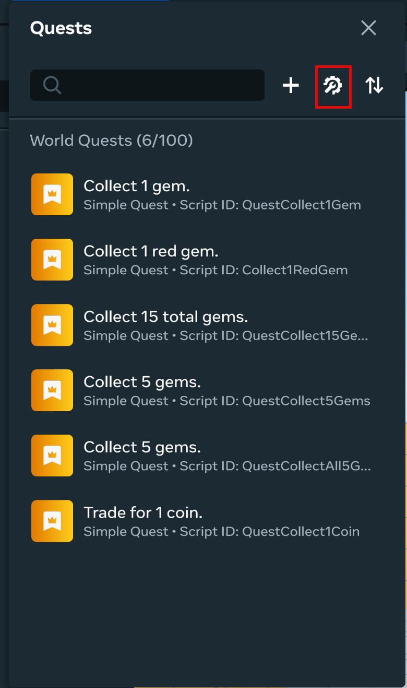
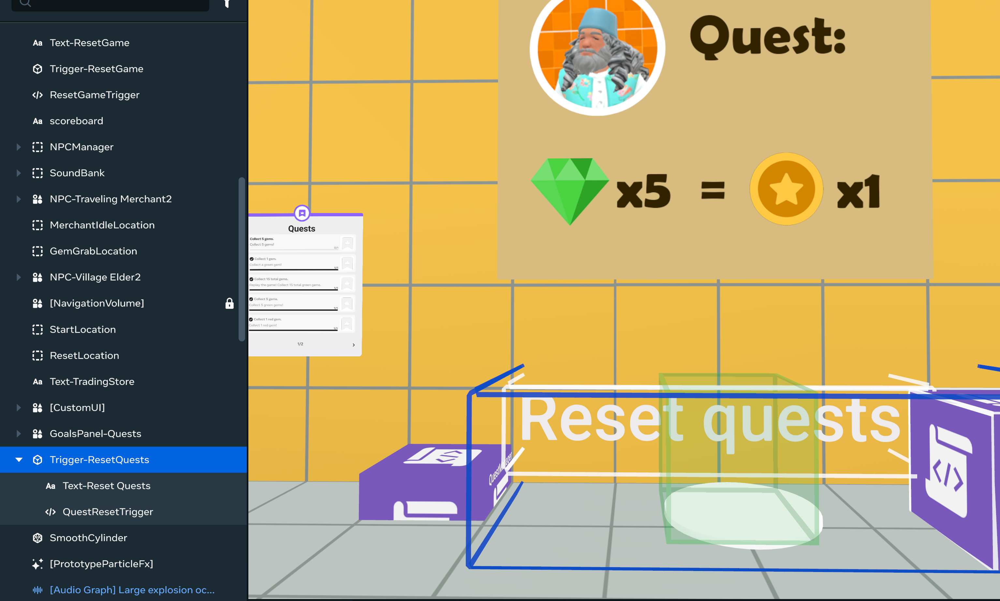

# [Module 5 - Quest Manager](#module-5---quest-manager)

When a player completes an achievement in the world, one of the world’s quests is marked as completed, and a brief reward is shared.

Quests are managed through the `QuestManager.ts`, which does the following:

- Maintains list of quests
- Defines events to complete and to reset individual quests
- Defines listeners for these events, which in turn call:
  - Methods to handle these events

**Tip**: All quest management code is maintained in a single file for easy access and reference. This pattern is used for other systems in the world.

## [Quest Entities](#quest-entities)

To manage quests in your world, you must create the following entities:

| Entity      | Description                                                                                                                                                                                                                                                                                                                    |
| ----------- | ------------------------------------------------------------------------------------------------------------------------------------------------------------------------------------------------------------------------------------------------------------------------------------------------------------------------------ |
| Quest board | The Quest gizmo is a panel that can be positioned in the world. It always displays the available quests in the world and their status for the player who is viewing the board. **Tip**: After you deploy this gizmo, you don’t need to do much to configure or maintain it.                                                    |
| Quests      | Quests are data entities that you create through the **Systems menu** in the Desktop Editor. A quest is some descriptive text for the player to be displayed in the Quest board, as well as the type of quest: Simple or Tracked (which means it is governed by a persistent variable). These quest types are discussed below. |
| Script      | In TypeScript, you must create the mechanisms for tracking and resolving the quests in your world. In this tutorial world, `QuestManager.ts` provides a simple model for managing quests. It is described in this module.                                                                                                      |

For more information, see [Quests Overview](../../../Desktop%20editor/Quests%2C%20leaderboards%2C%20and%20variable%20groups/Quests%20Overview.md).

### [Define quests](#define-quests)

You can review the quests defined for this world. In the Desktop Editor, click **Systems menu > Quests**. Click the **Edit icon** next to one of the quests.



The quest definitions in this world are pretty simple: all are of Simple type, which means that they are resolved by flipping a Boolean flag (covered later).

After this quest is completed, the Quest board in the world is updated to reflect the change:



#### [Tracked quest type](#tracked-quest-type)

**Note**: In this world, all quests are of Simple type. Progress toward completion of these quests is not maintained over multiple sessions in the world.

You can create quests that are tracked based on conditionals that apply to persistent variables.

**Tip**: These types of quests are great for indicating to the player progress toward the goal. For example, the quests in the tutorial world that track the collection of multiple gems could be converted to quests of Tracked type, which are tied to a persistent variable. However, the implementation of Simple persistent variables was easier in this case.

For a Tracked quest:

- You define the Success Criteria:
  - Success criteria are 1 or more Objectives, which are connected to each other through logical `AND` or logical `OR`.
  - Each Criteria is an evaluation of a selected Persistent Variable. **Note**: The evaluation is always comparing the value of the Persistent Variable to be greater than a fixed value.

**Tip**: When building Tracked quests, you should start simple.

## [Quest List](#quest-list)

The following quests are tracked:

| Quest Name            | Description                                                                                                                                   |
| --------------------- | --------------------------------------------------------------------------------------------------------------------------------------------- |
| `QuestCollect1Coin`   | Collect a single coin. This quest requires engagement with the gem trader interface.                                                          |
| `QuestCollect1Gem`    | Collect a single gem. This quest is designed to introduce players to the questing system.                                                     |
| `QuestCollect5Gems`   | Collect five gems in a single run of the game. This quest requires beating the Village Elder and the Traveling Merchant to each gem.          |
| `QuestCollect15Gems`  | Collect a total of 15 gems. This quest requires replay of the game multiple times.                                                            |
| `QuestCollect1RedGem` | Collect a single red gem. This gem can be collected if you trade some green gems for a coin and then trade the coin for the gem in the kiosk. |

Quests are tracked in the following enum:

```typescript
export enum QuestNames {
  'QuestCollect1Coin', // trade 2 gems for 1 coin in the kiosk
  'QuestCollect1Gem', // collect 1 gem.
  'QuestCollect5Gems', // collect five gems in the world
  'QuestCollect15Gems', // collect 15 total gems (requires replay)
  'QuestCollect1RedGem', // collect 1 red gem (requires collecting coins and trading them at the kiosk)
  };
```

## [Quest Events](#quest-events)

In `QuestManager.ts`, the following events are defined at the top of the file:

```typescript
export const questComplete = new hz.LocalEvent<{player: hz.Player, questName: QuestNames}>('questComplete');
export const questReset = new hz.LocalEvent<{player: hz.Player, questName: QuestNames}>('questReset');
export const questBoardUpdate = new hz.LocalEvent<{}>('questBoardUpdate');
```

### [Completing quests](#completing-quests)

The above events are triggered elsewhere in the code. For example, in the `NPCManager.ts` script, the gem collection quests are completed using the following code:

```typescript
if (!isNPC(ps.player)) {
  if ((ps.gemsCollected >= 1) && (ps.player.hasCompletedAchievement('QuestCollect1Gem') == false)) {
    this.sendLocalBroadcastEvent( questComplete, {player: ps.player, questName: QuestNames.QuestCollect1Gem } );
  } else if ((ps.gemsCollected >= 5) && (ps.player.hasCompletedAchievement('QuestCollect5Gems') == false)) {
    this.sendLocalBroadcastEvent( questComplete, {player: ps.player, questName: QuestNames.QuestCollect5Gems } );
  }
}
```

In the above code:

- The triggering player (`ps.player`) is checked to see if it is a human player. If so, then the quest logic is triggered:
  - If the player’s count of collected gems (`ps.gemsCollected`) is greater than or equal to `1` and the quest has not been completed:
    - Then, a local broadcast event is sent. This event is the `questComplete` event.
    - The `questComplete` event requires two pieces of data: 1) the player (`ps.player`) and 2) the quest to complete (a reference to the enum item `QuestNames.QuestCollect1Gem`). **Note**: The check to see if the quest has already been completed is necessary since it is possible for the player at runtime to reset the quests.
  - If the player’s count of collected gems is `5`:
    - Then, the `questComplete` event is broadcast, including the player and the `QuestNames.Collect5Gems` enumerated value.

## [Quest Listeners](#quest-listeners)

When the event is broadcast, it is received only by code in which a listener for the specific event has been created. In this case, there are three event listeners in the `start()` method of the `QuestManager.ts` script, one for each of the defined events:

```typescript
// listener for questComplete event.
this.connectLocalBroadcastEvent(questComplete, (data:{player: hz.Player, questName: QuestNames}) => {
  this.completeQuest(data.player, data.questName);
});
// listener for questReset event.
this.connectLocalBroadcastEvent(questReset, (data:{player: hz.Player, questName: QuestNames}) => {
  this.resetQuest(data.player, data.questName);
});
// listener for questBoardUpdate event.
this.connectLocalBroadcastEvent(questBoardUpdate, ({}) => {
  this.questBoardUpdate();
});
```

### [completeQuest function](#completequest-function)

The listener for the `questComplete` event simply passes the input data (player, quest) to a local function (`this.completeQuest`) for processing:

```typescript
  public completeQuest(player: hz.Player, questName: QuestNames): void {
    if (isNPC(player) == false) {
      let qValue = QuestNames[questName]
      if (player.hasCompletedAchievement(qValue) == false) {
        player.setAchievementComplete(qValue, true)
        console.log("Quest " + qValue + " complete for " + player.name.get()+"!")
        this.world.ui.showPopupForPlayer(player, 'Quest Complete!',2)
        if (this.props.sfxQuestWin) {
          this.props.sfxQuestWin.as(hz.AudioGizmo).play()
        }
        this.async.setTimeout(() => {
          if (this.checkAllQuestsCompleted(player) == true) {
            if (this.props.vfxAllQuestsWin) {
              let myVFX: hz.ParticleGizmo = this.props.vfxAllQuestsWin.as(hz.ParticleGizmo)
              myVFX.play()
            }
            if (this.props.sfxAllQuestsWin) {
              let mySFX: hz.AudioGizmo = this.props.sfxAllQuestsWin.as(hz.AudioGizmo)
              mySFX.play()
            }
          }
        }, 3000);
      }
    }
  }
```

In the `completeQuest` function:

- The code checks to see if the received `player` is human and if the quest is currently set to `false`:

```typescript
if (player.hasCompletedAchievement(qValue) == false) {
```

If so, then:

```typescript
player.setAchievementComplete(qValue, true)
```

- In the above code, the `setAchievementComplete` API endpoint receives the name of the quest (contained in `qValue`) and its new state (`true`) as parameters. Since it is triggered off of the `player` object, it already knows the player to which to apply the change.
- A UI is displayed to the player for two seconds: \*\*Quest Complete!\*\***Note**: You could display the name of the quest as part of the UI. However, by omitting it, you can suggest to the player to check the Quest Board to see what was accomplished.
- In the above code, a console message has been commented out. This may be useful for debugging purposes.
- The function also calls to `checkAllQuestsCompleted()` to evaluate if the player has completed all quests. If so, special VFX and sound effects are played on loop.

## [Resetting Quests](#resetting-quests)

**Note**: After a quest is complete, it remains completed unless the developer resets a quest.

During development, you can reset quest data through the Desktop Editor. In the **Systems menu**, select **Quests**.



Then, click the highlighted icon below. In the panel, click **Reset all quests**.

**Note**: This resets all quest data for the current player.

### [Reset through TypeScript](#reset-through-typescript)

End users who do not have access to the Desktop Editor cannot reset their quests. Instead, you as the developer can enable resetting of quests through TypeScript.

In this world, the following entities have been added to enable the player to reset quests:



**Entities**:

- Trigger zone
  - `QuestResetTrigger.ts` script
- Marker on the ground to indicate location of the trigger zone (non-critical)
- Text gizmo displaying **Reset quests** (non-critical)

When the player enters the trigger zone, the attached script `QuestResetTrigger.ts` contains a CodeBlockEvent listener:

```typescript
  start() {
    this.connectCodeBlockEvent(
      this.entity,
      hz.CodeBlockEvents.OnPlayerEnterTrigger,
      (enteredBy: hz.Player) => {
        const keys = Object.keys(QuestNames)
        keys.forEach((key,value) => {
          if ((value.valueOf() == 0) && (value.toString() != "0") && (value.toString() != "undefined") )
          console.log("Resetting quest: " + value)
          this.sendLocalBroadcastEvent( questReset, {player: enteredBy, questName: value } );
        })
      }
    )
  }
```

In this case, when the player enters the trigger, the code iterates through the keys of the `QuestNames` enum. In this case, the iteration returns values that are text names (good) and array index values (not useful). So, if the returned `value` is a text value, then the embedded `questReset` event is broadcast. Similar to the `questComplete` event, this one takes the player and the name of the quest as parameters. By iterating through all of the text names for the quests, all available quests can be reset in this manner.

### [Reset individual quest](#reset-individual-quest)

In `QuestManager.ts`, the received event triggers the `resetQuest` function for the player and the named event:

```typescript
public resetQuest(player: hz.Player, questName: QuestNames): void {
  let qValue = QuestNames[questName]
  if (qValue != undefined ) {
   console.log("Resetting quest: " + qValue)
   player.setAchievementComplete(qValue, false)
  }
}
```

## [Refresh Quest Board](#refresh-quest-board)

When a quest is completed, the quest board receives an update shortly thereafter. However, when one or more quests is reset, the board may not be updated automatically.

To facilitate, the `questBoardUpdate` event is defined, and its listener executes the `questBoardUpdate()` function:

```typescript
public questBoardUpdate(): void {
  if (this.props.questBoard) {
    let myQuests: string[] = []
    const keys = Object.keys(QuestNames)
    keys.forEach((key,value) => {
      if (key) {
        myQuests.push(key.toString())
      }
    })
    if (myQuests.length > 0) {
      let myBoard: hz.AchievementsGizmo = this.props.questBoard.as(hz.AchievementsGizmo)
      myBoard.displayAchievements(myQuests)
      console.log("Quest board displaying these quests:" + myQuests.toString())
    } else {
      console.error("No quests to display!")
    }
  }
}
```

This function gathers the names of the quests from the `questNames` enum into a string array and passes this string to the following:

```typescript
let myBoard: hz.AchievementsGizmo = this.props.questBoard.as(hz.AchievementsGizmo)
myBoard.displayAchievements(myQuests)
```

The above code forces the Quest Board (specified in the `questBoard` property) to display the set of quests in the string array `myQuests`, as well as their current status for the player, effectively refreshing the board.

