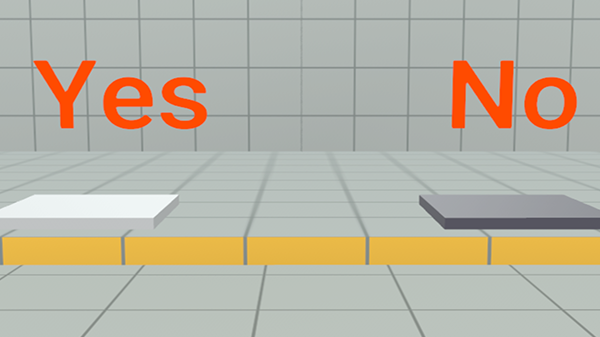

# Module 1 - Setup

Important

 This content is intended as a companion to the tutorial world of the same name, which you can access through the desktop editor. When you open the tutorial world, a copy is created for you to explore, and this page is opened so that you can follow along. For more information, see [Access Tutorial Worlds](../../Getting%20started/Getting%20started%20with%20tutorials/Access%20Tutorial%20Worlds.md).

## Welcome

Welcome to the Text as Assets tutorial world! The goal of the world is to show some simple examples of how you can use the feature to add more content to your world. Example uses include:

* **Text as content**: Imported text can be applied as text to in-world entities, enabling you to centralize text content outside of the code files.
* **Text as metadata**: Text in JSON format can be used to specify assets to spawn into your world.
* **Text for timed events**: Text in JSON format can be used to define events timed for execution after the world is initialized.

Before hopping in, you may want to take a look at the following worlds that showcase how to use the basic versions of the concepts used inside the Text as Assets world:

* **Build your first game**: This world covers the desktop editor application, a primary interface for world building. Through the desktop editor, you can access and build TypeScripts to power your world. For more information, see [Build your first game](https://developers.meta.com/horizon-worlds/learn/documentation/tutorial-worlds/build-your-first-game/module-1-build-your-first-game).
* You also should also take a look at the [feature documentation](../../../Desktop%20editor/Assets/Data%20as%20an%20Asset.md).

## Key game development areas

* Assets
  + Text asset type
* TypeScript
  + JSON ingestion

## Introduction to Text As Assets Tutorial world

This world demonstrates some examples of using the Text as Assets or Data As Assets feature as it is seen in the [official documentation](../../../Desktop%20editor/Assets/Data%20as%20an%20Asset.md).

**Note**: This world only uses JSON as text assets. No other format for text as assets is supported.

### Get started

Before you begin, please verify that you have acquired access to your own copy of the tutorial world through the Creation Home screen in the desktop editor. For more information on this workflow, see [Access Tutorial Worlds](../../Getting%20started/Getting%20started%20with%20tutorials/Access%20Tutorial%20Worlds.md).

Open your copy in the desktop editor, where you can explore it in either Build mode or Preview mode to familiarize yourself with the world and its structures before modifying it.

**Note**: This tutorial assumes that you are familiar with the desktop editor, a desktop application for world building in Meta Horizon Worlds. If you are new to the desktop editor, you might want to start with the Build your first game tutorial. See [Build your first game](https://developers.meta.com/horizon-worlds/learn/documentation/tutorial-worlds/build-your-first-game/module-1-build-your-first-game).

### On mobile and desktop

To explore the finished world on mobile or desktop, please use the following link: [https://horizon.meta.com/worlds/10163627755382468/?](https://horizon.meta.com/worlds/10163627755382468/)

**Note**: Desktop users must be signed in first.

There are three stations in the world, each described in one of the following modules. For each world, we use a direct reference to a Text Asset, which includes the Asset ID and asset’s Version ID.

### Clone world

To get started, you must create a new world based on the tutorial world. For more information on this workflow, see [Access Tutorial Worlds](../../Getting%20started/Getting%20started%20with%20tutorials/Access%20Tutorial%20Worlds.md).

### Use in your world

For more information on how to apply assets or scripts from this world to yours, see [Use Assets from Tutorials](https://developers.meta.com/horizon-worlds/learn/documentation/tutorial-worlds/getting-started-with-tutorials/use-assets-from-tutorials).