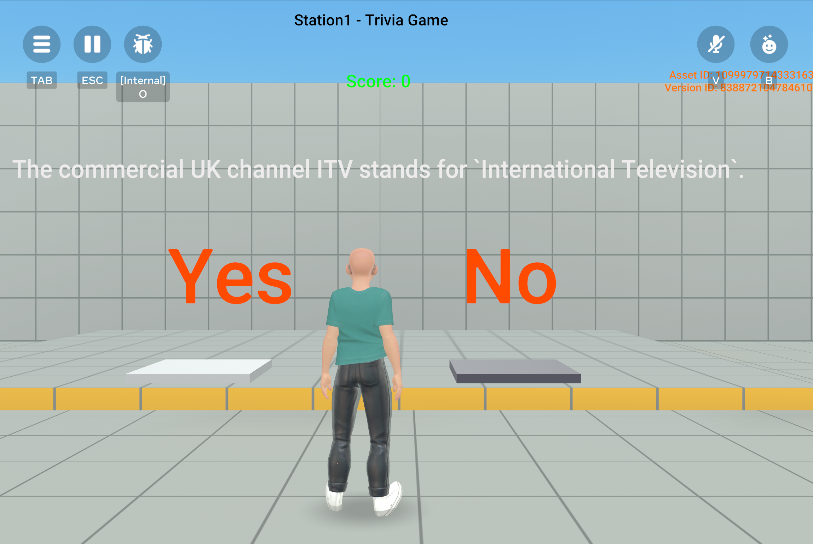

# [Module 2 - Using Text assets as in-game content](#module-2---using-text-assets-as-in-game-content)

Text assets can be used to upload in-game data from outside sources, which has several advantages:

- Text can be managed in an external tool, such as Excel, which supports tabular format.
- Text-based content can be curated by non-engineers, such as writers.
- Updates to in-game text do not touch the codebase.
- Updates do not require a re-publication in order for them to be available.

In this module, text as in-game content is used to implement a trivia game. Most trivia games are expected to have a large number of questions and answers that you can share with players. Text As Assets is one way to maintain and deliver large volumes of text content into your world. By updating the text asset periodically, you can insert and remove questions/answers to freshen your game content.

**How to use this module**:

Look at the `TriviaGameManager` script and object. By loading the asset with lots of questions and answers, you can deliver many trivia questions to players and update the world content without having to republish the world.

**Tip**: In the script’s comments, you can see example JSON records in use for this station, which you can use as the basis for creating your own content for this station.

