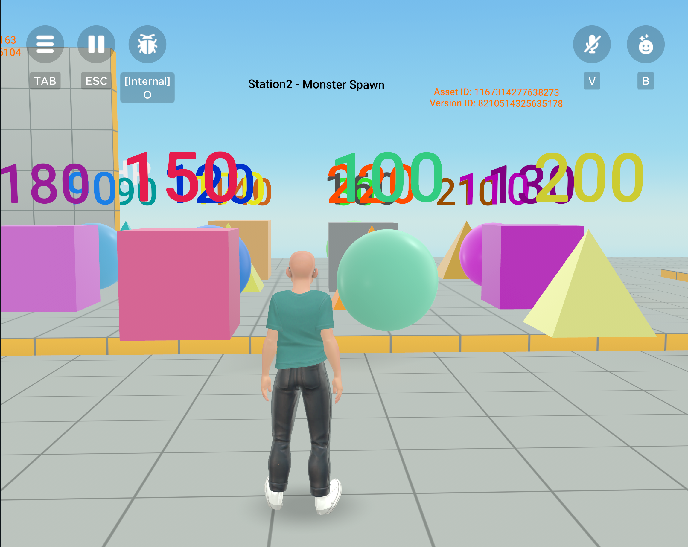

# [Module 3 - Using Text assets as metadata](#module-3---using-text-assets-as-metadata)

Text assets can also be used to store metadata about the game. For example, you can store data about enemies, weapons, and environments as JSON data. Generating enemies using text does not necessarily require text as assets. However, as your world grows, the large volume of text can impact script sizing limits if the data is stored in TypeScript. Additionally, you can change or refresh this data by updating a single asset without engineering and without republishing the game.

**How to use this module**:

Look at the `MonsterSpawnerManager` script and object. By loading the asset with the stats of enemies that you can spawn to fight, you are able to create a lot of enemies at once and control the scaling of their statistics in a predictable manner. In this example, hit point values are retrieved from the JSON asset, which can be used a vehicle for defining various aspects of enemy behavior.

**Tip**: In the script’s comments, you can see example JSON records in use for this station, which you can use as the basis for creating your own content for this station.

