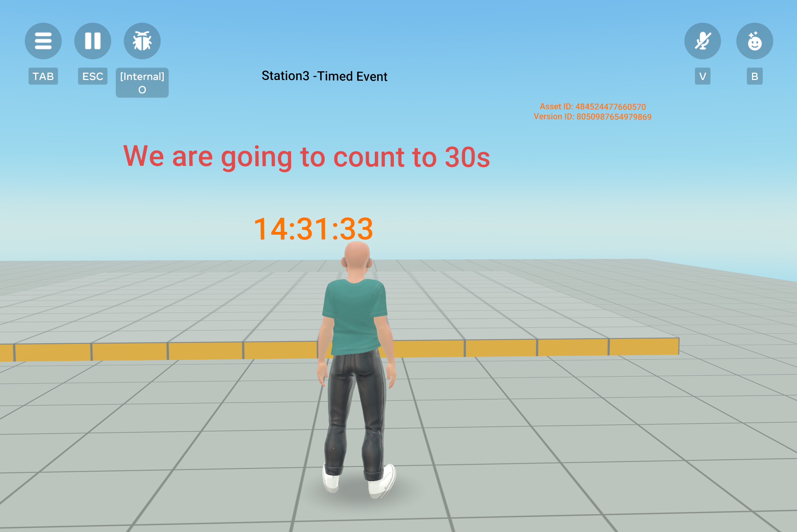

# [Module 4 - Using Text assets for timed events](#module-4---using-text-assets-for-timed-events)

Text assets can be used for creating dynamic events, which may be based on real-world time or events. For example, you can change your world to reflect a New Year’s theme or a National holiday theme. By having events defined in a Text asset, you can easily swap content in and out, without having to modify the world code and republish the world.

**How to use this module**:

Look at the `TimeEventsManager` script and object. This example controls the world based on the number of seconds in the current minute. Relevant to games, for example, you can control the entire layout of your world during a holiday event by structuring the configuration inside a JSON text file and loading the appropriate one.

**Tip**: In the script’s comments, you can see example JSON records in use for this station, which you can use as the basis for creating your own content for this station.

