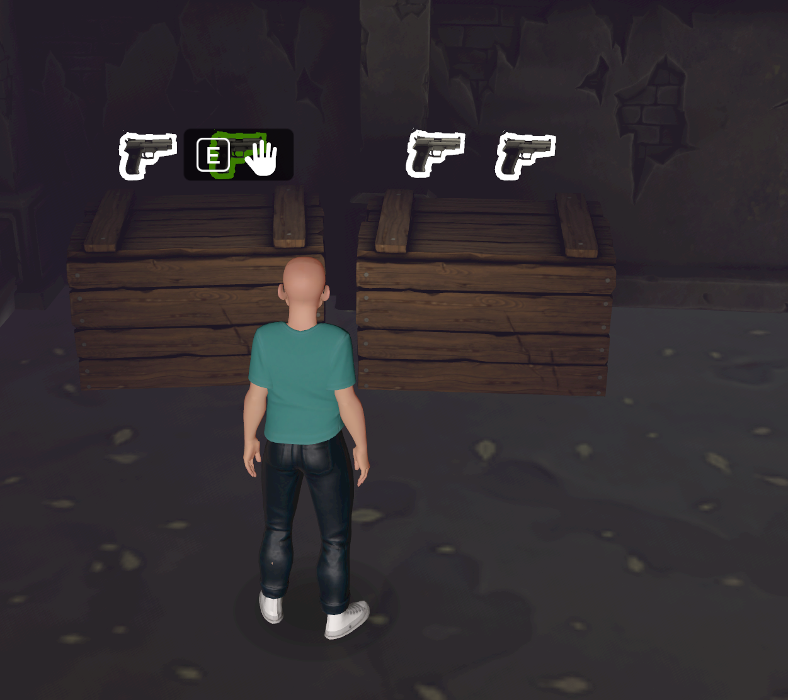

# [Module 8 - Weapon Systems - Handgun](#module-8---weapon-systems---handgun)

The pistol weapon system supports the pistols available in the Chop ‘N Pop: Graveyard Bash world.

- When a pistol is collected, aiming is determined based on a crosshairs presented on-screen when the pistol is in a player’s hand.
- Each pistol requires a clip of ammunition, which is decremented with each shot. When the ammo in the clip is empty, the player must find and collect a new clip and then reload the clip into the gun.



The gun weapon system leverages the Meta Horizon Worlds projectile management system and collision detection to create an effective gun. The system is composed of a multi-entity gun object, called ZombieGun3000 in the Chop ‘N Pop: Graveyard Bash world. This object also includes a ProjectileLauncher gizmo, which manages the release and collision detection of the projectile. Two scripts drive the gun system: `GunCore.ts` and `GunProjectile.ts`.

**Note**: `GunCore.ts` and `GunProjectile.ts` must be set to Local execution mode.

## [System Components](#system-components)

### [ZombieGun3000 object](#zombiegun3000-object)

Its entities are the following:

- ZombieGun3000 reference object
  - `GunCore.ts` - script is attached to ZombieGun3000
  - HackyGrabCube - used for setting grab points on the weapon
  - PistolModel - Unity Asset Bundle for the pistol object model and textures
  - MuzzleFlash - VFX displayed at the end of the muzzle when the gun is fired
  - ProjectileLauncher - gizmo for firing projectiles
    - `GunProjectile.ts` - script is attached to ProjectileLauncher
  - AmmoText - Text gizmo for displaying the ammo count left in the clip just above the gun
  - WeaponPickup - sound
  - PistolFire - sound
  - PistolReload - sound
  - PistolDryFire - sound
  - PistolShellDrop - sound
  - PistolPickup - sound

### [Scripts](#scripts)

**GunCore.ts**:

`GunCore.ts` handles the onGrab start and events, initializing the gun, and event subscriptions for pressing trigger, releasing it, and reloading the ammo clip.

Firing is issued by a call to the ProjectileLauncher gizmo referenced in its script properties, and `GunCore.ts` handles the gunfire-related effects, like kickback and clip animation. Each button press decrements the ammo counter.

Script Dependencies:

- `AnimUtils.ts`
- `Behaviour.ts`
- `Events.ts`
- `HapticFeedback.ts`
- `StageHand.ts`

**GunProjectile.ts**:

`GunProjectile.ts` handles the tracking of a projectile by registering the entity with two CodeBlockEvents. When the projectile hits an object, the `handleHit()` method in the script plays the appropriate effects and sends the Events.projectileHit to all entities for handling.

Script Dependencies:

- `Behaviour.ts`
- `Events.ts`
- `Throttler.ts`

## [How to Deploy](#how-to-deploy)

The ZombieGun3000 reference object and all sub-nodes must be saved as an asset template. In your own world, you must replace the `GunCore.ts` and `GunProjectile.ts` references with your own scripts. Script dependencies must be copied over, too.

For more information, see “Deploying Systems” in [Module 1 - Setup](Module%201%20-%20Setup.md).

## [How to Use](#how-to-use)

Add the ZombieGun3000 into your world, referencing your localized versions of `GunCore.ts` and `GunProjectile.ts`.

**Note**: Make sure that your versions of these scripts are configured to operate in Local mode.

**Note**: In order for the gun to shoot at the crosshairs in 2D screens in web and mobile, the player must be set as the owner of the Projectile Launcher entity.

**Note**: You must build out how to handle the Events.projectileHit event in your code. In Chop ‘N Pop: Graveyard Bash, this event is handled in `NPCAgent.ts`.

## [Modifications](#modifications)

### [Gun properties](#gun-properties)

In `GunCore.ts`, you can modify the properties exposed in the panel and properties in the script to change the behavior and responsiveness of the gun. Properties:

```typescript
const pistolConfig = {
  fireRate: 100,
  fireSpeed: 500,
  maxAmmo: 10,
  shouldAutoFire: false,
  reloadTime: 200,
  upwardsRecoilVel: 30,
  upwardsRecoilAcc: 350,
  backwardsRecoilVel: 0.5,
  backwardsRecoilAcc: 7,
};
```

## [Summary](#summary)

The gun weapon system features a model and related sound and audio effects. Behaviors are scripted for managing the gun firing, its ammunition, and reloading, as well as the projectile hits through `GunProjectile.ts`, which sends an event received in `NPCAgent.ts`. That script is attached to each potential target (enemy).

