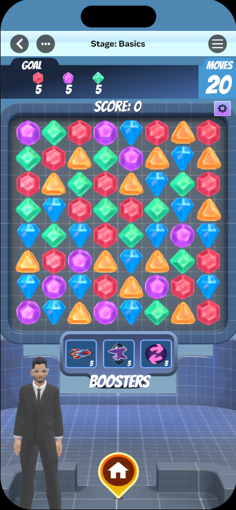
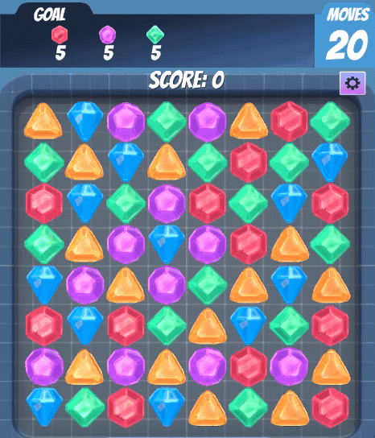
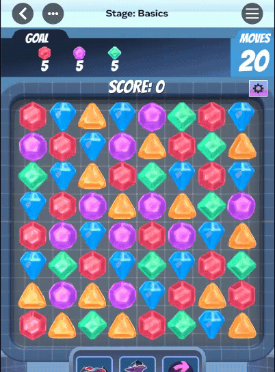
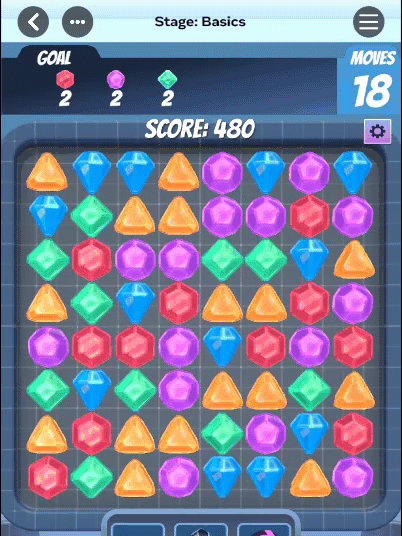
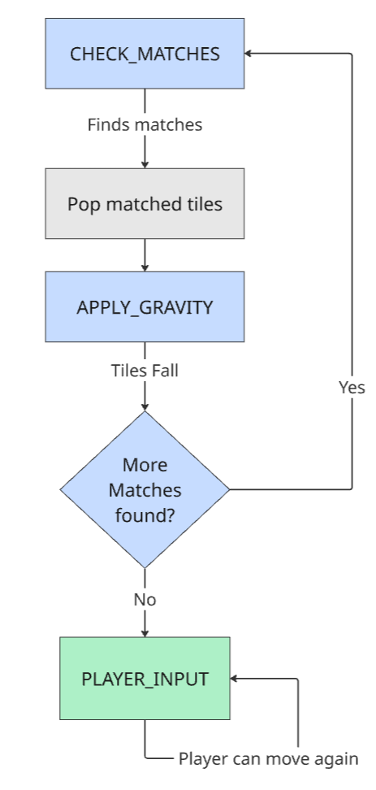
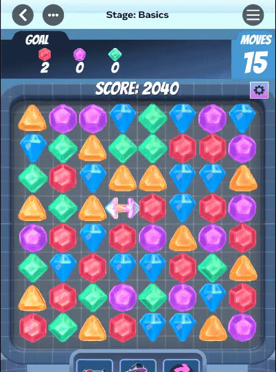
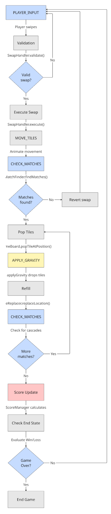

# [Module 1 - Match 3 Basics](#module-1---match-3-basics)

This module covers the core fundamentals of creating a Match 3 game.

The core gameplay is simple: players swap tiles to line up 3 or more of the same type in a row. This creates a “match,” which clears those tiles from the board.

After a match, tiles above the empty spaces drop down. This “cascade” effect can create new matches automatically. When a single move triggers multiple matches, these are called “combos”, and they give the player bonus points.

To win, players have to clear a specific number of tiles within a set number of moves. If they don’t clear enough tiles with the available moves, they typically lose.

A great Match 3 game encourages players to think ahead in order to chain multiple matches from a single move.

To look at any script mentioned in this module, open the **Scripts** menu in the top menu of the Horizon Editor. Then, click the **Scripts in this world** drop down. 

## [Try It First](#try-it-first)

### [Play the Match 3 Basics game](#play-the-match-3-basics-game)

- **Objective:** Pop a certain number of colored gems within 20 moves!
  - 5 red gems
  - 5 pink gems
  - 5 green gems
- **How to Play:** Swipe on a tile in any direction to swap it with an adjacent tile.
- **Tips:** Look for moves that will cause tiles to fall and create chain reactions!

Take a few minutes to play and experience all the core mechanics. Notice how tiles fall, how combos multiply your score, and what happens when you run out of moves.

## [What You’ll Learn](#what-youll-learn)

Now that you’ve experienced the game, let’s break down how each mechanic works in the code:

### [Step 1: Match Mechanics](#step-1-match-mechanics)

Learn about the basic swap-and-match system that makes tiles disappear when you line up 3 in a row.

In the code, you’ll find:

- `Basics_GameState_PlayerInput.ts`
  - `onSwipe()` - Detects the player’s swipe direction and initiates the swap
  - `onTouchStart()` - Handles player touch input on tiles
  - `getTile()` - Determines which tile the player touched using raycasting
- `Basics_SwapHandler.ts`
  - `validate(pos1, pos2)` - Checks if two tiles are adjacent (not diagonal)
  - `execute(pos1, pos2)` - Performs the tile swap on the board
  - `attemptSwap(pos1, pos2)` - Combines validation and execution
  - `attemptRevertSwap()` - Undoes swaps that don’t create matches
  - `areAdjacent()` - Helper that ensures tiles are horizontally or vertically adjacent
- `Basics_MatchFinder.ts`
  - `findMatches()` - Scans the entire board for 3+ tile matches
  - `findHorizontalMatches()` - Checks each row for consecutive matching tiles
  - `findVerticalMatches()` - Checks each column for consecutive matching tiles
  - `saveMatchIfValid()` - Records matches of 3 or more tiles

**Key implementation**: The match detection uses a line-scanning algorithm that checks each row and column independently. The `findMatchesInLine()` method counts consecutive identical tiles and saves groups of 3 or more. Diagonal matches are not detected.

Key files to explore:

- `Basics_SwapHandler:51` - Swap validation logic
- `Basics_MatchFinder.ts:22` - Match finding entry point
- `Basics_GameState_PlayerInput.ts:68` - Swipe handling

### [Step 2: Board Management](#step-2-board-management)

Learn how the board stores tiles, removes matched ones, and refills empty spaces.

In the code, you’ll find:

- `Basics_GameBoard.ts`
  - `getTile(x, y)` - Retrieves the tile at a specific grid position
  - `setTile(x, y, tile)` - Places a tile at a specific position
  - `removeTile(x, y)` - Removes a tile from the board (leaves empty space)
  - `swapPositions(pos1, pos2)` - Swaps two tiles in the grid array
  - `popTileAtPosition(x, y)` - Clears a matched tile and sends it to the backlog
  - `getAllTiles()` - Returns array of all tiles currently on the board
  - `_grid` - The 2D array storing the board state. For example, `grid[y][x]`
- `Basics_GameState_Gravity.ts`
  - `applyGravity()` - Moves tiles downward to fill empty spaces below them
- `Basics_TileReplacer.ts`
  - `replaceLocation(x)` - Spawns a new tile at the top of a column
  - `generateTile(position)` - Creates a tile from the backlog at a specific position
  - `determineTileTypeConstraints()` - Prevents the board from spawning with matches
- `Basics_TileBacklog.ts` (object pooling system)
  - Stores pre-spawned tiles for performance
  - `dequeueRandom()` - Gets a random tile from the pool

**Key implementation**: The board uses a 2D array (`_grid[row][column]`) to track tile positions. Gravity is applied by looping through each column from bottom to top, checking for empty spaces, and moving tiles down one position at a time. New tiles spawn from the top of columns when spaces need to be filled.

Key files to explore:

- `Basics_GameBoard.ts` - Board grid structure
- `Basics_GameState_Gravity.ts` - Gravity application
- `Basics_TileReplacer.ts` - Tile refill system

### [Step 3: Cascades](#step-3-cascades)

Learn about the cascade system that rewards players for creating chain reactions, powered by a state machine.

#### [Understanding the State Machine](#understanding-the-state-machine)

The game uses a *state machine* (`GameStateController`) that automatically creates cascades. When tiles fall and create new matches, the game loops through states:

In the code, you’ll find:

- `Basics_GameStateController.ts`
  - `setState(newState)` - Transitions between game states
  - `getCurrentState()` - Returns current state (`PLAYER_INPUT`, `CHECK_MATCHES`, etc.)
  - `update(deltaTime)` - Calls the active state’s update method for each frame
  - `_gameStates` - Map containing all state objects
- `Basics_GameState_CheckMatch.ts`
  - `start()` - Calls `findMatches()` when entering this state
  - `update()` - Pops matched tiles, then transitions to `APPLY_GRAVITY`
  - Publishes `MATCHES_FOUND` event with match data
- `Basics_GameEvents.ts`
  - `MATCHES_FOUND` - Event published when matches are detected
  - `STATE_CHANGED` - Event published when game state transitions
- `Score_ComboTracker.ts` (handles combo multipliers)
  - `incrementCombo()` - Called each time a cascade match occurs
  - `getMultiplier()` - Returns combo multiplier (1.0x → 1.5x → 2.0x → 2.5x, etc.)
  - `endCombo()` - Resets combo counter when returning to PLAYER\_INPUT
  - `MULTIPLIER_INCREMENT = 0.5` - Each combo adds 0.5x to the multiplier
  - `MAX_MULTIPLIER = 5.0` - Maximum multiplier cap

**Key implementation**: Cascades happen automatically through the state machine loop. Each time `CHECK_MATCHES` finds matches, it pops tiles and transitions to `APPLY_GRAVITY`. After gravity is applied, the game returns to `CHECK_MATCHES`, which automatically detects new matches created by falling tiles. The combo tracker increments with each pass through `CHECK_MATCHES`, increasing the score multiplier.

Key files to explore:

- `Basics_GameStateController.ts:90` - State transition system
- `Basics_GameState_CheckMatch.ts:30` - Match checking in cascades
- `Score_ComboTracker.ts:113` - Combo increment logic

### [Step 4: Win Conditions](#step-4-win-conditions)

To complete the board, players must complete all of the objectives before they run out of moves.

Players also earn points for each match they make, which is covered within [Module 2 - Scoring System](Module%202%20-%20Scoring%20System.md).

Let’s learn how the game tracks objectives and determines victory.

In the code, you’ll find:

- `Score_ScoreManager.ts`
  - `getTotalScore()` - Returns the current score
  - `addScore(matchInfo)` - Adds points when matches occur (base score × combo multiplier)
  - `getSessionData()` - Returns complete game stats (score, moves, time, combos)
- `Score_StarRating.ts`
  - `calculateRating(score)` - Evaluates the final score against thresholds, returns 0-3 stars
  - `StarThresholds` - Configuration type: `{oneStar, twoStars, threeStars}`
  - `wouldGetStars(score, stars)` - Checks if a score meets a specific star threshold
  - `getScoreNeededForNextStar()` - Shows how many more points are needed
- `Basics_GameEvents.ts`
  - `GAME_END` - Event that signals that the game has finished

**Key implementation**: Win conditions are typically checked by comparing the current score (from `ScoreManager`) against target thresholds. The `StarRating` system evaluates performance at game end, awarding 1-3 stars based on configurable score thresholds. All cascades from a move are processed before checking win conditions, ensuring combo points count toward victory.

Key files to explore:

- `Score_ScoreManager.ts:104` - Score calculation with combos
- `Score_StarRating.ts:54` - Star rating calculation
- `Score_Definitions.ts:24` - StarThresholds type definition

### [Step 5: Loss Conditions](#step-5-loss-conditions)

Learn how the game creates challenges through failure states.

In the code, you’ll find:

- `Basic_MoveTracker.ts`
  - `movesRemaining()` - Returns the number of moves made
  - `movesMade()` - Increments move counter after each valid swap
- `Basics_GameStateController.ts`
  - `endGame()` - Transitions to GAME\_OVER state
  - `EGameState.GAME_OVER` - The game over state enum value
  - `reset()` - Returns game to IDLE state
- `Basics_GameEvents.ts`
  - `GAME_END` - Event published when the game ends
  - `PLAYER_MOVE` - Event published when the player makes a valid move
  - `INVALID_MOVE` - Event published when the player attempts an invalid swap

**Key implementation**: Loss conditions typically trigger when the player runs out of moves without reaching the score target. The move counter is managed by `MoveTracker.moveMade()`, which is called whenever a valid swap occurs. Game logic (likely in a separate game manager) compares moves remaining against the move limit and calls `GameStateController.endGame()` when the limit is reached.

Key files to explore:

- `Score_ScoreManager.ts:155` - Move tracking
- `Basics_GameStateController.ts:189` - Game end transition
- `Basics_Definitions.ts:15` - EGameState enum

## [Code Architecture Overview](#code-architecture-overview)

The Match 3 Basics implementation follows this state machine flow:

**Key insight**: The state machine automatically handles cascades by looping between `CHECK_MATCHES` and `APPLY_GRAVITY` until no more matches exist. The `ComboTracker` increments with each loop iteration, increasing the score multiplier.

## [Your Turn to Experiment](#your-turn-to-experiment)

Now that you understand the code structure, try modifying these values:

- In `Basics_MatchFinder.ts`
  - Line 240: Change `if (tiles.length < 3)` to `< 4` to require 4-tile matches instead of 3 (makes the game harder)
- In `ScoreAPI_ComboTracker.ts`
  - Line 38: Change `MULTIPLIER_INCREMENT = 0.5` to `1.0` to make combos more rewarding (1.0x → 2.0x → 3.0x)
  - Line 39: Change `MAX_MULTIPLIER = 5.0` to `10.0` to allow higher combo multipliers

### [In your game configuration](#in-your-game-configuration)

- In the project hierarchy, expand the entity “BasicsPool.” Click on “CoreApi,” then look at the component fields on the right side. Adjust `xGridSize` and `yGridSize` to change board dimensions (8x8 is standard).
- In the same component fields, adjust `chanceToHaveNeighbouredGems` to control how often similar tiles spawn next to each other.

### [Experiment Results](#experiment-results)

- Fewer tile types means easier to find matches
- Higher multiplier increment means more emphasis on cascade strategy
- Smaller board means fewer cascade opportunities

