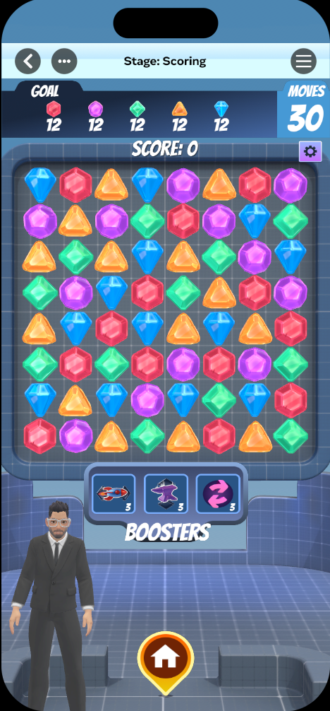
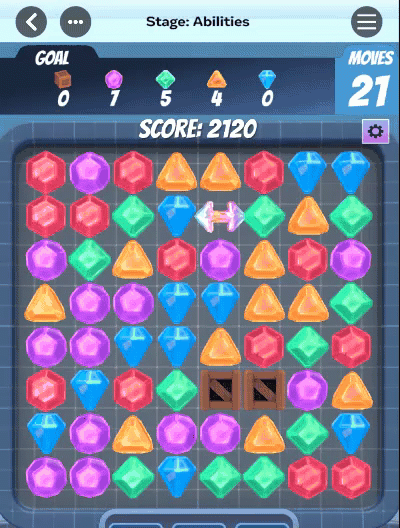
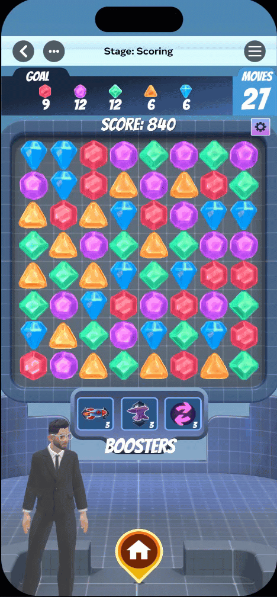

# [Module 2 - Scoring System](#module-2---scoring-system)

This module teaches you how to create a comprehensive scoring system for Match-3 games.

Players increase their score by creating cascades (multiple matches from a single move), clearing as many tiles as possible, and completing levels efficiently.

The scoring system uses a star rating model (1-3 stars) where players earn more stars by reaching higher score thresholds. This creates replay value as players try to improve their performance and achieve the coveted 3-star rating.

A well-designed scoring system rewards both skill (cascades, combos) and efficiency (time, moves), giving players clear feedback on their performance.

To look at any script mentioned in this module, open the **Scripts** menu in the top menu of the Horizon Editor. Then, click the **Scripts in this world** drop down. 

## [Try It First](#try-it-first)



### [Play the Scoring System game](#play-the-scoring-system-game)

- **Objective**: Match 10 of all colored gem types in 25 moves

- |                                       |                   |                   |
  | ------------------------------------- | ----------------- | ----------------- |
  | **Star Thresholds**: 1 star = 100 pts | 2 stars = 250 pts | 3 stars = 500 pts |

- **How to Play**: Focus on creating cascades to maximize combo multipliers.

- **Tips**: Longer combo chains multiply your score dramatically! Try to set up moves that create chain reactions.

Pay attention to how your score increases with each match, how combos multiply your points, and what score thresholds unlock each star rating.

## [What You’ll Learn](#what-youll-learn)

Now that you’ve experienced how scoring drives the Match-3 experience, let’s explore the implementation:

### [Step 1: Score Calculation](#step-1-score-calculation)



Learn how the game calculates points from matches and applies multipliers.

In the code, you’ll find:

- `Score_ScoreManager.ts`
  - `TilePopped()` - Calculates score for a single tile pop
  - `getTotalScore()` - Returns the current total score
  - `addBonus(bonusType, amount)` - Adds bonus points (time/move bonuses)
  - `getSessionData()` - Returns complete game statistics
  - `_totalScore` - Private field tracking cumulative score
  - `_scoreHistory` - Array of all scoring events for analysis
- `Score_Definitions.ts`
  - `EScoreEvent` - Enum of score event types (`MATCH_3`, `MATCH_4`, `MATCH_5_PLUS`, `COMBO`, `TIME_BONUS`, `MOVE_BONUS`)
  - `ScoreData` - Type containing event, baseScore, multiplier, totalScore, timestamp
  - `MatchScoreInfo` - Extends MatchInfo with scoring details

**Key implementation**: Score calculation follows this formula:

```
Final
 
Score
 
=
 
Base
 
Score
 
(
from
 match type
)
 
×
 
Combo
 
Multiplier
```

The `addScore()` method:

1. Gets base score from `ScoreConfig` based on match type (3, 4, or 5+ tiles)
2. Retrieves current combo multiplier from `ComboTracker`
3. Multiplies base score by multiplier
4. Adds to total score and publishes `SCORE_UPDATED` event

Key files to explore:

- `Score_ScoreManager.ts:104` - Match score calculation formula
- `Score_Definitions.ts:12` - EScoreEvent enumeration
- `Score_BonusCalculator.ts:26` - ScoreConfig type

### [Step 2: Combo System](#step-2-combo-system)



Learn how cascades increase your score through multipliers.

In the code, you’ll find:

- `Score_ComboTracker.ts`
  - `incrementCombo()` - Called for each match in a cascade chain
  - `getMultiplier()` - Returns current multiplier (1.0x, 1.5x, 2.0x, etc.)
  - `endCombo()` - Resets combo when player makes a new move
  - `getCurrentCombo()` - Returns combo count
  - `getMaxCombo()` - Returns highest combo achieved this game
  - `getTotalCombos()` - Returns number of 2+ combo chains
- Combo Constants:
  - `BASE_MULTIPLIER = 1.0` - Starting multiplier (no combo)
  - `MULTIPLIER_INCREMENT = 0.5` - Each combo adds 0.5x
  - `MAX_MULTIPLIER = 5.0` - Maximum combo multiplier cap
- `Score_ComboTracker.ts` events:
  - `COMBO_STARTED` - Published when first match occurs
  - `COMBO_UPDATED` - Published when combo chain continues
  - `COMBO_ENDED` - Published when returning to player input

**Key implementation**: The combo multiplier formula:

```
Multiplier
 
=
 BASE_MULTIPLIER 
+
 
(
combo 
-
 
1
)
 
×
 MULTIPLIER_INCREMENT

Capped
 at MAX_MULTIPLIER
```

Combo Examples:

- Combo 1 (first match): 1.0x multiplier → 100 pts × 1.0 = 100 pts
- Combo 2 (cascade): 1.5x multiplier → 100 pts × 1.5 = 150 pts
- Combo 3 (cascade): 2.0x multiplier → 100 pts × 2.0 = 200 pts
- Combo 4 (cascade): 2.5x multiplier → 100 pts × 2.5 = 250 pts
- Combo 10 (cascade): 5.0x multiplier (capped) → 100 pts × 5.0 = 500 pts

The combo counter increments with each match found during cascades, then resets when the game returns to `PLAYER_INPUT` state.

Key files to explore:

- `Score_ComboTracker.ts:113` - Combo increment logic
- `Score_ComboTracker.ts:137` - Multiplier calculation formula
- `Score_ComboTracker.ts:96` - Combo end/reset

### [Step 3: Star Rating System](#step-3-star-rating-system)


Learn how the game evaluates performance and awards 1-3 stars.

In the code, you’ll find:

- `Score_StarRating.ts`
  - `calculateRating(score)` - Evaluates score and returns 0-3 stars
  - `setThresholds(thresholds)` - Updates star threshold configuration
  - `wouldGetStars(score, stars)` - Checks if score meets specific star level
  - `getScoreNeededForNextStar(currentScore)` - Shows points needed for next star
  - `getCurrentRating()` - Returns the current star rating
  - `_thresholds` - Private StarThresholds configuration
- `Score_Definitions.ts`
  - `StarThresholds` - Type: `{oneStar: number, twoStars: number, threeStars: number}`
- `Score_StarRating.ts` events:
  - `STAR_RATING_CALCULATED` - Published when star rating is determined

**Key implementation**: The star rating uses a simple threshold comparison.

```
if
 
(
score 
>=
 
this
.
_thresholds
.
threeStars
)
 
{

  rating 
=
 
3
;


}
 
else
 
if
 
(
score 
>=
 
this
.
_thresholds
.
twoStars
)
 
{

  rating 
=
 
2
;


}
 
else
 
if
 
(
score 
>=
 
this
.
_thresholds
.
oneStar
)
 
{

  rating 
=
 
1
;


}
 
else
 
{

  rating 
=
 
0
;


}
```

Star ratings are typically calculated at game end (when `ObjectiveManager.endGame()` is called). The thresholds are configurable per level, allowing difficulty scaling.

Example Configuration:

```
const
 easyLevel
:
 
StarThresholds
 
=
 
{

  oneStar
:
 
1000
,

  twoStars
:
 
2000
,

  threeStars
:
 
3000


};


const
 hardLevel
:
 
StarThresholds
 
=
 
{

  oneStar
:
 
3000
,

  twoStars
:
 
5000
,

  threeStars
:
 
8000


};
```

Key files to explore:

- `Score_StarRating.ts:54` - Star calculation logic
- `Score_StarRating.ts:114` - Score needed for next star
- `Score_Definitions.ts:24` - StarThresholds type

## [Your Turn to Experiment](#your-turn-to-experiment)

Now that you understand the scoring system, try modifying these values:

- In `Score_ComboTracker.ts`:
  - Line 37: Change `BASE_MULTIPLIER = 0.5` to `0.25` for gentler scaling (1.0x → 1.25x → 1.5x)
  - Line 35: Change `MULTIPLIER_INCREMENT = 0.5` to `1.0` for aggressive scaling (1.0x → 2.0x → 3.0x)
  - Line 36: Change `MAX_MULTIPLIER = 5.0` to `10.0` to reward extremely long combos

Experiment Results:

- Higher base scores = easier to reach star thresholds
- Higher multiplier increment = greater emphasis on combo strategy

