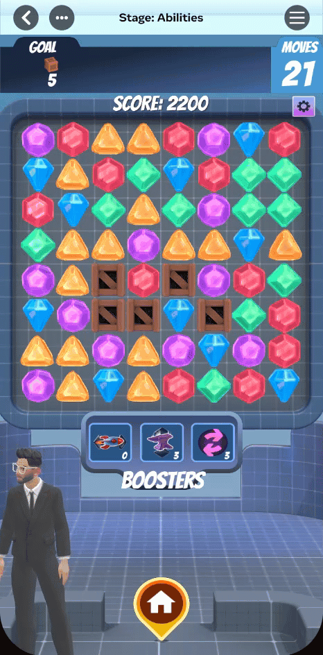
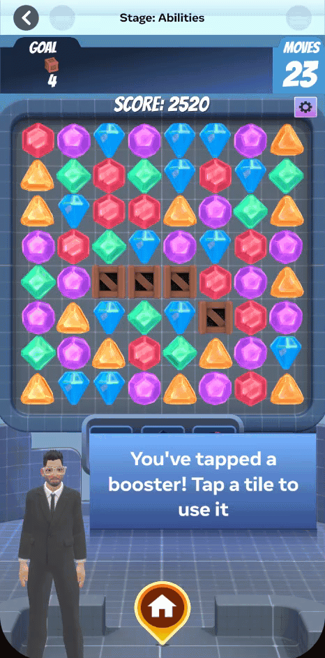
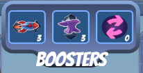
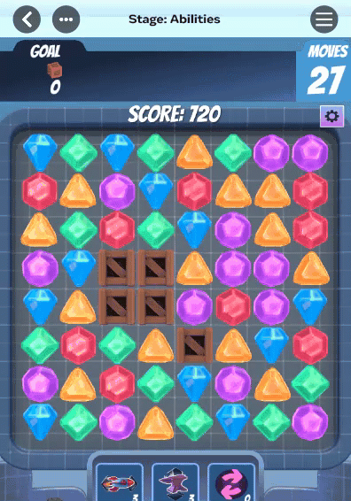

# [Module 3 - Power-ups and boosters](#module-3---power-ups-and-boosters)

This module explains the difference between *power-ups* and *boosters*, which are essential to the Match-3 experience.

Power-ups are special tiles created by making matches of 4 or more tiles. When matched, the power-up appears on the board where the match occurred. Activating a power-up triggers a unique effect, such as clearing an entire row or all tiles within a radius.

Boosters are consumable items earned through achievements. Their effects can significantly impact the board—from removing a single tile to transforming multiple tiles into a specific type for easier matches.



To look at any script mentioned in this module, open the **Scripts** menu in the top menu of the Horizon Editor. Then, click the **Scripts in this world** drop down. 

## [Try It First](#try-it-first)

### [Play with Power-ups and boosters](#play-with-power-ups-and-boosters)

**Objective**: Experience how power-ups and boosters change gameplay strategy

- **Power-ups to try**:
  - Make a 4-tile match to create a row/column clearing power-up.
  - Make a 5-tile match to create a color clear power-up.
  - Make an L- or T-shaped match to create a bomb power-up.
- **Boosters to try**:
  - Use the clear row booster to remove a strategic row.
  - Use the clear column booster to eliminate a column.
  - Use the shuffle board booster when no good moves are available.

**Note**: Notice how power-ups spawn from special matches and how boosters require targeting.

Take a few minutes to experiment with creating different power-ups and activating boosters. Notice the difference between the two systems and how they complement each other.

## [What You’ll Learn](#what-youll-learn)

Now that you’ve experienced power-ups and boosters, let’s break down how each system works in the code:

### [Step 1: Ability System Architecture](#step-1-ability-system-architecture)

The abilities system is built as a plugin on top of the Basics system. It uses a unified architecture where both power-ups and boosters share the same execution logic, but differ in how they’re triggered:

- **Power-ups** are triggered when special tiles are matched or swapped on the board.
- **Boosters** are triggered by player action before making a move.

In the code, you’ll find:

- `Abilities_CoreAPI.ts`
  - `start()` - Initializes the abilities system and waits for BasicsCoreAPI to be ready
  - `onBasicsCoreReady()` - Creates all subsystems once the game board is initialized
  - `constructSystems()` - Instantiates all managers in the correct order
  - `registerPowerUps()` - Creates and registers all available abilities
  - Properties:
    - `powerUpRegistry` - Central registry for all ability implementations
    - `powerUpTileManager` - Handles creating special tiles on the board
    - `boosterInventory` - Tracks player’s available boosters
    - `boosterActivationManager` - Manages booster execution
    - `boosterTargetingManager` - Handles player targeting for directional boosters
    - `comboRewardsManager` - Awards boosters for high combos
- `Abilities_AbilityRegistry.ts`
  - `registerAbility(id, ability)` - Adds a new ability to the registry
  - `getAbility(id)` - Retrieves an ability by its unique ID
  - `executeAbility(id, position)` - Runs an ability’s effect
  - `hasAbility(id)` - Checks if an ability is registered
- `Abilities_Definitions.ts`
  - `EAbilityType` - Enum defining all ability types (CLEAR\_ROW, CLEAR\_COLUMN, BOMB\_CLEAR, etc.)
  - `IAbility` - Interface that all abilities must implement
  - `BoosterEntry` - Data structure for inventory entries
  - `PowerUpTileConfig` - Configuration for power-up visual assets
  - `BoosterConfig` - Configuration for starting booster amounts

**Key implementation**: The abilities system uses the strategy pattern where each ability implements the `IAbility` interface with an `execute()` method. The `AbilityRegistry` acts as a factory that stores and executes abilities without knowing their specific implementation details. This makes it easy to add new abilities without modifying existing code.

Key files to explore:

- `Abilities_CoreAPI.ts:89` - System initialization
- `Abilities_AbilityRegistry.ts:18` - Ability registration
- `Abilities_Definitions.ts:13` - Ability type definitions

### [Step 2: Power-up Tile Creation](#step-2-power-up-tile-creation)

Learn how special matches automatically create power-up tiles on the board.

The `PowerUpTileManager` subscribes to match events and determines when to create power-up tiles based on match patterns. It uses an object pooling system to efficiently spawn and recycle special tiles.

Power-up Creation Rules:

| Power Up Type           | Creation Rule                                                 |
| ----------------------- | ------------------------------------------------------------- |
| 4-in-a-row (Horizontal) | Creates a row clearing power-up                               |
| 4-in-a-row (Vertical)   | Creates a column clearing power-up                            |
| 5-in-a-row              | Creates a color clear power-up (clears all tiles of one type) |
| L- or T-shape           | Creates a bomb power-up (clears 3x3 area)                     |

In the code, you’ll find:

- `Abilities_PowerUpTileManager.ts`
  - `handleMatchesFound(matchResults)` - Called automatically when matches are detected
  - `determinePowerUpType(position, matchInfo)` - Analyzes match pattern to determine which power-up to create
  - `determineLeastStaleTile(matchInfo)` - Finds the most recently moved tile in the match to place the power-up
  - `createSpecialTileAt(powerUpType, position)` - Spawns a power-up tile at the specified position
  - `spawnPowerUpTile(powerUpType, position, spawnLocation)` - Creates a new power-up tile entity with proper visuals
  - `popSpecialTile()` - Executes the power-up’s ability when it’s matched or swapped
  - `makeSubscriptions(powerUpType, tile)` - Sets up events for when the power-up is activated
  - `isMatchHorizontal()` - Determines if a 4-tile match is horizontal or vertical
- `Abilities_RegisteredAbilities.ts`
  - `ClearRowAbility` - Removes all tiles in a horizontal row
    - `execute(targetPosition)` - Loops through row and pops each tile
  - `ClearColumnAbility` - Removes all tiles in a vertical column
    - `execute(targetPosition)` - Loops through column and pops each tile
  - `ClearTileTypeAbility` - Removes all tiles of the same type as the target
    - `execute(targetPosition)` - Scans entire board and clears matching tile types
    - `getModifiedPos()` - Handles edge case where power-up is created from a swap
  - `BombAbility` - Clears tiles in a radius around the target
    - `execute(targetPosition)` - Clears 3x3 grid around target position
  - `ShuffleBoardAbility` - Randomizes all tiles on the board
    - `execute()` - Calls TileReplacer’s shuffle method
- `Abilities_AbilityEvents.ts`
  - `ON_SPECIAL_TILE_CREATED` - Published when a power-up tile spawns on the board

**Key implementation**: The system uses a backlog/object pool to pre-spawn power-up visuals for performance. When a match is found, the manager retrieves the least recently moved tile’s position (`determineLeastStaleTile`), determines which power-up to create based on match type, then swaps the matched tile with a power-up tile from the backlog. When the power-up tile is later matched or swapped (`POPPED` or `FINISHED_SWAP` events), it executes its ability through the registry.

Key files to explore:

- `Abilities_PowerUpTileManager.ts:164` - Match detection handler
- `Abilities_PowerUpTileManager.ts:166` - Power-up type determination
- `Abilities_RegisteredAbilities.ts:14` - ClearTileType implementation
- `Abilities_RegisteredAbilities.ts:144` - Bomb ability implementation

### [Step 3: Booster Inventory & Activation](#step-3-booster-inventory--activation)

Learn how the booster system tracks player inventory and activates boosters before moves.

The booster system consists of two main components: the `BoosterInventory` which tracks quantities, and the `BoosterActivationManager` which handles execution and validation.

In the code, you’ll find:

- `Abilities_BoosterInventory.ts`
  - `initializeBoosters()` - Sets up starting booster quantities from config
  - `initializeBooster(id, initialCount)` - Creates a new booster entry
  - `canAfford(id)` - Checks if player has at least 1 of this booster
  - `addBooster(id, count)` - Adds boosters to inventory (for shop purchases or rewards)
  - `consumeBooster(id)` - Removes one booster from inventory (returns false if none available)
  - `getRemaining(id)` - Returns current count for a booster
  - `setCount(id, count)` - Directly sets booster count (useful for save/load)
  - `getAllBoosters()` - Returns array of all booster entries with counts
  - `_quantities` - Map storing booster ID → count
- `Abilities_BoosterActivationManager.ts`
  - `activateBooster(boosterId, targetPosition)` - Main entry point for booster activation
  - `canUseBooster()` - Validates that game is in PLAYER\_INPUT state
  - `subscribeToGameEvents()` - Listens to STATE\_CHANGED events
  - `onStateChanged(newState)` - Tracks current game state
  - `publishActivationSuccess()` - Fires event when booster activates
  - `publishActivationFailed()` - Fires event when activation fails
  - Activation Flow:
    1. Validates game state is PLAYER\_INPUT
    2. Checks if player has the booster in inventory
    3. Gets ability from registry
    4. Executes the ability’s effect
    5. Transitions game to APPLY\_GRAVITY state
    6. Consumes booster from inventory
    7. Publishes activation event
- `Abilities_AbilityEvents.ts`
  - `ON_BOOSTER_ACTIVATED` - Published when booster successfully activates
  - `ON_BOOSTER_ACTIVATION_FAILED` - Published when activation fails (wrong state or no inventory)
  - `ON_BOOSTER_ADDED` - Published when boosters are added to inventory
  - `ON_BOOSTER_CONSUMED` - Published when a booster is used

**Key implementation**: The booster system uses event-driven architecture to communicate changes. When a booster is activated, the manager first validates preconditions (correct game state, sufficient inventory), then executes the ability through the shared registry, and finally updates inventory. The system automatically transitions the game state to `APPLY_GRAVITY` after activation so cascades can occur. All inventory changes publish events so the UI can update automatically.

**Booster vs power-up differences**

| Feature     | Power-ups                    | Boosters                       |
| ----------- | ---------------------------- | ------------------------------ |
| Trigger     | Matched/swapped on board     | Activated before move          |
| State       | Any (checked during match)   | Must be `PLAYER_INPUT`         |
| Inventory   | No tracking (tiles on board) | Tracked via `BoosterInventory` |
| Consumption | Automatic when matched       | Explicit consumption           |
| Creation    | From special matches         | Purchased or rewarded          |



Key files to explore:

- `Abilities_BoosterInventory.ts:42` - Affordability check
- `Abilities_BoosterActivationManager.ts:84` - Activation flow
- `Abilities_BoosterActivationManager.ts:126` - State validation

### [Step 4: Booster Targeting System](#step-4-booster-targeting-system)

Learn how players select target positions for directional boosters.

Some boosters (like ClearRow and ClearColumn) require the player to select a target position on the board. The `BoosterTargetingManager` handles this by entering a special targeting mode and intercepting touch input.

In the code, you’ll find:

- `Abilities_BoosterTargetingManager.ts`
  - `enterTargetingMode(boosterId)` - Activates targeting mode for a specific booster
  - `cancelTargeting()` - Exits targeting mode without activating booster
  - `isAwaitingTarget()` - Returns true if currently in targeting mode
  - `getActiveBooster()` - Returns the ID of the booster awaiting targeting
  - `canEnterTargetingMode()` - Validates game state is PLAYER\_INPUT
  - `handleTouchStart(touchData)` - Intercepts touch input during targeting mode
  - `selectTarget(position)` - Called when player taps a tile, activates booster at position
  - `getTileFromTouch(touchData)` - Uses raycasting to determine which tile was touched
  - `subscribeToEvents()` - Listens to touch input and state changes
- `Basics_Input_Screen.ts`
  - `onTouchStart` - Event published when screen is touched
  - Provides `InteractionInfo` with world ray for raycasting

Targeting Flow:

1. UI button calls `enterTargetingMode(boosterId)`
2. Manager sets `_activeBoosterForTargeting` flag
3. Player taps on the board
4. `handleTouchStart` intercepts the touch before PlayerInputState
5. Uses raycasting to get the tile at touch position
6. Calls `selectTarget(position)` with the tile’s grid position
7. Clears targeting mode flag
8. Automatically calls `boosterActivationManager.activateBooster(boosterId, position)`

**Key implementation**: The targeting system uses an input interception pattern. It subscribes to the global `onTouchStart` event and checks if targeting mode is active. When active, it processes the touch, determines the tile position, and consumes the input (returns true) so the normal PlayerInputState doesn’t process it. This prevents the player from accidentally swapping tiles while targeting. The system validates that the game is in `PLAYER_INPUT` state before allowing targeting to prevent conflicts with animations or cascades.

Boosters that Require Targeting:

- `CLEAR_ROW` - Player selects any tile, clears that row
- `CLEAR_COLUMN` - Player selects any tile, clears that column
- `BOMB_CLEAR` - Player selects center point, clears 3x3 area
- `CLEAR_TILE_TYPE` - Player selects tile type to clear

Boosters that Don’t Require Targeting:

- `SHUFFLE_BOARD` - Affects entire board immediately

Key files to explore:

- `Abilities_BoosterTargetingManager.ts:70` - Enter targeting mode
- `Abilities_BoosterTargetingManager.ts:93` - Touch input interception
- `Abilities_BoosterTargetingManager.ts:120` - Target selection

### [Step 5: Combo Rewards System](#step-5-combo-rewards-system)

Learn how the game rewards players with boosters for achieving high combos.

The `ComboRewardsManager` listens to combo achievements and can award bonus boosters when players create impressive chain reactions.

In the code, you’ll find:

- `Abilities_ComboRewardsManager.ts`
  - `onMatchComboAchieved(comboData)` - Called when a combo milestone is reached
  - `onTilesClearedForCombo(tiles)` - Called when tiles are cleared in a combo chain
  - Example reward thresholds:
    - Combo level 5+: Could award shuffle booster
    - Combo level 10+: Could award clear row/column booster
    - 20+ tiles cleared: Could award bonus boosters

**Key implementation**: The combo rewards system provides a framework for awarding boosters based on player performance. The example implementation shows logging for high combos (level 5+), but the actual rewards are commented out, allowing developers to customize their own reward structure. This system encourages skillful play by providing tangible rewards for creating cascades.

**Integration with score system**: The combo system works alongside the `Score_ComboTracker` from Module 2, which tracks:

- Current combo level (consecutive cascade matches)
- Score multiplier (increases with each combo)
- Total tiles cleared in the combo chain



Key files to explore:

- `Abilities_ComboRewardsManager.ts:28` - Combo achievement handler
- `Score_ComboTracker.ts:42` - Combo tracking (from Module 2)

## [Setting Up Power-ups and Boosters](#setting-up-power-ups-and-boosters)

To configure the abilities system in your world:

### [1. Add the AbilitiesCoreAPI Component](#1-add-the-abilitiescoreapi-component)

Attach the `AbilitiesCoreAPI` component to an entity in your world. This component has several props to configure:

**Power-up visual configuration**

- `horizontalTileAsset` - Asset for row clearing power-up
- `horizontalTileRotation` - Rotation for the asset
- `horizontalTileScale` - Scale for the asset
- `verticalTileAsset` - Asset for column clearing power-up
- `verticalTileRotation` - Rotation for the asset
- `verticalTileScale` - Scale for the asset
- `colorTileAsset` - Asset for color clearing power-up
- `colorTileRotation` - Rotation for the asset
- `colorTileScale` - Scale for the asset
- `bombTileAsset` - Asset for bomb power-up
- `bombTileRotation` - Rotation for the asset
- `bombTileScale` - Scale for the asset

**Booster inventory configuration**

- `horizontalBoosterAmount` - Starting count of clear row boosters
- `verticalBoosterAmount` - Starting count of clear column boosters
- `shuffleBoosterAmount` - Starting count of shuffle board boosters

**Performance configuration**

- `powerUpBacklogSize` - Number of each power-up type to pre-spawn (object pooling)

### [2. Access the Abilities System in Your Code](#2-access-the-abilities-system-in-your-code)

```
import
 
{
 
AbilitiesCoreAPI
,
 ABILITIES_READY 
}
 
from
 
'Abilities_CoreAPI'
;


import
 
{
 
EAbilityType
 
}
 
from
 
'Abilities_Definitions'
;


// Wait for abilities system to initialize

ABILITIES_READY
.
subscribe
((
abilitiesAPI
)
 
=>
 
{

    console
.
log
(
'Abilities system ready!'
);


    
// Access subsystems

    
const
 inventory 
=
 abilitiesAPI
.
boosterInventory
;

    
const
 activationManager 
=
 abilitiesAPI
.
boosterActivationManager
;

    
const
 targetingManager 
=
 abilitiesAPI
.
boosterTargetingManager
;


});


// Or access the singleton directly after initialization


const
 abilitiesAPI 
=
 
AbilitiesCoreAPI
.
instance
;
```

### [3. Activate the System](#3-activate-the-system)

The abilities system starts and stops with the game:

```
// Start abilities (enable power-up creation and booster usage)


await
 abilitiesAPI
.
startSystems
();


// Stop abilities (disable during game over, menus, etc.)

abilitiesAPI
.
stopSystems
();
```

### [4. Add Custom Abilities](#4-add-custom-abilities)

To create a new ability:

```
import
 
{
 
IAbility
,
 
EAbilityType
 
}
 
from
 
'Abilities_Definitions'
;


import
 
{
 
BasicsCoreAPI
 
}
 
from
 
'Basics_CoreAPI'
;


import
 
{
 
GridPosition
 
}
 
from
 
'Basics_Definitions'
;


export
 
class
 
MyCustomAbility
 
implements
 
IAbility
 
{

    
readonly
 id
:
 
string
 
=
 
'MY_CUSTOM_ABILITY'
;


    
private
 _basicsCoreAPI
:
 
BasicsCoreAPI
;


    constructor
(
basicsCoreAPI
:
 
BasicsCoreAPI
)
 
{

        
this
.
_basicsCoreAPI 
=
 basicsCoreAPI
;

    
}


    
async
 execute
(
targetPosition
?:
 
GridPosition
):
 
Promise
<boolean>
 
{

        
// Implement your custom ability logic here

        console
.
log
(
'Custom ability activated!'
);


        
// Example: Clear a diagonal line

        
if
 
(
targetPosition
)
 
{

            
const
 board 
=
 
this
.
_basicsCoreAPI
.
gameBoard
;

            
for
 
(
let
 i 
=
 
0
;
 i 
<
 
3
;
 i
++)
 
{

                
const
 tile 
=
 board
.
getTile
(
targetPosition
.
x 
+
 i
,
 targetPosition
.
y 
+
 i
);

                
if
 
(
tile
)
 
{

                    board
.
popTileAtPosition
(
targetPosition
.
x 
+
 i
,
 targetPosition
.
y 
+
 i
);

                
}

            
}

        
}


        
return
 
true
;

    
}


}


// Register your custom ability


const
 myAbility 
=
 
new
 
MyCustomAbility
(
basicsCoreAPI
);

abilitiesAPI
.
powerUpRegistry
.
registerAbility
(
myAbility
.
id
,
 myAbility
);
```

