# [Module 4 - Progression](#module-4---progression)

This module teaches you how to create a progression system for your Match 3 game.

Progression systems determine how players unlock features and when those features become available.

Players earn experience points by completing levels and milestones throughout the game.

When players accumulate enough experience points to reach the level threshold, they level up and their profile level increases.

To look at any script mentioned in this module, open the **Scripts** menu in the top menu of the Horizon Editor. Then, click the **Scripts in this world** drop down. 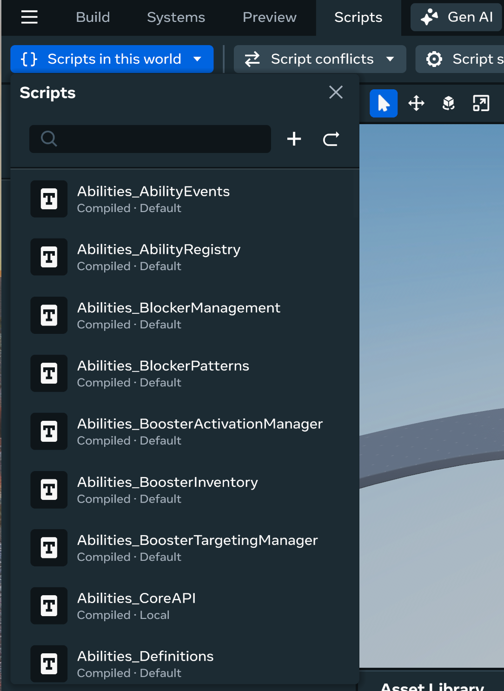

## [Try It First](#try-it-first)

### [Play the Progression System game](#play-the-progression-system-game)

- **Objective**: Experience the full progression system with XP, levels, and achievements
- **How to Play**: Complete matches to earn XP and level up your profile
- **Tips**: Try to earn 3 stars for maximum XP! Watch for achievement notifications as you play.

Pay attention to how XP is awarded after each match, what happens when you level up, and how achievements track your progress across multiple games.

## [What You’ll Learn](#what-youll-learn)

Now that you’ve experienced how progression enhances the Match-3 experience, let’s explore the implementation:

### [Step 1: XP & Player Level](#step-1-xp--player-level)

Learn how the game tracks player progression through experience points and levels.

In the code, you’ll find:

- `Progression_PlayerProfile.ts`
  - `playerLevel` - Current player level (starts at 0)
  - `currentXP` - Experience points accumulated toward next level
  - `getXPThresholdForNextLevel()` - Returns XP needed to reach next level
  - `getXPThresholdForLevel(level)` - Returns XP threshold for a specific level
  - `saveData()` - Persists profile data to player variables
  - `_data` - Private field storing PlayerProfileData (level, XP, highestCombo)
- `Progression_XPManager.ts`
  - `awardXP(amount)` - Adds XP to player profile and checks for level up
  - `checkLevelUp()` - Private method that handles level-up logic
  - `attemptLevelUp()` - Recursive function that handles multiple level-ups at once
- `Progression_XPRelay.ts`
  - `awardMatchXP(starRating)` - Converts star ratings into XP rewards
  - `overrideConfig(config)` - Customizes XP values per level
  - `resetConfig()` - Restores default XP configuration
  - Listens to `STAR_RATING_CALCULATED` event from scoring system
- `Progression_Definitions.ts`
  - `XPConfig` - Type defining XP reward values
  - `DEFAULT_XP_CONFIG` - Default values: \[0, 50, 100, 150] XP for \[0, 1, 2, 3] stars
  - `XPGainedData` - Event data published when XP is awarded
  - `LevelUpData` - Event data published when player levels up
  - `PlayerProfileData` - Player progression data model

**Key implementation**: The XP system uses a relay pattern to connect the scoring system to progression:

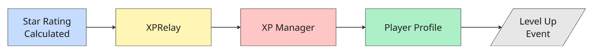

The `awardMatchXP()` method in `Progression_XPRelay.ts:52`:

1. Receives star rating (0-3) from scoring system
2. Looks up XP reward from `xpPerStar` array in config
3. Adds `baseMatchExperience` bonus to the reward
4. Calls `xpManager.awardXP()` to add points to profile
5. Saves profile data to player variables

The level-up system in `Progression_XPManager.ts:57`:

1. Checks if `currentXP` >= `xpThresholdForNextLevel`
2. Increments player level
3. Calculates XP overflow (excess XP carries over)
4. Recursively checks for additional level-ups (handles earning multiple levels at once)
5. Publishes `LEVEL_UP` event with old level, new level, and overflow data

XP Configuration Example (In `Progression_Definitions.ts`):

```
// Default XP rewards


const
 DEFAULT_XP_CONFIG
:
 
XPConfig
 
=
 
{

  xpPerStar
:
 
[
0
,
 
50
,
 
100
,
 
150
],
  
// 0 stars = 0 XP, 1 star = 50, etc.

  baseMatchExperience
:
 
10
         
// Bonus XP for completing any match


}


// Example: Player earns 3 stars


// XP Awarded = xpPerStar[3] + baseMatchExperience


//            = 150 + 10 = 160 XP
```

**Level thresholds**:

The default level thresholds in `Progression_PlayerProfile.ts:19`:

```
levelThresholds
:
 
[

  
200
,
    
// Level 0 → 1: Need 200 XP

  
400
,
    
// Level 1 → 2: Need 400 XP

  
700
,
    
// Level 2 → 3: Need 700 XP

  
1100
,
   
// Level 3 → 4: Need 1100 XP

  
1600
    
// Level 4 → 5: Need 1600 XP


]
```

Key files to explore:

- `Progression_XPRelay.ts:47` - Star rating to XP conversion
- `Progression_XPManager.ts:51` - Level-up logic
- `Progression_PlayerProfile.ts:77` - XP threshold lookup
- `Progression_Definitions.ts:37` - Default XP configuration

### [Step 2: Player Achievements](#step-2-player-achievements)

Learn how achievements track player milestones and reward progress.

In the code, you’ll find:

- `Progression_AchievementManager.ts`
  - `storeAchievementRelay(relay)` - Registers a new achievement
  - `enableRelay(relay)` - Loads saved progress and activates achievement tracking
  - `saveProgress(relay)` - Persists achievement progress to player variables
  - `startSystem()` - Enables all registered achievements
  - `stopSystem()` - Disables all achievements (used when changing levels)
  - `_achievementRelays` - Map storing all registered achievements by ID
- `Progression_AchievementRelays.ts`
  - `BaseAchievementRelay` - Abstract base class for all achievements
  - `progress` - Current progress toward achievement goal
  - `progressUpdate` - Event published when progress changes
  - `enable()` / `disable()` - Control achievement tracking
  - `setProgress(progress)` - Used to restore saved progress
- `Progression_Definitions.ts`
  - `AchievementData` - Achievement configuration type
  - `IAchievementRelay` - Interface all achievements implement
  - Defines: `id`, `name`, `description`, `xpReward`, `currentProgress`, `customValidator`

**Key implementation**: Achievements use a relay architecture where each achievement listens to game events and tracks its own progress:

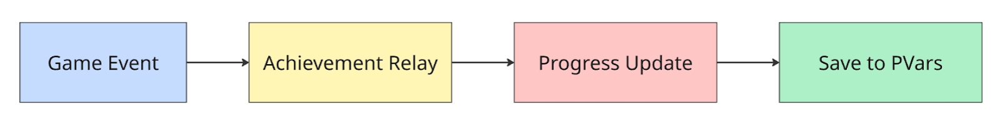

How `TilePopAchievement` Works (`Progression_AchievementRelays.ts:70`):

1. Component props define `achievementPvarId`, `tileType`, and `xpReward`
2. On `enable()`: Subscribes to `TILE_POP` event from game
3. When tile pops: Checks if tile type matches achievement requirement
4. If matched: Increments progress counter and publishes `progressUpdate` event
5. AchievementManager listens to `progressUpdate` and saves to player variables
6. When goal reached: Awards XP through `xpManager.awardXP()`

**Achievement lifecycle**:

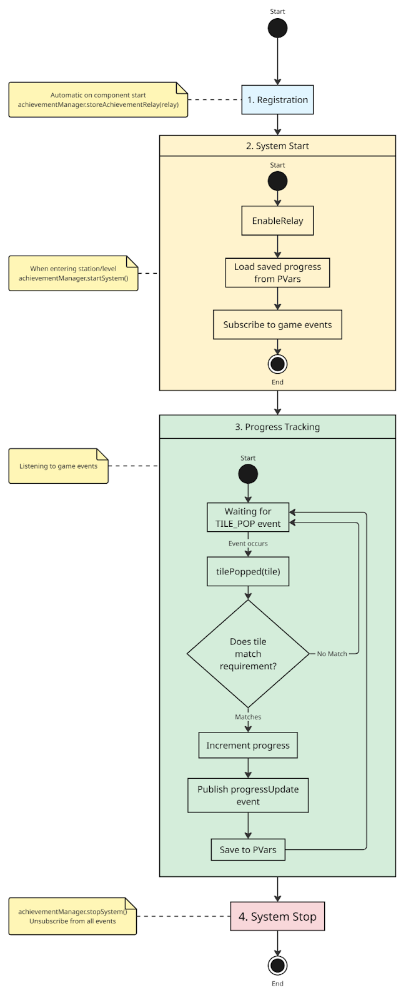

**Creating custom achievements**:

To create a new achievement type, extend `BaseAchievementRelay`:

```
export
 
class
 
ComboAchievement
 
extends
 
BaseAchievementRelay
<
typeof
 
ComboAchievement
>
 
{

  
// 1. Define props

  
public
 
static
 propsDefinition 
=
 
{

    
...
BaseAchievementRelay
.
propsDefinition
,

    requiredComboCount
:
 
{
 type
:
 
PropTypes
.
Number
 
},

  
}


  
// 2. Override enable() to subscribe to events

  
override
 enable
():
 
void
 
{

    
super
.
enable
();

    
this
.
_subscriptionBag
.
add
(

      scoreEvents
.
COMBO_UPDATED
.
subscribe
(
this
.
onComboUpdate
.
bind
(
this
))

    
);

  
}


  
// 3. Track progress when events occur

  
private
 onComboUpdate
(
comboData
:
 
ComboData
):
 
void
 
{

    
if
 
(
comboData
.
count 
>=
 
this
.
props
.
requiredComboCount
)
 
{

      
this
.
_progress
++;

      
this
.
progressUpdate
.
publish
(
this
.
_progress
);

    
}

  
}


}
```

**Achievement props configuration**:

Achievements are configured in the Horizon Worlds editor:

- `achievementPvarId`: Unique ID for saving progress (e.g., “M3: Achievement: Pop 100 Red Tiles”)
- `xpReward`: XP awarded when achievement is completed
- `tileType`: (TilePopAchievement only) Which tile type to track (e.g., “RED”, “BLUE”)

Key files to explore:

- `Progression_AchievementManager.ts:60` - Achievement registration
- `Progression_AchievementRelays.ts:70` - TilePopAchievement implementation
- `Progression_AchievementRelays.ts:95` - Event subscription pattern

### [Step 3: Stage Sequences & Configuration](#step-3-stage-sequences--configuration)

Learn how to create multiple levels with custom objectives and settings.

In the code, you’ll find:

- `Progression_LevelSequenceManager.ts`
  - `storeParentCollection(parentCollection)` - Registers a level sequence parent
  - `storeChild(child, config)` - Registers a level config component
  - `startLevelSequence(id)` - Activates all configs for a level
  - `checkIfLevelSequenceIsReady()` - Waits until all child configs are registered
  - `_stageConfigCollection` - Map of completed level configurations
- `Progression_LevelSequenceConfigs.ts`
  - `ParentLevelSequence` - Component that groups level config children
  - `BaseLevelConfig` - Abstract base for all configuration components
  - `ObjectiveScore` - Sets score target and move limit
  - `ObjectiveTileMatch` - Requires matching specific tile types
  - `ObjectiveStarRating` - Requires achieving star thresholds
  - `OverrideBoardGame` - Changes board dimensions and settings
  - `OverrideMatchExperience` - Customizes XP rewards per level
- `Progression_ObjectiveValidators.ts`
  - `ScoreObjectiveValidator` - Validates score-based win/loss conditions
  - `TileMatchObjective` - Validates tile-matching objectives
  - `StarRatingObjective` - Validates star-based objectives

**Key implementation**: Level sequences use a parent-child component pattern in Horizon Worlds:

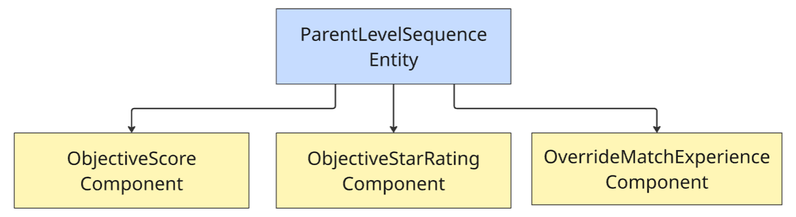

How Level Sequences Work:

1. **Setup Phase** (`Progression_LevelSequenceConfigs.ts:60`):
   - `ParentLevelSequence` component stores parent info and child entities
   - Each child config component registers itself with `LevelSequenceManager`
   - When all children are registered, level sequence becomes “ready”

2. **Activation Phase** (`Progression_LevelSequenceManager.ts:27`):
   - Call `startLevelSequence(levelId)` to activate a level
   - Manager clears previous validators from `ObjectiveManager`
   - Calls `activateConfig()` on each child component in sequence
   - Each config registers its validator or applies its settings

3. **Configuration Types: Objective configurations** (create win/loss conditions)

   - In the hierarchy, navigate to `TutorialLevelPool`: `TutorialLevels` to see the Stages that have already been set up.
   - Create child entities under the parent (e.g. “Stage\_01”)
   - Add a component to the child entity by selecting “Attach Script”
   - In the drop-down bar, search for the config overrides defined in `Progression_LevelSequenceConfigs`
   - Examples:

   * To create a new “Goal” objective to match 30 red tiles, attach component `ObjectiveTileMatch` and assign the `tileType` and `matchAmount` quantities. 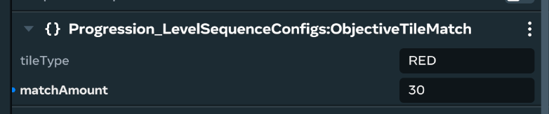
   * To adjust star thresholds, attach component `OverrideStaRatingThreshold` and assign new values to the thresholds. 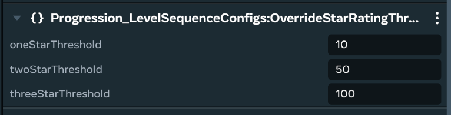

4. **Override Configs** (customize level settings)

   - Similarly, you can override level settings such as the board size and the amount of XP needed for Star Ratings.

   * To assign a unique board size, attach component `OverrideBoardGame` to assign a unique grid size and chance for the same gem to spawn in an adjacent tile. 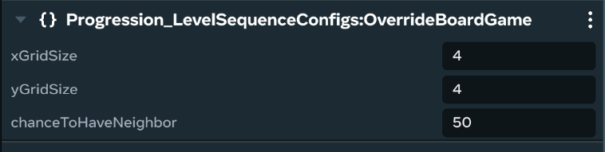
   * To override the amount of XP awarded, attach `OverrideMatchExperience`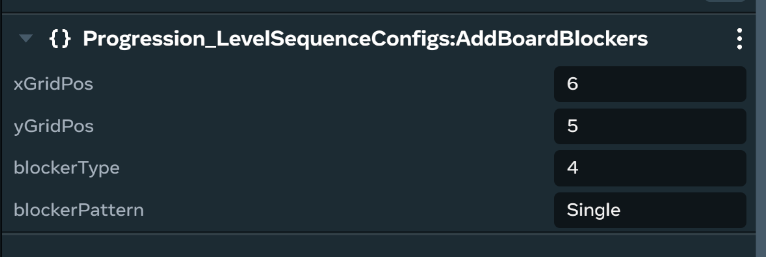
   * To override this level by adding blocker tiles, attach component `AddBoardBlockers`, then define the tile position, the type of blocker, and the `blockerPattern`. 

**Creating a multi-level game**:

In the Horizon Worlds editor:

1. Create a `ParentLevelSequence` component on an entity by clicking the attach script button and selecting `ParentLevelSequence.ts` from the drop down menu.
   - Set `levelId` to unique identifier (e.g., “level\_1”)
   - Set `levelName` to display name (e.g., “Level 1: Easy Mode”)
2. Add child entities with config components:
   ```
   Level
    
   1
    
   Parent
    
   Entity

     
   ├─
    
   Child
   :
    
   ObjectiveStarRating
    
   (
   defines win condition
   )

     
   ├─
    
   Child
   :
    
   OverrideBoardGame
    
   (
   makes board 
   6x6
   )

     
   └─
    
   Child
   :
    
   OverrideMatchExperience
    
   (
   doubles XP rewards
   )
   ```
3. In code, the level is activated by calculating `progressionAPI.levelSequenceManager.StartLevelSequence(LevelID)` and passing in a level ID:
   - All current level IDs can be found in `Tutorial_Definitions.ts:1-10`.
   - Add new levels into this list.

```
// When player selects a level

progressionAPI
.
levelSequenceManager
.
startLevelSequence
(
"level_1"
);


// This will:


// 1. Clear previous objectives


// 2. Apply board override (6x6 grid)


// 3. Apply XP override (double rewards)


// 4. Register star rating objective validator
```

**Objective validator flow**:

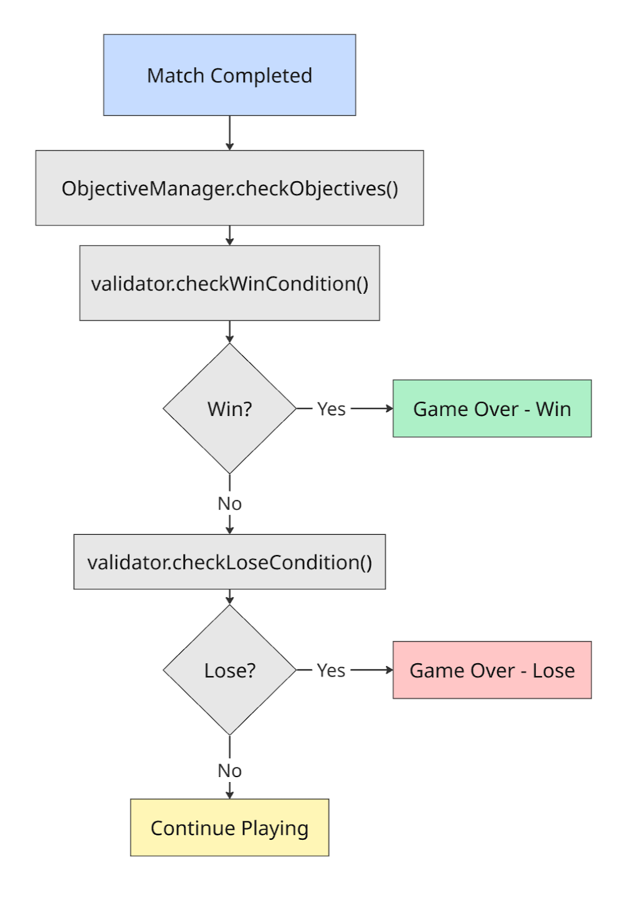

Each validator implements `IObjectiveValidator` interface:

```
interface
 
IObjectiveValidator
 
{

  checkWinCondition
():
 
boolean
;

  checkLoseCondition
():
 
boolean
;

  endReason
:
 
string
;
  
// Description of why game ended


}
```

**Example: progressive difficulty**

```
// Level 1: Easy (generous thresholds)


Level
 
1
 
Configs
:

  
-
 
ObjectiveStarRating
:
 
[
1000
,
 
2000
,
 
3000
]
 
for
 
[
1
,
 
2
,
 
3
]
 stars
  
-
 
OverrideMatchExperience
:
 
[
75
,
 
150
,
 
225
]
 XP per star


// Level 5: Hard (strict thresholds)


Level
 
5
 
Configs
:

  
-
 
ObjectiveStarRating
:
 
[
5000
,
 
8000
,
 
12000
]
 
for
 
[
1
,
 
2
,
 
3
]
 stars
  
-
 
OverrideBoardGame
:
 
10x10
 grid
,
 more tiles 
=
 more complexity
  
-
 
OverrideMatchExperience
:
 
[
50
,
 
100
,
 
150
]
 XP 
(
lower rewards
)
```

Key files to explore:

- `Progression_LevelSequenceManager.ts:27` - Level activation logic
- `Progression_LevelSequenceConfigs.ts:76` - ObjectiveScore implementation
- `Progression_LevelSequenceConfigs.ts:313` - OverrideMatchExperience implementation
- `Progression_ObjectiveValidators.ts:151` - StarRatingObjective validation

### [Progression System Architecture](#progression-system-architecture)

The progression system integrates with other game modules through events:

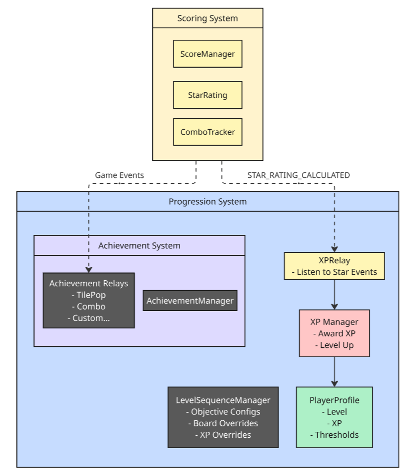

**Event flow**:

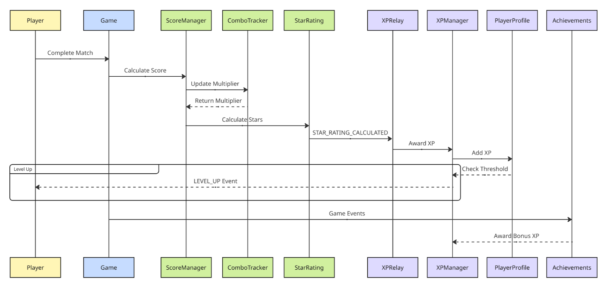

