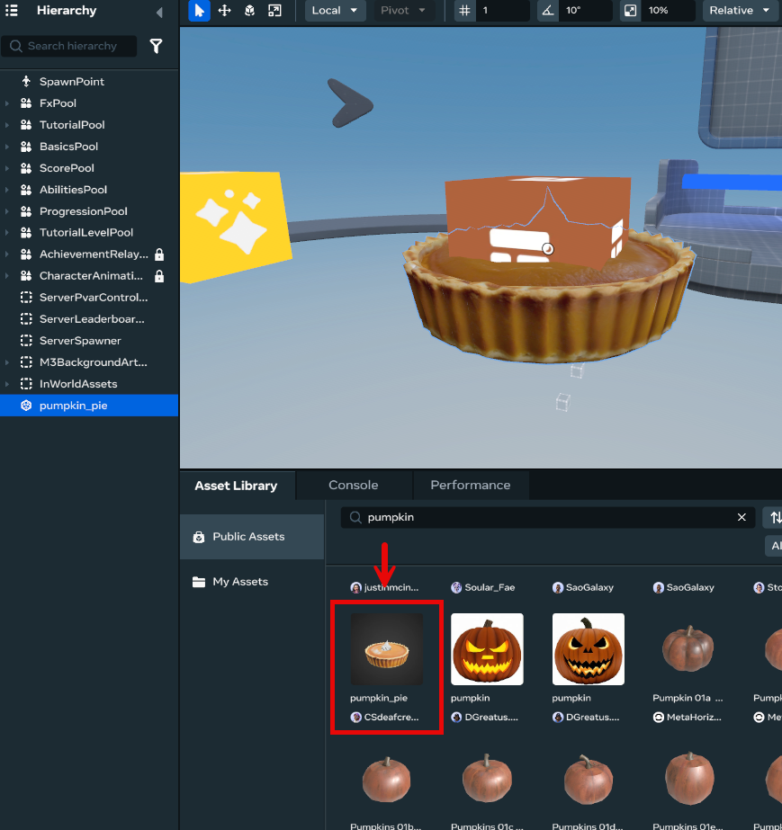
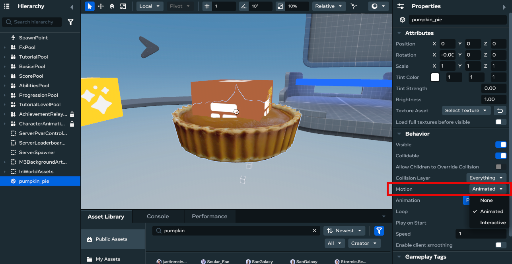
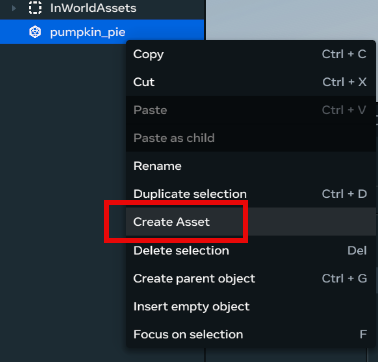
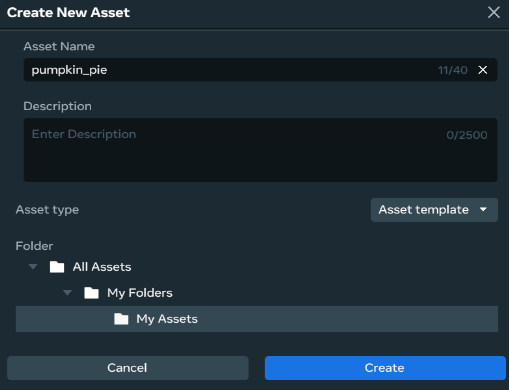
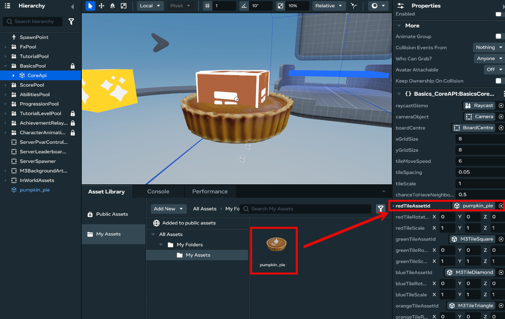
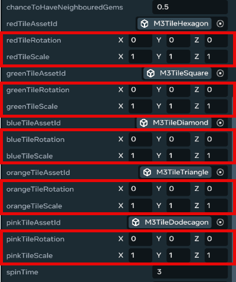
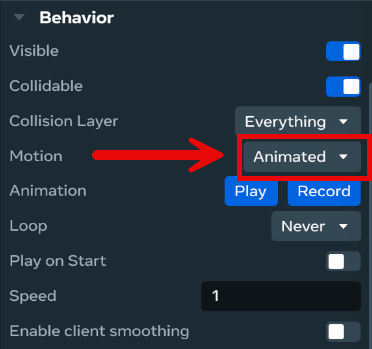
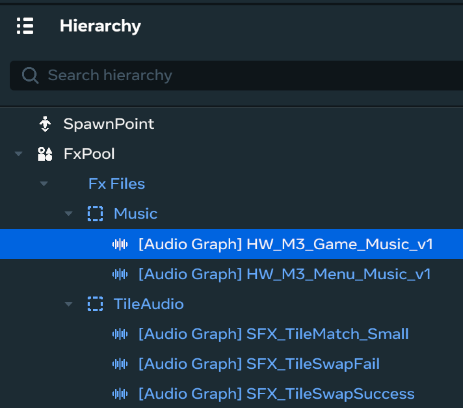

# [Module 5 - Customize your own Match 3 game](#module-5---customize-your-own-match-3-game)

This module covers common questions about customizing your Match 3 game into a fully functioning, personalized experience.

## [How do I add in my own tile assets?](#how-do-i-add-in-my-own-tile-assets)

Swapping the default tile and sound assets with your own designs are some of the most impactful ways to customize your Match 3 game. This guide walks you through those complete processes.

### [Step 1: Creating Your Custom Tile Asset](#step-1-creating-your-custom-tile-asset)

First, you’ll need to create or find the asset you want to use as a tile. For this example, we’ll use a pumpkin asset from Horizon Worlds’ Public Assets library.

1. In your Horizon Worlds editor, open the **Asset Library**.
2. Navigate to **Public Assets**.
3. Search for the asset you want to use (e.g., “pumpkin”).
4. Select the asset and add it to your world.

Once you’ve added your asset to the world, you’ll need to configure it properly before it can work with the Match 3 system.

### [Step 2: Configuring Your Asset](#step-2-configuring-your-asset)

For your custom asset to work correctly with the Match 3 system, you need to configure several important settings:

#### [CRITICAL: Set Motion to “Animated”](#critical-set-motion-to-animated)

This is the most important step. If you skip this, you’ll encounter errors when the game tries to move your tiles.

1. Select your custom asset (e.g., the pumpkin)
2. Open the **Behavior** properties panel
3. Find the **Motion** dropdown
4. Change it from “None” to **“Animated”**

**Why this matters:** By default, objects in Horizon Worlds are set to “Static” (Motion: None), which means they cannot be moved by scripts. Since the Match 3 system needs to move tiles around the board during gameplay, static objects will cause an error: **“Unable to manipulate static entity (moveto)”**. Setting Motion to “Animated” allows the system to move your tile.

#### [Scripts](#scripts)

- Your custom assets do **NOT** need any scripts attached to them
- The existing Match 3 system handles all the logic and will work with any visual asset you provide

Once you’re happy with the configuration, simply right-click on the object in the Hierarchy and select “Create Asset”.

Select a location into your own Asset Library folder (in this case, named “My Assets”) to place the assets into, then select “Create”.

Scale your asset down to be about the size of a 1x1 grid. As an easy reference point, you can click on the **Build** menu in the top left of the editor, choose a Cube from the **Shapes** sub-menu, put it in your world, and scale your new asset to be approximately the same size.

Now that your asset is created, you should be able to use it in the next step.

### [Step 3: Swapping Your Asset Into the Game](#step-3-swapping-your-asset-into-the-game)

Now that your custom asset is configured, you need to tell the Match 3 system to use it instead of the default tiles.

1. Navigate to **BasicsPool** in your Horizon Worlds hierarchy
2. Select **CoreApi**
3. Look at the attached component called `BasicsCoreAPI`.
4. In the inspector, locate the section where default tile assets are referenced
5. Replace the default tile asset reference with your newly created custom asset

You can also configure both the rotation and scale underneath each of the different color tiles if you desire.

### [Troubleshooting: “Unable to manipulate static entity” Error](#troubleshooting-unable-to-manipulate-static-entity-error)

If you encounter the error message **“Unable to manipulate static entity (moveto)”** when testing your game, this is because the object’s Motion setting is incorrect.

**The problem**: By default, objects in Horizon Worlds are set to “Static” (Motion: None), which means they cannot be moved by scripts or game logic. Since the Match 3 system needs to move tiles around the board during gameplay, static objects will cause errors.

**The solution**:

You must set the object’s **Motion** property to **“Animated”** instead of “None”:

1. Select your custom tile asset
2. Open the **Behavior** properties panel
3. Find the **Motion** dropdown
4. Change it from “None” to **“Animated”**

This allows the Match 3 system to move the tile object around the game board during gameplay.

### [Tips for Success](#tips-for-success)

- **Test frequently:** After swapping an asset, test your world to ensure the tile appears correctly and moves properly during gameplay
- **Consistent sizing:** Make sure all your tile assets are roughly the same size so they fit properly on the game board
- **Visual clarity:** Choose assets that are visually distinct from each other so players can easily identify different tile types
- **Performance:** Keep your asset poly counts reasonable to maintain good performance, especially if you plan to have many tiles on screen at once

## [How do I change the audio?](#how-do-i-change-the-audio)

The game uses a centralized audio system that lets you swap sound effects without modifying any code. All audio is organized into **banks** (folders) in the Horizon Worlds editor, and each sound file has a **tag** that scripts use to play the correct sound.

### [Understanding the Audio System](#understanding-the-audio-system)

The game has three main audio components:

1. **FxFiles Entity** - The parent container in your world hierarchy that holds all audio banks
2. **Audio Banks** - Folders that group related sounds together (e.g., TileAudio, ObjectiveAudio)
3. **Audio Graph Items** - Individual sound files within each bank, each with a unique tag

### [Audio Banks in Your Game](#audio-banks-in-your-game)

The game includes the following audio banks:

| **Bank Name**      | **Bank ID**      | **Description**                                       |
| ------------------ | ---------------- | ----------------------------------------------------- |
| **TileAudio**      | `Tile_Bank`      | Match sounds, tile swaps, combos, and obstacle sounds |
| **ObjectiveAudio** | `Objective_Bank` | Win/lose sounds, star ratings, round end              |
| **AbilitiesAudio** | `Abilities_Bank` | Booster and power-up sounds                           |
| **UIAudio**        | `UI_Bank`        | Button clicks and UI feedback sounds                  |
| **Music**          | `Music_Bank`     | Background music tracks for gameplay and menus        |

### [How to Change Audio Files](#how-to-change-audio-files)

#### [Step 1: Locate the Audio in Hierarchy](#step-1-locate-the-audio-in-hierarchy)

1. Open your world in Horizon Worlds Editor
2. In the Hierarchy panel, expand **FxPool**
3. Expand **Fx Files** to see all audio banks

#### [Step 2: Find the Sound You Want to Replace](#step-2-find-the-sound-you-want-to-replace)

1. Expand the relevant audio bank (e.g., **TileAudio** for match sounds)
2. You’ll see a list of \[Audio Graph] items with descriptive names
3. Select the \[Audio Graph] item you want to replace

#### [Step 3: Replace the Audio Asset](#step-3-replace-the-audio-asset)

1. From your asset library, add the new audio asset to the appropriate bank
2. With the new \[Audio Graph] item selected, add the **tag** from the sound you’re replacing
3. Delete the old audio asset

**IMPORTANT**: Do NOT change the **tag** name! The tag is what the code uses to find the correct sound. Only replace the audio asset itself.

### [Common Sound Tags Reference](#common-sound-tags-reference)

Here are the key sound tags you’ll see in each bank:

#### [TileAudio Bank](#tileaudio-bank)

|Tag Name|When It Plays| | --- | --- | |`SFX_TileMatch_Small`|When 3 tiles match| |`SFX_TileMatch_Big`|When 4+ tiles match| |`SFX_TileSwapSuccess`|When a valid swap is made| |`SFX_TileSwapFail`|When an invalid swap is attempted| |`SFX_Obstacle_Damage`|When an obstacle is damaged| |`SFX_Obstacle_Break_Single`|When a single obstacle breaks| |`SFX_Obstacle_Break_Multiple`|When multiple obstacles break| |`SFX_Combo_01` through `SFX_Combo_05`|Combo sounds (currently unused in code)| |`SFX_Combo_Swish_01` through `SFX_Combo_Swish_04`|Swish sounds (currently unused in code)|

#### [ObjectiveAudio Bank](#objectiveaudio-bank)

|**Tag Name**|**When It Plays**| |---|---| |`SFX_Objective_Success`|When completing a level successfully| |`SFX_Objective_Failed`|When failing a level| |`SFX_Objective_StarRating`|When star ratings are shown| |`SFX_Objective_RoundEnd`|When a round ends|

#### [AbilitiesAudio Bank](#abilitiesaudio-bank)

|**Tag Name**|**When It Plays**| |---|---| |`SFX_Abilities_Rocket`|When rocket booster is used| |`SFX_Abilities_Anvil`|When anvil booster is used| |`SFX_Abilities_Shuffle`|When shuffle booster is used| |`SFX_Abilities_UIButton`|When booster UI buttons are clicked| |`SFX_Abilities_Row`|When row-clear power-up is used| |`SFX_Abilities_Column`|When column-clear power-up is used|

### [Tips for Custom Audio](#tips-for-custom-audio)

- Keep your audio files short and crisp for the best player experience
- Match the volume levels of the original sounds so nothing is too loud or quiet
- Use audio file formats supported by Horizon Worlds (typically .wav or .mp3)
- Test your sounds in-game after replacing them to ensure they play at the right moments
- Remember: you can change the audio files as many times as you want without affecting the game code!

## [How do I design a good Match 3 game?](#how-do-i-design-a-good-match-3-game)

Creating a compelling Match 3 game requires thoughtful design, balanced difficulty, and engaging obstacles. This guide helps you optimize your game and deliver the best player experience.

### [Taking Your Game to the Next Level](#taking-your-game-to-the-next-level)

#### [New Obstacle Types](#new-obstacle-types)

Having multiple types of obstacles is a key component of creating a fun and varied match-3 experience.

The Wooden Box Obstacle creates interesting gameplay, but you can also design obstacles that introduce new mechanics and challenges.

#### [Integrating Obstacles into Stages](#integrating-obstacles-into-stages)

When creating a new obstacle, it’s important to consider the player’s gameplay experience when placing them.

**Remember**:

- The more obstacles you have in your stages, the less likely players will have space to make matches.
- Adding multiple obstacle types to a stage can provide the player with a varied experience. However, avoid having too many obstacles in one stage; otherwise, the player may feel overwhelmed by the decisions they need to make.

#### [New Obstacle Examples](#new-obstacle-examples)

Here are some examples you could use to create some fun new obstacles:

**Flowers**

- Tiles can travel underneath this obstacle, making it difficult for players to plan their next move.
- This obstacle can be removed by making a match next to it
- Has multiple layers, making its difficulty variable.

**Concrete Block**

- It can only be damaged by hitting it with power-ups or boosters.
- Has multiple layers, making its difficulty variable.

**Apple Basket**

- Contains ‘apples’ which players need to collect to complete an objective (E.g. Collect 20 Apples)
- Making a match next to an Apple Basket or hitting it with a power-up or booster obstacle rewards the player with an apple.
- Apple Baskets are indestructible and cannot be removed from the board.

#### [Slowly Introduce Obstacles](#slowly-introduce-obstacles)

- Allow the player to understand the core fundamentals of the game before introducing new obstacles.
- When you introduce a new obstacle, make sure players understand its functionality.
- You can do this by creating a level with an easy set of objectives and a high number of moves, so they are unlikely to fail.
- Let the players use a new obstacle for a significant amount of time before introducing a new one.
- It will allow the player to become comfortable with the mechanics of the game and increase the length of their experience.

### [Balancing Your Game](#balancing-your-game)

Here are a couple of things to keep in mind when tailoring your gameplay experience for other players.

#### [Aim for Multiple Difficulties](#aim-for-multiple-difficulties)

Having levels of varying difficulties is good for the player’s gameplay experience, as it makes completing stages feel rewarding.

Consider using the ‘Peaks and Valleys’ philosophy when balancing your stages:

1. Start the player with some easy levels (Valley)
2. Slowly increase the difficulty
3. Have a difficult level that players can eventually overcome (Peak)
4. Reward them with an easier level (Valley)

This allows players to have a varied difficulty experience, fostering a sense of growth and achievement.

You can also use this technique for testing a player’s understanding of new obstacles while also making them feel rewarded.

#### [Modify Player Moves](#modify-player-moves)

Move count will be your strongest tool in determining the difficulty of the stages you create.

- Test your stages after creating them to make sure they can be completed.
- Take note of how many moves it takes to complete and modify the move total to make it easier or harder.

#### [Gameplay Length](#gameplay-length)

- Try to keep each stage’s gameplay between 1 - 3 minutes in duration
- This will allow the player to win/lose quickly and move on to the next stage
- If a stage can be completed too quickly, players won’t find it challenging.

