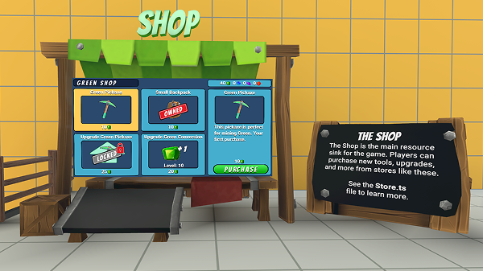
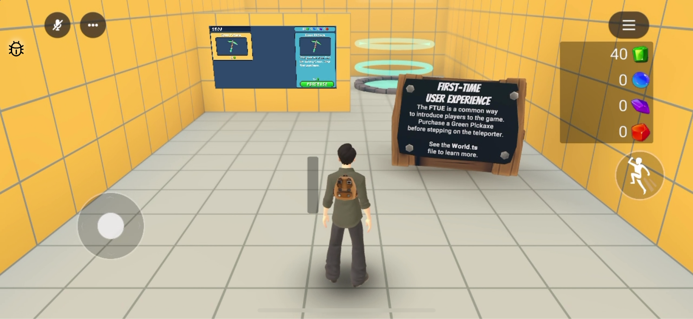
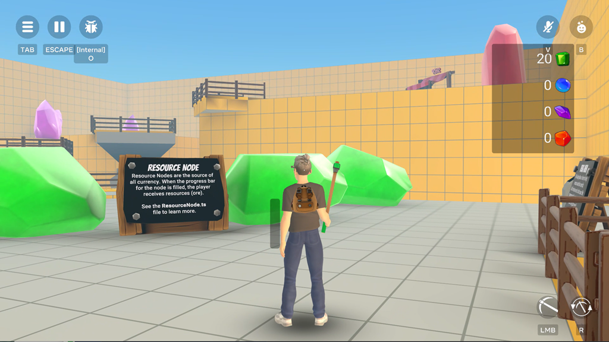
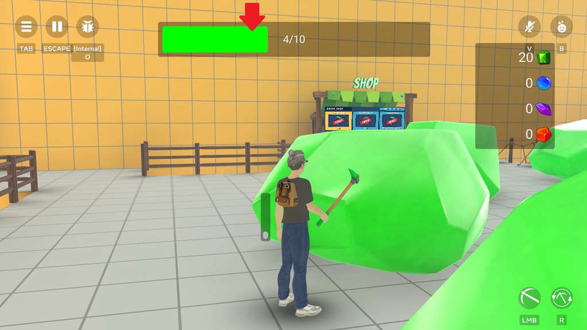
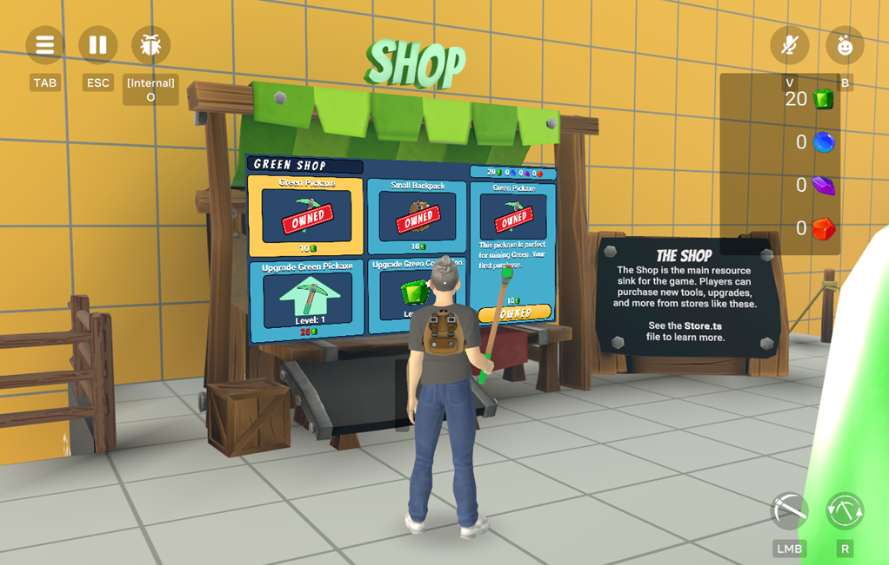

# [Module 0 - Setup](#module-0---setup)

Welcome, creators!

This documentation serves as a companion guide to the **Sim Tycoon** template world, one of the tutorial worlds available in the **Home** section of the Horizon Desktop Editor.

## [Finding and opening the template world](#finding-and-opening-the-template-world)

To access the Custom UI Tutorial World:

1. Open the Horizon Desktop Editor to be taken to the **Creation Home** page.
2. Select **Tutorials** from the left navigation options.
3. Look for **Sim Tycoon Template** in the list of available tutorial worlds and click to open and explore the world.

## [Before you start](#before-you-start)

After creating a new copy of this template world, you need to do the following in the Desktop Editor:

1. Navigate to **Systems** > **VariableGroups**, then create a new variable group.
2. Inside the variable group, add a new player variable called `SaveGame`.
3. To link the new player variable to the code, open the `SaveGame.ts` file and find `pvarsBaseName` variable.
   1. Change the value of this to match your VariableGroup name.
   2. Make sure that the `:` (colon) is on the end of the line.
   3. If you did not name the variable `SaveGame`, you need to update the next line `saveGameKey` with the corresponding variable name.

## [Reference world overview](#reference-world-overview)

This reference world provides you with the foundational systems, components, and project setup to quickly create a mobile-only multiplayer sim tycoon game. The reference world is limited to a maximum of eight players, but you can change that number.

This game genre goes by many different names such as Tycoon Simulator, Progression Simulator, Incremental Tycoon, or Incremental Sim game.

Popular Horizon World games in this genre include Samurai Tycoon, Saber, and Plants.

The key characteristics of this style of game are:

- Players use tools to gather resources
- Players exchange or convert those resources for currency
- Players use that currency to buy and upgrade tools to gather resources faster
- The cycle repeats.

The core gameplay loop (gather, exchange, upgrade) is repeatable which drives player progression and engagement.

The core game components are:

- Tools
- Collectable items (resources)
- Conversions (stores and converter)

## [Explore the reference world](#explore-the-reference-world)

To learn how this reference world works, start by playing the game. New players start in the FTUE (First-Time User Experience) zone.

New players must buy a green pickaxe to activate the teleporter. The teleporter transports players to the main gameplay zone. Once you complete the FTUE, you will spawn at the main zone’s spawn point.

When you spawn in, you’ll be placed on the green platform which contains green resource nodes. Resource nodes are the source of all currencies in the game. Mine the green node by hitting it with your pickaxe. The HUD displays your progress in collecting green gems.

Each time the progress bar is completed, you gain gems and the bar of your backpack UI fills up. Walk towards the center of the world to step on the trigger for the converter. Converting gems turns this resource into currency.

Spend currency at the shops to purchase new items. The top row of the shop sells pickaxes and backpacks. The bottom row offers upgrades to your pickaxe and improved conversion rates.

Cross the bridge to the next platform where you will find new colored resource nodes (blue) and items for sale.

## [Creating your own world](#creating-your-own-world)

### [Editing properties](#editing-properties)

Many of the gameplay systems include properties that can dramatically affect gameplay. Use these designer tools to tune gameplay interactions. For example, look at the tools hidden under the world and the resource nodes.

### [Editing code](#editing-code)

Some changes will require you to modify scripts. Data sections have been implemented for you to modify. We recommend you have a basic understanding of using TypeScript in Horizon Worlds before making changes to scripts.

### [Adding your own art](#adding-your-own-art)

One critical aspect of making your own game is the artwork. Most of the artwork in the sample world can be completely changed. Certain aspects that relate to gameplay, however, will require scripts to be attached. Examples include changing the artwork for tools and resource nodes.

## [Tutorial Modules](#tutorial-modules)

This tutorial is organized into comprehensive modules that build upon each other. Each module focuses on a specific system or component within the sim tycoon game. Work through them in order for the best learning experience:

### [Core Systems](#core-systems)

- **Module 1 - SimPlayer**: Learn about player state management, tool equipping, and resource tracking that forms the foundation of player interactions.
- **Module 2 - Resource Nodes**: Understand the interactive mining objects that players use to gather resources and materials.
- **Module 3 - Tools and ToolGroups**: Explore the tool management system that handles player equipment and tool distribution.

### [Player Equipment](#player-equipment)

- **Module 4 - Pickaxe**: Deep dive into the primary mining tool that players use to extract resources from nodes.
- **Module 5 - Backpack**: Discover the inventory system that manages player storage capacity and resource collection.

### [Economy Systems](#economy-systems)

- **Module 6 - Resource Converter**: Learn how raw resources are converted into currency for purchasing upgrades.
- **Module 7 - Store System**: Understand the shop mechanics that allow players to purchase tools and upgrades.

### [Game Management](#game-management)

- **Module 8 - World Management**: Explore the central game coordination system that ties all components together.
- **Module 9 - SaveGame System**: Implement persistent player data that maintains progress across sessions.

### [User Interface](#user-interface)

- **Module 10 - HUD System**: Create the user interface elements that display player progress and game information.
- **Module 11 - FTUE System**: Build the first-time user experience that introduces new players to the game.

### [Advanced Features](#advanced-features)

- **Module 12 - Global Resource Nodes**: Implement shared resource nodes that multiple players can interact with simultaneously.
- **Module 13 - Teleporter System**: Add transportation mechanics that move players between different game areas.
- **Module 14 - Particle VFX System**: Enhance the visual experience with particle effects and visual feedback.
- **Module 15 - Audio System**: Integrate sound effects and audio feedback to create an immersive experience.
- **Module 16 - Achievement Quest System**: Add progression tracking and achievement systems to increase player engagement.
- **Module 17 - Configuration and Customization**: Learn advanced techniques for customizing and extending the game systems.

