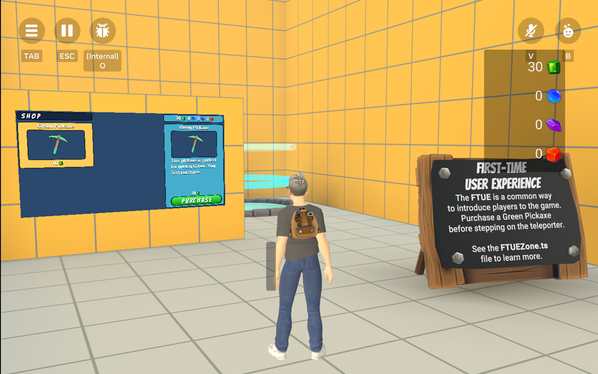

# [Module 11 - FTUE System](#module-11---ftue-system)

The FTUE is a short tutorial where new players learn the basic game mechanics before teleporting to the main gameplay area. It provides a controlled environment for players to understand the core systems.

## [System overview](#system-overview)

The FTUE zone contains a simplified store which only sells the green pickaxe. Players must purchase a green pickaxe to activate the teleporter and to mine in the main gameplay area.



## [How the FTUE works](#how-the-ftue-works)

When a player joins the game world, `World.ts` checks the save game state (`SaveGame.ts`) to determine whether the player has already completed the FTUE. If the player is a first-time user, they are spawned in the FTUE zone.

The following code sample can be found on line 143 of `World.ts`:

```typescript
// If we are First Time Users, port to the intro space
if (!simPlayer.saveGame?.hasCompletedFTUE() && this.props.ftueSpawnPoint) {
  this.props.ftueSpawnPoint.as(hz.SpawnPointGizmo).teleportPlayer(simPlayer.player)
}
```

When the player purchases the green pickaxe, they are marked as having completed the FTUE (even if they do not use the FTUE teleporter). This ensures that the player is spawned into the main play area when they return to this world.

## [FTUE flow](#ftue-flow)

The First-Time User Experience follows this sequence:

1. **Arrival**: New players spawn in the dedicated FTUE area.
2. **Introduction**: Simple UI and guidance introduce the core concepts.
3. **Store Tutorial**: Players learn to navigate and use the store interface.
4. **First Purchase**: Players must buy their first tool (green pickaxe).
5. **Teleporter Activation**: Purchase unlocks the teleporter to the main game area.
6. **Completion Tracking**: FTUE completion is saved to prevent repeat tutorials.

## [FTUE zone design](#ftue-zone-design)

### [Simplified environment](#simplified-environment)

- **Focused Learning**: Only essential game elements are present
- **Reduced Complexity**: Limited options prevent overwhelming new players
- **Clear Objectives**: Obvious goals that guide player actions
- **Safe Practice**: No penalties for experimentation

### [Store configuration](#store-configuration)

- **Limited Inventory**: Only green pickaxe available for purchase
- **Starting Currency**: Players begin with enough currency for first purchase
- **Clear Instructions**: Visual and text cues guide the purchase process
- **Immediate Feedback**: Purchase completion triggers positive reinforcement

## [Integration with save system](#integration-with-save-system)

### [FTUE completion tracking](#ftue-completion-tracking)

The FTUE system integrates with the save game system to track completion status:

```typescript
// Check FTUE completion status
hasCompletedFTUE(): boolean {
  return this.gameData.completedFTUE
}

// Mark FTUE as completed
setFTUECompleted(): void {
  this.gameData.completedFTUE = true
  this.save()
}
```

### [Spawn point determination](#spawn-point-determination)

The World system uses FTUE completion status to determine where to spawn players:

- **New Players**: Spawn in FTUE zone for tutorial
- **Returning Players**: Spawn in main gameplay area
- **Manual Override**: Debug options can reset FTUE status for testing

## [Customization guide](#customization-guide)

### [Modifying FTUE content](#modifying-ftue-content)

1. **Update Store Inventory**: Modify which items are available in the FTUE store.
2. **Adjust Starting Resources**: Change initial currency or tool allocations.
3. **Customize Instructions**: Update guidance text and visual cues.
4. **Modify Requirements**: Change what constitutes FTUE completion.

### [Adding FTUE steps](#adding-ftue-steps)

1. **Define New Objectives**: Create additional learning goals.
2. **Implement Progress Tracking**: Track completion of each step.
3. **Update Save Data**: Include new progress flags in save system.
4. **Create Visual Feedback**: Provide clear indication of progress.

### [FTUE environment design](#ftue-environment-design)

1. **Simplified Layout**: Keep the environment focused and uncluttered
2. **Clear Pathways**: Guide player movement with obvious routes
3. **Visual Hierarchy**: Use color, size, and positioning to highlight important elements
4. **Consistent Theming**: Maintain visual consistency with the main game

## [Testing and validation](#testing-and-validation)

### [FTUE testing checklist](#ftue-testing-checklist)

- **New Player Experience**: Test with fresh save data
- **Completion Tracking**: Verify FTUE completion is properly saved
- **Spawn Behavior**: Confirm returning players skip FTUE
- **Store Functionality**: Ensure FTUE store works correctly
- **Teleporter Activation**: Test teleporter unlocking after purchase

### [Common issues and solutions](#common-issues-and-solutions)

#### [Players stuck in FTUE](#players-stuck-in-ftue)

- Verify your purchase requirements are achievable
- Check that FTUE completion is properly triggered
- Ensure teleporter activation conditions are met

#### [FTUE not triggering for new players](#ftue-not-triggering-for-new-players)

- Confirm save game system is properly configured
- Check spawn point assignments in World.ts
- Verify FTUE completion flag is correctly initialized

## [Best practices](#best-practices)

### [Design principles](#design-principles)

- **Keep It Simple**: Focus on core mechanics only
- **Progressive Disclosure**: Introduce concepts gradually
- **Clear Feedback**: Provide obvious confirmation of success
- **Forgiving Design**: Allow experimentation without harsh penalties

### [Technical implementation](#technical-implementation)

- **Efficient Save Operations**: Minimize save frequency during FTUE
- **Error Handling**: Gracefully handle edge cases and errors
- **Performance Optimization**: Keep FTUE zone lightweight for smooth performance
- **Accessibility**: Ensure FTUE works well on all supported devices

### [Player experience](#player-experience)

- **Respect Player Time**: Keep FTUE concise and focused
- **Build Confidence**: Start with easy wins to build player confidence
- **Set Expectations**: Clearly communicate what players will learn
- **Smooth Transition**: Provide seamless progression to main gameplay

