# [Create your first world tutorial, part 1](#create-your-first-world-tutorial-part-1)

Welcome to part 1 of the create your first world tutorial. In this tutorial you’ll learn how to create a basic new world, hosting a simple game where you shoot marauding skeletons in a graveyard.

This first part shows you how to create a new world, place an asset in the world, manipulate it using the desktop editor, then preview the world and playtest it on a mobile device. If you’re looking for the second half of the tutorial, go to the [Create your first world tutorial, part 2](Create%20your%20first%20world%20tutorial%2C%20part%202.md).

The key things you should learn from this module are the following:

- Setting up your tooling
- Creating a new world
- Selecting assets to use in your world and learning how to manipulate them
- Previewing your world for playtesting
- Playtesting in your world on your mobile device

**Note**: This tutorial assumes that you’ve completed the prerequisites discussed in [Intro Tutorial Overview](https://developers.meta.com/horizon-worlds/learn/documentation/get-started/create-your-first-world-intro).

## [Step 1: Create a new world](#step-1-create-a-new-world)

*In this section, you’ll create a new world for your game.*

1. Open the Worlds desktop editor.

   

2. On the **Creation Home** page, click **New World**.

   

3. When the desktop editor opens, click **Rename World** from the main menu.

   

4. Provide a name for your new world

   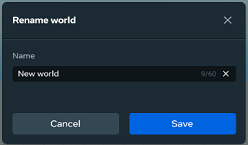

   **Note**: If you do not provide a name for your new world, it will still exist and be saved as normal. However, the next time you open it, it will be called “New World” with the count of how many worlds you’ve created without names appended to it (for instance, “New World 4.” If you do this several times, you may end up with multiple worlds called by similar names, potentially causing confusion. You can always rename it to something else at a later time.

5. Click **Save**.

**Note**: Meta Horizon Worlds automatically saves your progress as you go.

## [Step 2: Place assets in the scene](#step-2-place-assets-in-the-scene)

Assets are objects that you can place in your world so that players can interact with them. Tables, chairs, laser guns, doors, and so on, are all potentially assets you can use. There are many assets created both by Worlds developers and by other creators that are available in the public asset library, which you’ll use in this tutorial. Public assets are displayed on the **Public Assets** panel of the **Assets Library** tab in the center bottom of the desktop editor. You can also create your own assets, which are stored in the **My Assets** panel of the same tab.

In this section, you will learn how to place an asset from the public assets into your scene. (Just like in a movie, a *scene* is a sequence of continuous action that’s usually oriented around a particular location. Many games consist of many scenes, although this one includes just one).

The **Scene** panel is the large window in the middle of the desktop editor. It shows the scene that you are currently working on, letting you see what it looks like so far. When you add assets to a scene, this is where they appear. **Note**: To learn more about this part of the UI (user interface), see [Panels and tabs in the desktop editor](../../Desktop%20editor/Get%20started%20with%20Desktop%20Editor/User%20interface/Panels%20and%20Tabs%20in%20the%20desktop%20editor.md).

1. On the **Asset Library** tab, select **Public Assets**.

   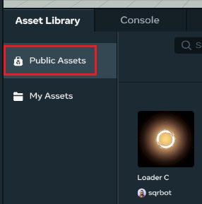

2. In the search field, search for *Unfinished Graveyard* in the search field.

   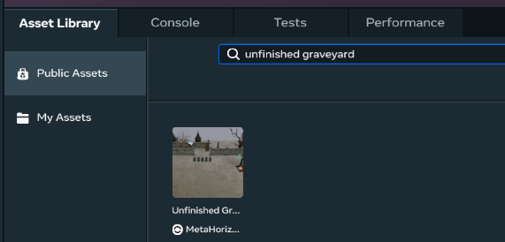

3. When the asset is shown, drag it into the **Scene** panel. This will place the the *unfinished graveyard* withing the scene you’re working on.

   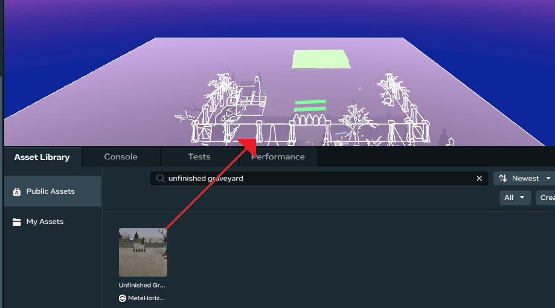

4. In the **Hierarchy** panel, select **MyFirstWorld**.

   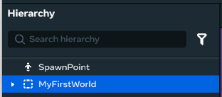

   Then, in the **Properties** panel, enter *0*, *0*, *0* for the **Position** and **Rotation** values.

   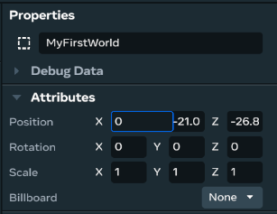

   The **Hierarchy** panel shows you the list of objects in the current scene. You can use this panel to sort and group the objects as needed. By selecting a particular object in the panel, you can see (and edit) the various properties of that object in the **Properties** panel. In this case, by selecting the top level of the hierarchy (**MyFirstWorld**), this allows you to change the position and rotation for all the child objects under that parent object.

   To explore this subject in greater depth, see the [Hierarchy panel overview](../../Desktop%20editor/Hierarchy%20window/Hierarchy%20panel%20overview.md) and the [Properties panel](../../Desktop%20editor/Get%20started%20with%20Desktop%20Editor/User%20interface/Panels%20and%20Tabs%20in%20the%20desktop%20editor.md#properties-panel).

5. Center the graveyard in the scene panel by moving the camera to get a better view. There are many different key shortcuts for doing maneuvering the camera, but the ones you’ll probably use the most are:

   - **Up**: Right-click + E
   - **Down**: Right-click + Q
   - **Left**: Arrow Left, or right-click + A
   - **Right**: Arrow Right, or right-click + D
   - **Forward**: Arrow Up, or right-click (on your mouse) + W
   - **Back**: Arrow Down, or right-click + S

   You can find a full list of the shortcuts by clicking **Keyboard Shortcuts** on the main menu.

   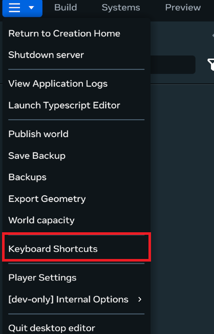

   **Note**: It’s often much easier to work on specific areas of a scene when they’re center-stage. Being able to move the camera can also help you select a particular object when you don’t know the name its been given.

6. In the **Hierarchy** panel, select **SpawnPoint**.

   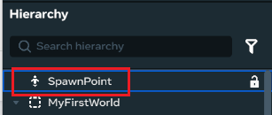

   This selects the player avatar and lets you move to a new position within the scene. **Note**: A *SpawnPoint* is a designated location within game where players appear (or “spawn”) when they enter the world. These are important for managing player entry and movement within the game.

7. Focus your camera on the avatar by pressing the **F** key.

   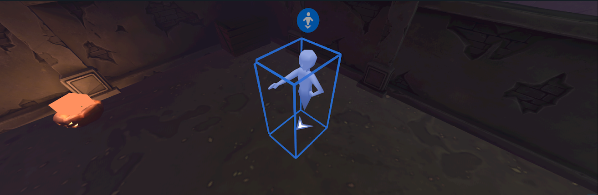

8. Select the **Move** tool to move the avatar around the scene.

   

   When you click the **Move** tool with the avatar selected, a small three-dimensional (3D) coordinate system appears on the object.

   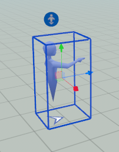

   It has arrows going along the red X (left-right), green Y (up-down), and blue Z (forward-back) directions. You can move the avatar in any of those directions by clicking and dragging on one of the arrows.

9. Select the **Rotate** tool to rotate the avatar about its center or pivot point.

   

   When you click the **Rotate** tool with an object selected, a small three-dimensional (3D) set of angles appears on the object.

   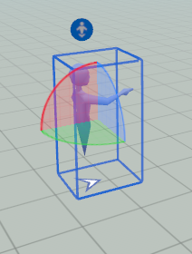

   Each angle shows the rotation around the center point of the avatar: the red X (horizontal), green Y (vertical), and the blue Z (forward-back) directions. You can rotate the avatar in any of those directions by clicking the angle and dragging it so that the object rotates the desired amount.

10. Adjust the camera to view the scene more easily, if needed.

    You can:

    - Orbit the camera around the avatar by holding Alt + the left mouse button while you drag the mouse.
    - Pan the camera using the left and right arrow keys, or by clicking the mouse scroll wheel and dragging the mouse.
    - Zoom in and out by rolling the mouse scroll wheel.

11. Use the **Move** and **Rotate** tools to move the avatar so that it will face the front of the tombstones in the graveyard. This will be the player’s starting position. 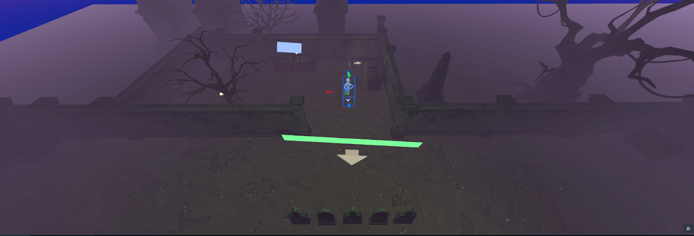

## [Step 3: Previewing your progress](#step-3-previewing-your-progress)

Playtesting your game during and after you’ve finished creating it is an essential part of being a Worlds creator. As experienced developers know, it’s too easy to miss essential things if you don’t playtest it enough.

For additional information on doing this, see [Preview](../../Desktop%20editor/Get%20started%20with%20Desktop%20Editor/Preview%20mode.md).

1. Click the play button to enter preview mode.

   

2. Move your avatar around using the arrow keys to get a feel for how your users will experience your world. You can also change the direction the avatar faces using your mouse.

   **Note**: The avatar displayed in the playtest will probably be your own personal avatar. In the actual game, the avatar of the user will be used.

   

3. When you’re done moving your avatar around, exit the preview mode by pressing **Escape** twice.

## [Step 4: Completing the graveyard](#step-4-completing-the-graveyard)

1. In the graveyard, select the back walls leading up to the gate.

   Do this by clicking one wall or post, holding the **Ctrl** key, and then clicking each one until you’ve got them all. Don’t forget the posts between the wall sections! You can also do this by selecting multiple files in the **Hierarchy** panel, but you may find this more difficult both because of the number of items and the obscure object names.

   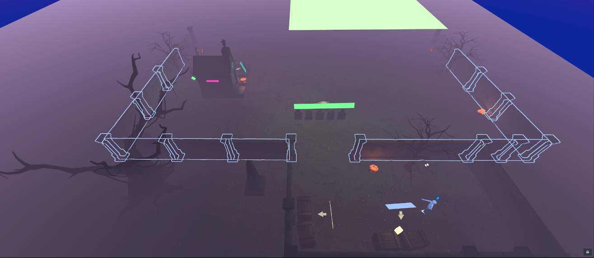

   **Note**: It may be easier to see the individual objects that make up the wall if you select **MyFirstWorld** in the **Hierarchy** panel. This will show the outlines of all the objects in the **Scene** panel.

   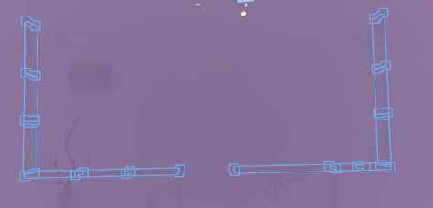

2. Select the **Move** button and then press **Ctrl** + **D** to duplicate these objects. Use the tools that you learned in Step 2 of this tutorial to move the walls to the

   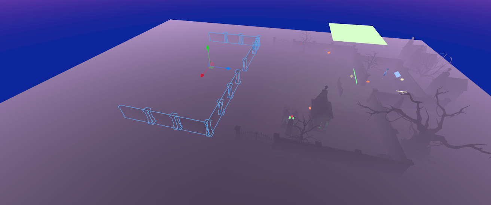

3. Rotate the walls 180 degrees and line them up with the backside of the gate. Now you have an enclosed graveyard.

   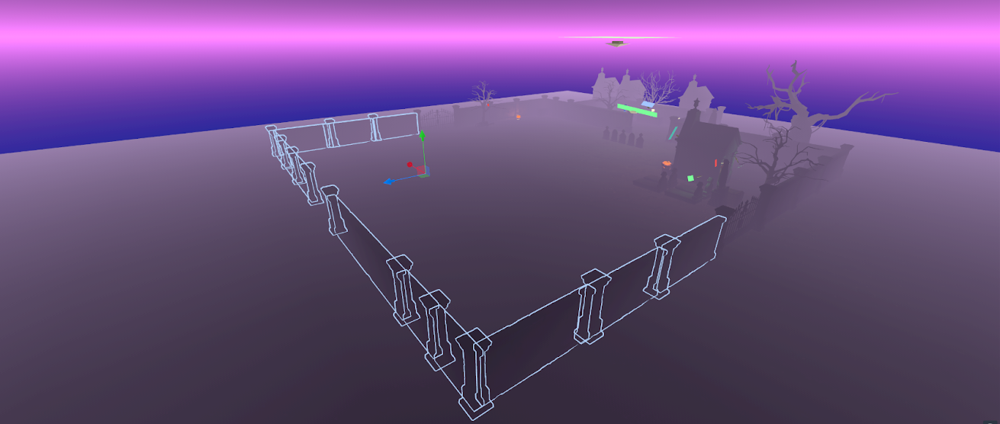

4. Use the other assets in the world to finish creating the graveyard. Feel free to get creative and add objects from the [asset library](../../VR%20tools/Getting%20started/Use%20the%20Asset%20Library%20in%20Meta%20Horizon%20Worlds.md).

   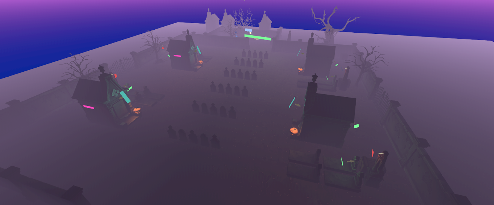

## [Step 5: Play in your world on mobile](#step-5-play-in-your-world-on-mobile)

1. Click the **Publish** button in the upper right of your screen or select **Publish World** from the main menu.

   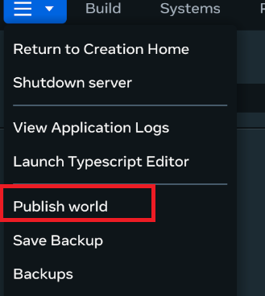

2. In the **Publish World** dialog, complete the required information and any additional details that you want to add. The following items are required:

   - **Name**
   - **Age Rating**
   - **Tags**
   - **Availability**
   - **Comfort Rating**

   Ensure that the option you select from the list for **Availability** includes mobile. If you don’t wish your world to be visible to the public, ensure that the **Visible to Public** option is not selected.

   **Note**: Do no select **Members-only world** at this time. Once this is done and the world is published, this cannot be changed.

   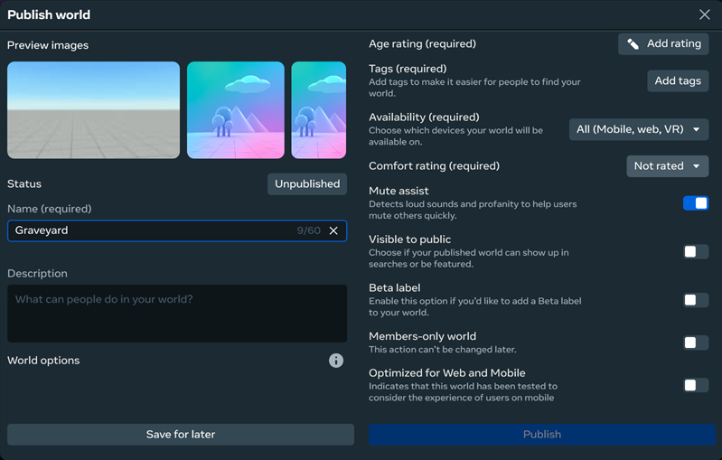

3. Click **Publish**.

   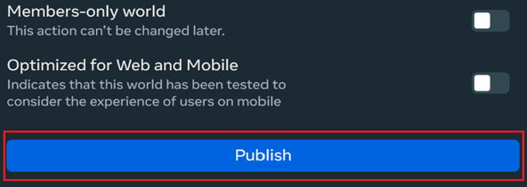

   For additional information on publishing your world, see the [Publish](../../Save%2C%20optimize%2C%20and%20publish/Publish%20your%20world.md) page.

4. Click **Preview tab**.

   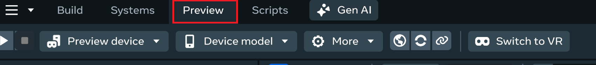

5. From the **Preview Device** list, select **Mobile**.

   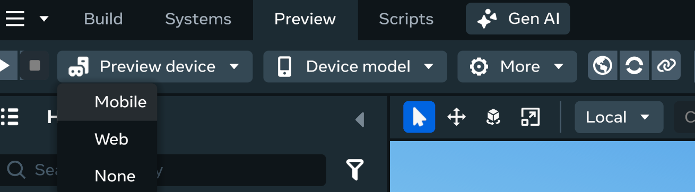

6. From **Preview actions**, select **Send preview build link to the Meta Horizon mobile app**.

   

   **Note**: If you do not have the Meta Horizon mobile app installed, you can install it and repeat this step, view the published world in your browser, or share the web link with others. For more information, see [Preview device](../../Desktop%20editor/Get%20started%20with%20Desktop%20Editor/Preview%20mode.md#preview-device).

7. Open the Meta Horizon app on your mobile device, find the build link under **Notifications** to play in your world.

   For more related information, see [Testing worlds on mobile](../../Mobile%20and%20web/Testing%20worlds%20on%20mobile%20and%20web.md#mobile).

## [What’s Next](#whats-next)

**Congratulations!** You’ve finished Part 1 of the Introductory Tutorial: Creating Your First World

Now go to the [Part 2 of the tutorial](Create%20your%20first%20world%20tutorial%2C%20part%202.md) to learn how to import custom models and write your first script.

