# [Create your first world tutorial, part 2](#create-your-first-world-tutorial-part-2)

**Welcome to Part 2 of the Creating Your First World Tutorial**

In this tutorial, you’ll continue to learn how to create a simple game in Horizon Worlds, where you shoot marauding skeletons in a graveyard. Where [Create your first world tutorial, part 1](Create%20your%20first%20world%20tutorial%2C%20part%201.md) showed you how to create a new world and build the basics of the game, part 2 will take you a bit farther. Part 2 shows you how to import custom models, which are complex 3D models that are not available in the public asset library. You won’t be creating them here—you’ll use demo assets so you can see how they’re imported. Once you’ve done that, the tutorial shows you how to write a basic script and attach it to the entity to create behavior. The tutorial ends with testing the simple game in virtual reality.

Creating customs models is outside the scope of this tutorial, but if you want to find out more about them, see [Creating a custom model](../../Custom%20models%20\(FBX\)/Creating%20custom%20models%20for%20Horizon%20Worlds/Creating%20a%20Custom%20Model.md).

If you’re looking for the first half of the tutorial, go to the [Introductory Tutorial part 1](Create%20your%20first%20world%20tutorial%2C%20part%201.md).

The key things you should learn from this module are the following:

- Importing custom models into your world
- Adding entities to your game
- Scripting entity behavior
- Trying your world in virtual reality

**Note**: This tutorial assumes that you’ve completed the prerequisites discussed in [Create your first world tutorial introduction](https://developers.meta.com/horizon-worlds/learn/documentation/get-started/create-a-new-world-intro).

This part of the tutorial requires that you first complete [part 1](Create%20your%20first%20world%20tutorial%2C%20part%201.md), as this is a continutation of that process.

## [Step 1: Add a pedestal and a rifle](#step-1-add-a-pedestal-and-a-rifle)

In part 1 of this tutorial, you created the graveyard. But if you’re going to hunt marauding skeletons, you’ll want to add a rifle and a pedestal to make it easier (otherwise you’d have to use your hands and that gets messy…)

1. Download the [Demo Assets](../../_assets/misc/57c2704c3a8466018227d9aa647b44f7f8c205c5e4eadbd16c3112a0374cbfbf.zip) .

   This file is a zip archive that contains a number of pre-made assets that you’ll add to your game (like the rifle).

2. Extract the contents of the zip archive. folder.

   a. Open the downloaded zip file.

   b. Click **Extract all**.

   c. Browse to a location for the folder on your local hard drive and click **Extract**.

3. Add the pedestal to the scene. To do this, click **My Assets** on the **Asset Library** tab at the bottom of the screen

   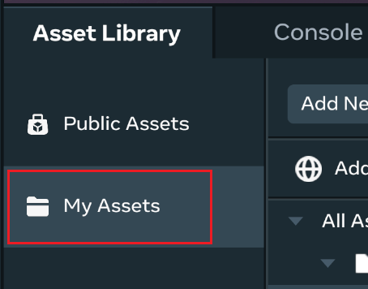

4. From the **Add New** list, select **3D Model**.

   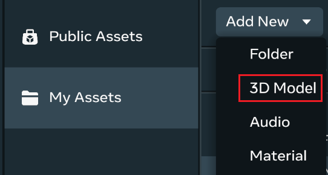

5. In the **Import Models** dialog box, enable **Preserve offset pivots** if it isn’t selected already.

   Because of the way they move, certain assets use [offset pivot points](../../Desktop%20editor/Assets/Use%20offset%20pivots.md), where the point around which they turn or pivot is offset from the center of the asset. This is so animation of the asset can look natural.

   Ignore the warning the dialog box shows: all the assets that this tutorial works with are [single mesh](https://developers.meta.com/horizon-worlds/%20learn/documentation/custom-model-import/creating-custom-models-for-horizon-worlds/materials-guidance-and-reference-for-custom-models) files.

   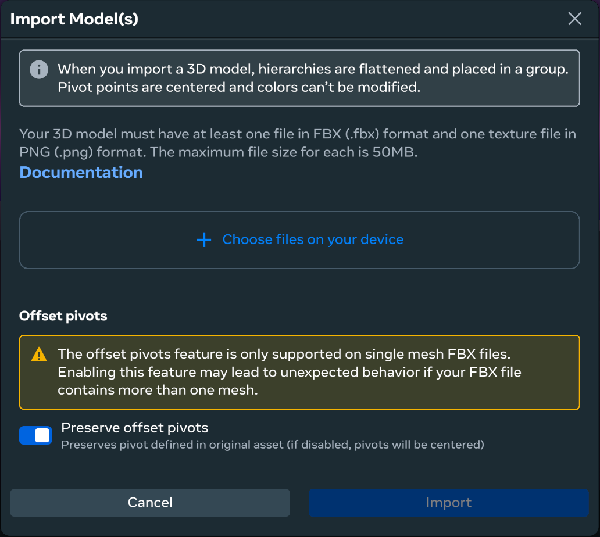

6. Click **Choose files on your device**, then navigate to the folder in which you extracted the demo assets.

   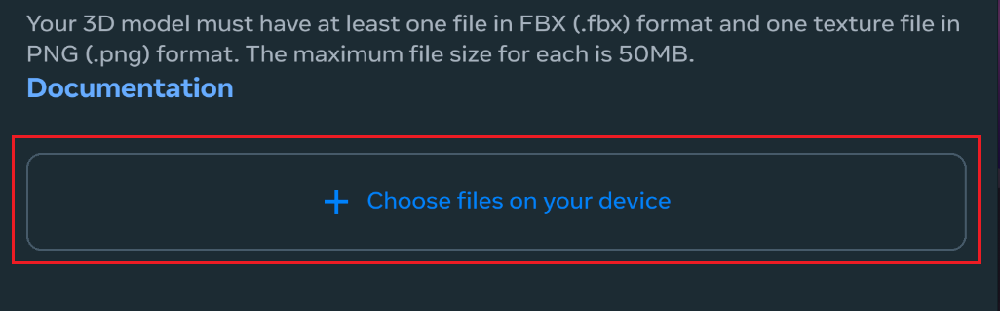

7. From the folder on your hard drive, select the `SingleBlock.fbx` and `StoneBlockKit_BR.png` files, and then click **Open**. `SingleBlock.fbx`is the 3D model file (or `.fbx` file) and `StoneBlockKit_BR.png` is its associated texture file. These are the files that make up the pedestal asset.

   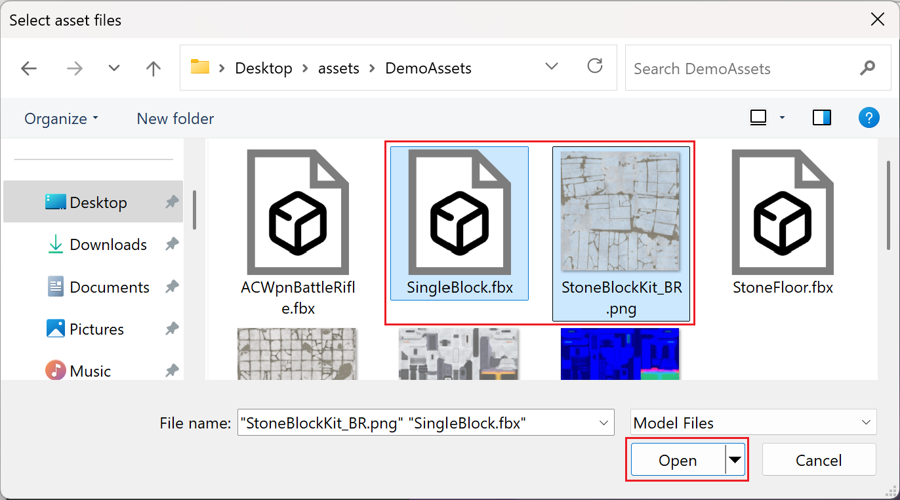

   These are then displayed in the the **Import Models** dialog box.

   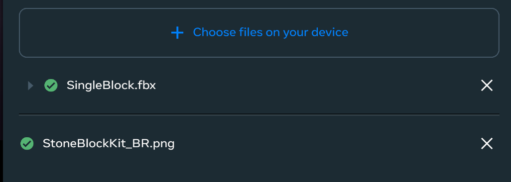

8. Click **Import**.

   **Note**: If you decide to leave your world at this point, it’s important to wait for the asset files to be imported into the desktop editor before you leave.

   The SingleBlock asset will appear in your library when it’s been imported

   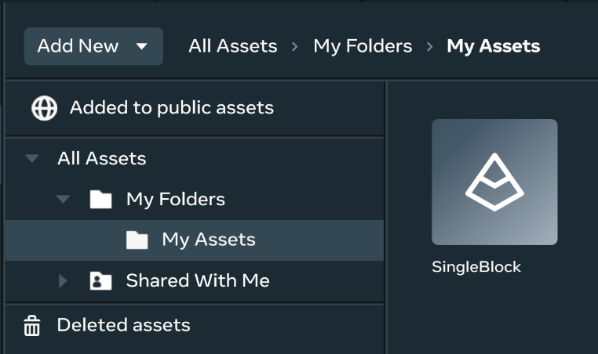

9. After the asset files have been imported, drag the SingleBlock asset into the scene.

   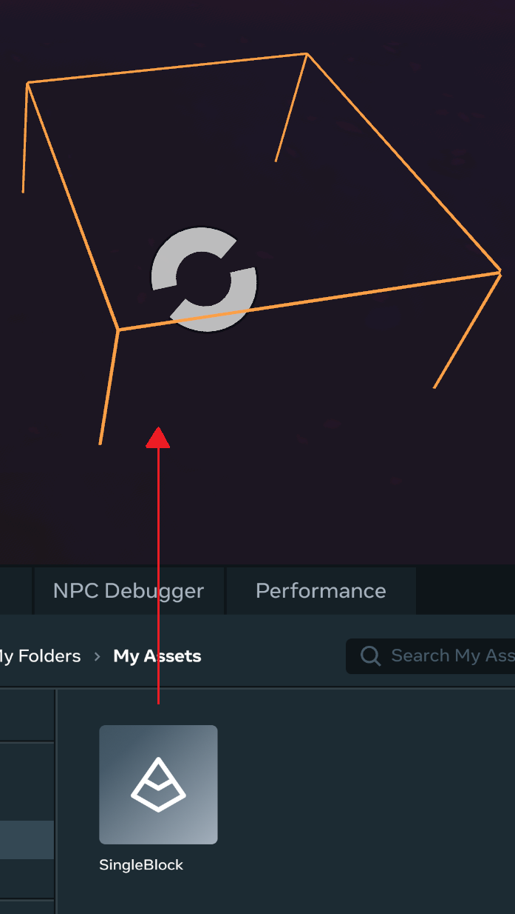

   The SingleBlock asset appears in the **Hierarchy** panel as an object named “SingleBlock”.

10. In the Hierarchy, rename the “SingleBlock” object to “Pedestal”.

11. Enable **Snap to surfaces** by clicking the **Snap to Surfaces** button. This allows you to easily position the base of the object along the ground.

    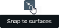

12. With the Pedestal object selected in the Hierarchy, position it by dragging it by the orange dot. You can place the Pedestal anywhere on the ground.

    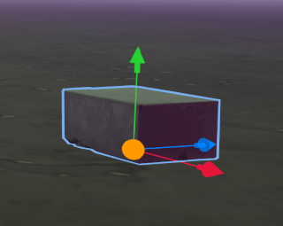

13. Add the rifle asset to the scene.

    a. Open the **Assets** panel by clicking the **Assets** tab.

    b. Click **Add New**, and then click **3D Model**.

    c. In the **Import Models** dialog box, disable **Preserve offset pivots** because the 3D model for the rifle uses [more than one material for the mesh in the FBX file](../../Custom%20models%20\(FBX\)/Creating%20custom%20models%20for%20Horizon%20Worlds/Multiple%20Materials%20per%20Mesh.md).

    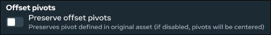

    d. Select the asset files to import by clicking **Choose files on your device**.

    e. In the file picker window that appears, select the 3D model file (ACWpnBattleRifle.fbx) and its associated texture files (WpnBattleRifleA\_BR.png, WpnBattleRifleA\_MEO.png, WpnIndictator\_BR.png, and WpnIndictator\_MEO.png), and then click **Open**.

    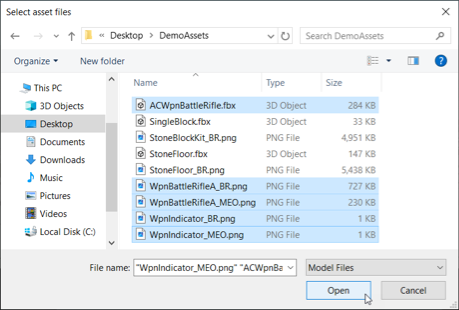

    f. In the **Import Models** dialog box, click **Import**. Wait for the asset files to be imported into the desktop editor.

    

    g. Drag the rifle asset into the scene, and place it upon the Pedestal.

    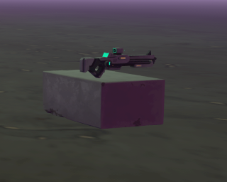

    **Note**: If you’re having difficulty positioning the rifle, remember that you can always use the orange surface snapping manipulator to move objects anywhere along the ground. You can activate it by pressing the “W” key. Optionally, using “Ctrl+G” lets you group the pedestal and rifle as one object, so you can move them together.

14. In the Hierarchy, rename the “ACWpnBattleRifle” object to “Rifle”.

Your Hierarchy should now look like this.

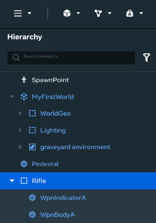

## [Step 2: Make the rifle grabbable](#step-2-make-the-rifle-grabbable)

In this section, you’ll learn how to make the rifle grabbable by the avatar.

1. Select the Rifle object from the Hierarchy.

2. In the Property panel, set the following two property values:

   **Motion** = “Interactive” and **Interaction** = “Grabbable”

   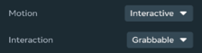

   **Note:** The **Interaction** property appears only after you set the **Motion** value to “Interactive”.

## [Step 3: Try-out your new world](#step-3-try-out-your-new-world)

In this section, you’ll try-out your new world to see what it’s like to pick up the rifle.

1. Click the Play button on the menu bar to enter preview mode.

   **Note**: Ensure you’ve configured world simulation to start automatically whenever you start the preview mode. Click the the ellipsis icon to open **Preview Configuration** and toggle on **Auto-start simulation on Preview entry** and **Auto-stop simulation on Preview entry**.

   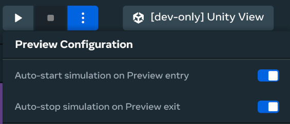

2. Maneuver the avatar over to the rifle using the arrow keys, and then pick it up by pressing the “E” key. 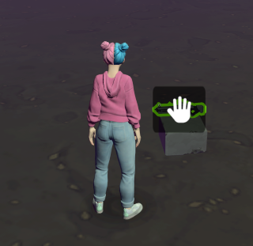 The way the avatar holds the rifle looks somewhat awkward, but don’t worry, you’ll soon fix that. 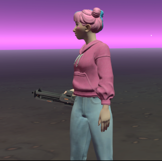

3. Exit preview mode by pressing Escape twice.

4. Fix the way the avatar holds onto the rifle. With the Rifle object selected in the Hierarchy, in the Property panel, scroll down to the **More** section, and enable both **Use VR Grab Anchor** and **Use HWXS Grab Anchor**. 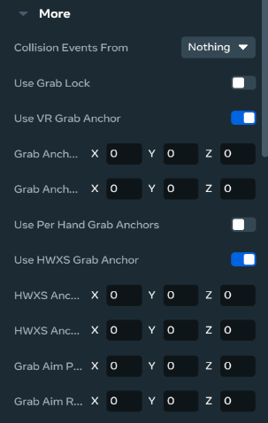

5. Set a pose to use when the avatar holds onto the rifle. With Rifle selected in the Hierarchy, scroll down through the property list until you see **Avatar Pose**. Click the drop-down menu beside it, and then select **Rifle**. 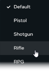 Now your avatar can hold onto the rifle properly. 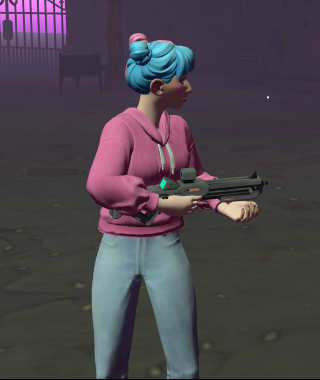 But the rifle still doesn’t do anything yet.

   ## [Step 4: Add a hello world script](#step-4-add-a-hello-world-script)

   You now have a rifle that you can pick up and move around with, but it still doesn’t do anything. In this section, you’ll make something happen when you fire the rifle. You’ll write code that prints “Hello World” in the **Console** whenever you fire the rifle.

6. Open the **Scripts Panel** by clicking the **Scripts** tab. 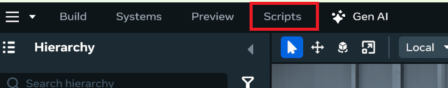

7. Open the **Scripts in this world** dialog. 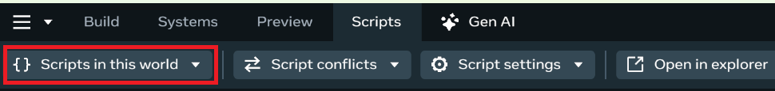

8. Create a new script by clicking the plus button. 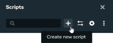

9. Name your script “Shoot”. **Note:** It takes a few seconds for the script to appear after you’ve inputted the name.

10. Open the script in VS Code. Click the menu icon next to the script name, and then select **Open in External Editor**. **Note:** Currently, scripts can only be opened in the aforementioned way, from the top dropdown menu. 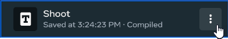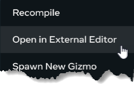 The new script opens in VS Code in a file called `Shoot.ts`. It contains boilerplate code. 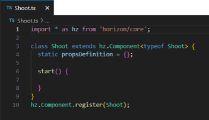**Note:** The `start()` function is called whenever the entity that the script component is attached to is created. At this point though, you haven’t attached this script component to an entity.

11. Add the following debug statement to the `start()` function. When the entity that this script component is attached to is created, this statement prints “Hello World!” to the **Console**.
    ```typescript
    start() {

        console.log("Hello, World!");

    }
    ```

12. Save the script file. You can press “Ctrl+S”.

13. In the desktop editor, attach your script component to the rifle entity. a. Select the Rifle object from the Hierarchy. b. In the Properties pane, scroll down to the **Scripts** section. 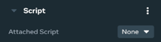 c. Attach the script component by selecting “Shoot:Shoot” from the **Attached Script** drop-down selection list. 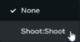

14. Preview your world by clicking the Play button on the menu bar. As soon as the Rifle entity is created, the script prints “Hello, World!” to the **Console**.

15. End the preview by pressing Escape twice.

16. You can see the debug message by clicking the **Console** tab at the bottom of the page. 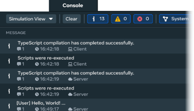 You’ve made your world interactive. The script outputs the message “Hello, World!” to the **Console**.

    ## [Step 5: Refine your script](#step-5-refine-your-script)

    But you really want the interaction to occur when you pull the trigger, not simply when the rifle is created. In this section, you’ll revise your script to print a message when you pull the trigger. When the rifle is created, an event is also created that fires each time you pull the trigger.

17. Replace the code in the `start()` function with the following code:
    ```typescript
    start() {

        // React to an event when the user pulls the trigger.

        this.connectCodeBlockEvent(this.entity, hz.CodeBlockEvents.OnIndexTriggerDown, (player: hz.Player) => {

            console.log("boom!");

        });

    }
    ```

18. Save your script. When editing your script, errors might appear in the **Console**. When this happens, you can clear the error messages from the **Console** by clicking **Clear**. 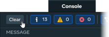**Note:** Normally, you shouldn’t see any error messages in the **Console** window. If you do though, then try copying and pasting the code instead of typing it yourself.

19. Preview your world by clicking the Play button.

20. Walk over to the rifle and grab it.

21. Fire the rifle several times by clicking the **A** button on the screen. As you fire the rifle, notice that a “boom!” message appears in the **Console** window along with the number of times that the message appeared. 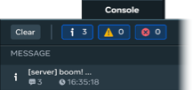

22. End the simulation by pressing Escape.

    ## [Step 6: Add a projectile launcher to the rifle](#step-6-add-a-projectile-launcher-to-the-rifle)

    You now have a rifle that you can pick up and carry around, but it doesn’t actually do anything except print debug messages. In this section, you’ll make the rifle launch projectiles.

23. Select the Rifle from the Hierarchy.

24. Focus on the Rifle in the scene by pressing the “F” key.

25. Click the **Build** button. 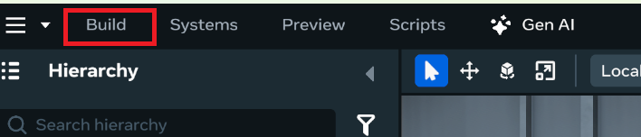

26. Select **Projectile Launcher** from Interactions.  The **Projectile Launcher** gizmo appears in the scene, and in the Hierarchy. Pressing the “F” key while the object is selected brings the object to focus.

27. Close the **Build** panel.

28. Attach the ProjectileLauncher to the Rifle by making it a child of the Rifle. In the Hierarchy, drag the projectile launcher, and drop it onto the Rifle. 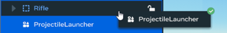 The ProjectileLauncher should appear indented in the hierarchy since it’s now a child object of the Rifle object. You can expand the hierarchy by clicking the triangle. 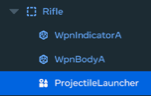 With the ProjectileLauncher selected in the Hierarchy, position it relative to the Rifle.

29. Adjust the Position values of the projectile so it aligns with the aim of the rifle. 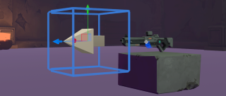 These adjustments in settings ensure that the projectile launcher appears at the front of the rifle, and that projectiles fire in the forward direction. Additionally, to make the projectiles easier to see, adjust **Scale** and **Trail Length Scale** based on your preference. Everything is now hooked up. Next, you’ll edit the code to make the rifle interactive.
    ### [Section 7: Hook up the projectile launcher](#section-7-hook-up-the-projectile-launcher)

Earlier in this tutorial, you got a debug message to appear when you pulled the trigger on the rifle. In this section, you’ll update your script to use the projectile launcher whenever you pull the trigger.

1. To use the projectile launcher, you need to reference it in your script. Update the **Shoot** class’s **propsDefinition** with the following statement:

   ```typescript
   class Shoot extends hz.Component<typeof Shoot> {


       static propsDefinition = {

           launcher: {type: hz.PropTypes.Entity}

       };
   ```

2. Add a statement to the `start()` function that creates a reference to the projectile launcher gizmo.

   ```typescript
   start() {


       // Store a reference to the projectile gizmo in the launcherGizmo variable.

       let launcherGizmo = this.props.launcher?.as(hz.ProjectileLauncherGizmo);
   ```

   With a reference to the `launcherGizmo`, you can call a function on it (`launchProjectile()`) to launch a projectile whenever you pull the trigger.

3. Add a statement just before the `start()` function that adds a property for holding the launcher options.

   ```typescript
   // The options to use when launching the projectile.

   launcherOptions: hz.LaunchProjectileOptions = {speed: 50};
   ```

4. Add a statement to the **OnIndexTriggerDown** event for launching a projectile.

   ```typescript
   start() {


       // Store a reference to the projectile gizmo in the launcherGizmo variable.

       let launcherGizmo = this.props.launcher?.as(hz.ProjectileLauncherGizmo);


       // Handle the OnIndexTriggerDown event when the user pulls the trigger.

       this.connectCodeBlockEvent(this.entity, hz.CodeBlockEvents.OnIndexTriggerDown, (player: hz.Player) => {

           console.log("boom!");

           launcherGizmo?.launch(this.launcherOptions);

       });

   }
   ```

   This change made it so that when the Rifle is created, you hook it up to the trigger, but now this event asks the projectile launcher gizmo to launch a projectile instead of just printing “boom”.

5. Save your script.

6. In the desktop editor, select the Rifle object from the Hierarchy.

7. In the Property pane, scroll down to the **Scripts** section. Notice that there is now a `launcher` property that you can set. This property appears because you added it to the `propsDefinition` in your script.

   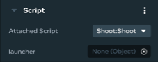

   **Note:** You might have to deselect and then reselect the Rifle object if this new property doesn’t appear.

8. Set this **launcher** property to the **ProjectileLauncher** object. Click on the field beside **launcher**, and then select **ProjectileLauncher** from the list that appears.

   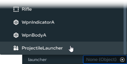

9. Preview your world by clicking the Play button.

10. Walk over to the rifle, grab it, and then click the mouse button. Notice what happens, a shot appears to come out of the rifle when you pull the trigger. Next, you’ll update your script to accumulate points whenever the player hits the target.

    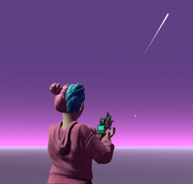

11. Exit Preview mode by pressing Escape.

### [Section 8: Count points whenever you hit the target](#section-8-count-points-whenever-you-hit-the-target)

In this section, you’ll update the script so that you score a point each time you hit the target.

1. In the desktop editor, select the SpawnPoint in the Hierarchy.

2. Click **Asset Library** > **Public Assets** under the Scene pane.

3. In the Search field, enter “skeletoncrayta” to find the skeleton.

   

   A skeleton object named [UnityAssetBundleGizmo](https://developers.meta.com/horizon-worlds/learn/documentation/desktop-editor/assets/unity-assetbundles/horizon-unity-assetbundles-overview) is added to your Hierarchy, and appears in your scene.

4. Rename the skeleton object from “UnityAssetBundleGizmo” to “Target”.

5. Position the target anywhere in the scene.

6. Update your script so that whenever a projectile hits an object, a point is added to your score. You’ll need to add a variable to track the current point value, and to initialize its value to zero. Add the following statement near the top of your class, just above the `start()` function.

   ```typescript
   // Keep track of the user's score.

   points: number = 0;
   ```

7. Add another event listener inside the `start()` function that fires whenever a projectile hits an object. Copy the following statements to the end of the `start()` function.

   ```typescript
   if (launcherGizmo) {

            this.connectCodeBlockEvent(

                launcherGizmo,

                hz.CodeBlockEvents.OnProjectileHitObject,

                (objectHit: hz.Entity, position: hz.Vec3, normal: hz.Vec3) => {

                    this.points = this.points + 1;

                    console.log("You're up to " + this.points + ' points!');

                },

            );

        }
   ```

   Your complete Shoot script should now look like this.

   ```typescript
   import * as hz from 'horizon/core';


   class Shoot extends hz.Component<typeof Shoot> {

     static propsDefinition = {

       launcher: {type: hz.PropTypes.Entity},

     };


     // The options to use when launching the projectile.

     launcherOptions: hz.LaunchProjectileOptions = {speed: 50};


     // Keep track of the user's score.

     points: number = 0;


     start() {

       // Store a reference to the projectile gizmo in the launcherGizmo variable.

       let launcherGizmo = this.props.launcher?.as(hz.ProjectileLauncherGizmo);


       // Handle the OnIndexTriggerDown event when the user pulls the trigger.

       this.connectCodeBlockEvent(

         this.entity,

         hz.CodeBlockEvents.OnIndexTriggerDown,

         (player: hz.Player) => {

           console.log('boom!');

           launcherGizmo?.launch(this.launcherOptions);

         },

       );


       if (launcherGizmo) {

            this.connectCodeBlockEvent(

                launcherGizmo,

                hz.CodeBlockEvents.OnProjectileHitObject,

                (objectHit: hz.Entity, position: hz.Vec3, normal: hz.Vec3) => {

                    this.points = this.points + 1;

                    console.log("You're up to " + this.points + ' points!');

                },

            );

        }

     }

   }


   hz.Component.register(Shoot);
   ```

8. Save your script.

9. Test your world.

   1. In the desktop editor, select the **Console** tab at the bottom of the screen.

   2. Click the Play button to enter preview mode. Your avatar spawns into your world, ready to go and get the rifle.

   3. Walk over to the rifle, pick it up, and then fire several shots at the skeleton.

      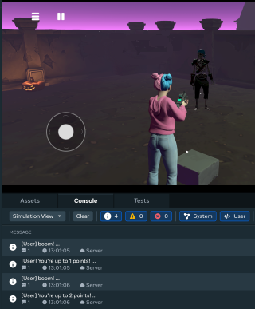

      Every time you hit the skeleton, a message prints to the **Console** that tells you how many points you’ve scored. If a shot doesn’t hit the skeleton, then the console message simply doesn’t appear.

### [Section 9: Display the score](#section-9-display-the-score)

In this section, you’ll revise your script so that the score appears in the game.

1. Add a **Text** gizmo to your scene.

   1. Click the **Build** panel.

      

   2. Select **Text**.

      

      A **Text** gizmo is added to the scene.

   3. Position the **Text** gizmo within the scene so that you can read the score while you’re shooting at the target.

      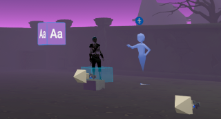

      You’ll need to rotate the **Text** gizmo so that the text displays in the correct orientation.

2. Update your script to use the **Text** gizmo. Remember, if you want to reference an entity property within a script, then you need to add that property to the `propsDefinition`. Add a `scoreView` property to `propsDefinition`.

   ```typescript
   static propsDefinition = {

       launcher: {type: hz.PropTypes.Entity},

       scoreView: {type: hz.PropTypes.Entity}

   };
   ```

3. To be able to use the `scoreView` property, you need a reference to `scoreView` as its specific type: `TextGizmo`. Store a reference to the `scoreGizmo` object in your `start()` function.

   ```typescript
   // Store a reference to scoreView as its specific type: TextGizmo.

   let scoreGizmo = this.props.scoreView?.as(hz.TextGizmo);
   ```

4. Update the scoreboard text by adding a single statement beneath the `console.log` statement that calls the `scoreGizmo.text.set()` function.

   ```typescript
   this.connectCodeBlockEvent(

     launcherGizmo,

     hz.CodeBlockEvents.OnProjectileHitObject,

     (objectHit: hz.Entity, position: hz.Vec3, normal: hz.Vec3) => {

        this.points = this.points + 1;

        console.log("You're up to " + this.points + ' points!');

        scoreGizmo?.text.set(this.points + ' points');

     },

   );
   ```

5. Save your script.

   Your complete script should now look like this.

   ```typescript
   import * as hz from 'horizon/core';


   class Shoot extends hz.Component<typeof Shoot> {

     static propsDefinition = {

       launcher: {type: hz.PropTypes.Entity},

       scoreView: {type: hz.PropTypes.Entity},

     };


     // The options to use when launching the projectile.

     launcherOptions: hz.LaunchProjectileOptions = {speed: 50};


     // Keep track of the user's score.

     points: number = 0;


     start() {

       // Store a reference to the projectile gizmo in the launcherGizmo variable.

       let launcherGizmo = this.props.launcher?.as(hz.ProjectileLauncherGizmo);


       // Store a reference to scoreView as its specific type: TextGizmo.

       let scoreGizmo = this.props.scoreView?.as(hz.TextGizmo);


       // Handle the OnIndexTriggerDown event when the user pulls the trigger.

       this.connectCodeBlockEvent(

         this.entity,

         hz.CodeBlockEvents.OnIndexTriggerDown,

         (player: hz.Player) => {

           console.log('boom!');

           launcherGizmo?.launch(this.launcherOptions);

         },

       );


       if (launcherGizmo) {

           this.connectCodeBlockEvent(

               launcherGizmo,

               hz.CodeBlockEvents.OnProjectileHitObject,

               (objectHit: hz.Entity, position: hz.Vec3, normal: hz.Vec3) => {

                   this.points = this.points + 1;

                   console.log("You're up to " + this.points + ' points!');

                   scoreGizmo?.text.set(this.points + ' points');

               },

           );

       }

     }

   }


   hz.Component.register(Shoot);
   ```

6. In the desktop editor, select the Rifle object from the Hierarchy.

7. Scroll to the **Scripts** section of the **Property** panel. Since you added `scoreView` to `propsDefinition` in your script, this property now appears in the **Scripts** section of the **Property** panel.

   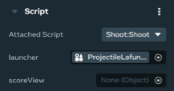

   **Note:** You might have to deselect the Rifle, and then reselect it if this new property doesn’t appear.

8. Set the value of `scoreView` to the Text gizmo that you added to the scene. Click the drop-down selector beside the label **scoreView**, and select “Text”.

   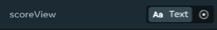

9. Test your world.

   1. In the desktop editor, select the **Console** tab at the bottom of the screen.

   2. Press the Play button to enter preview mode. Your avatar spawns into your world, ready to go and get the rifle.

   3. Walk over to the rifle and grab it, and use it to take several shots at the skeleton.

      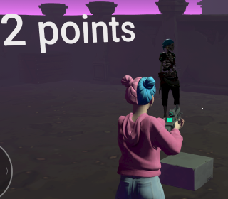

      You should see your score floating in space, and it should increment each time you shoot the skeleton.

### [Section 10: Create a second rifle](#section-10-create-a-second-rifle)

In this section, you’ll convert your Rifle/ProjectileLauncher combination into a Template Asset, and then you’ll use that asset to create another rifle.

1. From the Hierarchy, select the Rifle. This object has the script attached to it, and it’s also the parent of the ProjectileLauncher.

2. Right-click the Rifle object in the Hierarchy, and from the menu that appears, select **Create Asset**.

   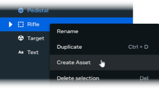

   The **Create New Asset** dialog appears.

3. Type a name for the asset, and type a description of the asset, and then click **Create**.

   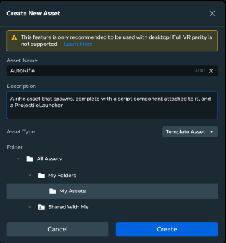

4. Open the **Assets** tab, and then select the **My Assets** folder. You’ll see your second rifle asset there.

   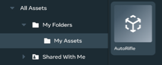

5. Click and drag the new AutoRifle asset, and drop it anywhere in the scene.

   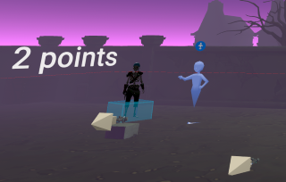

6. Test your world. Press the Play button to enter preview mode. Your avatar spawns into your world, ready to go and get the second rifle.

   Notice that you can use either rifle to shoot the skeleton and generate a score. Each rifle has its own score, which means the text box swaps between the scores as you swap rifles.

You’re done! You’ve completed building a game in Meta Horizon Worlds! In the next section (which is optional), you’ll try running your game in 3D on a Meta Quest headset.

## [What’s next?](#whats-next)

To learn more about Meta Horizon Worlds, try the following:

- Try the [Batting cage tutorial](../Adding%20and%20manipulating%20objects%20tutorial.md) now that you’ve created your first world.
- Learn about the desktop editor with the [Introduction to the desktop editor](../../Desktop%20editor/Get%20started%20with%20Desktop%20Editor/Introduction%20to%20the%20desktop%20editor.md).
- Learn about the other tools available by reading our [Tools overview](../../Get%20started/Tools%20overview.md).
- Join the [Meta Horizon Creator Program](https://developers.meta.com/horizon-worlds/programs) to learn about our program benefits.

