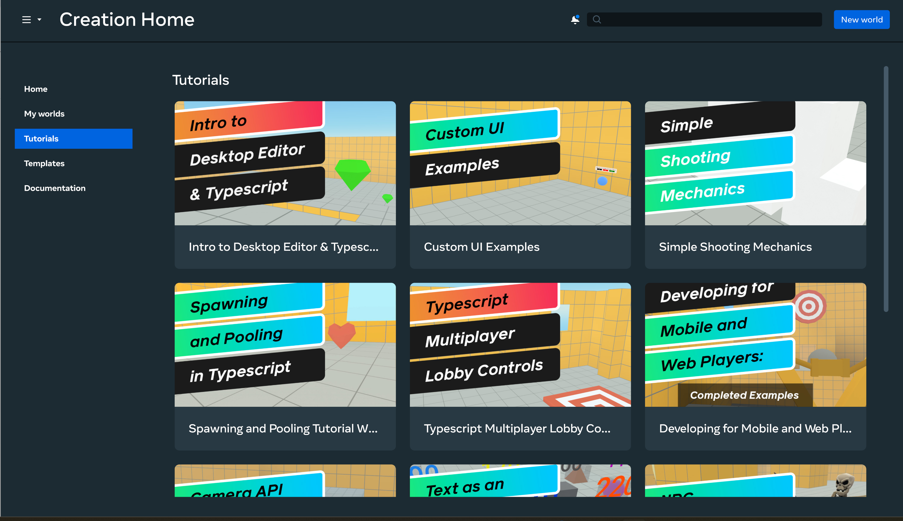
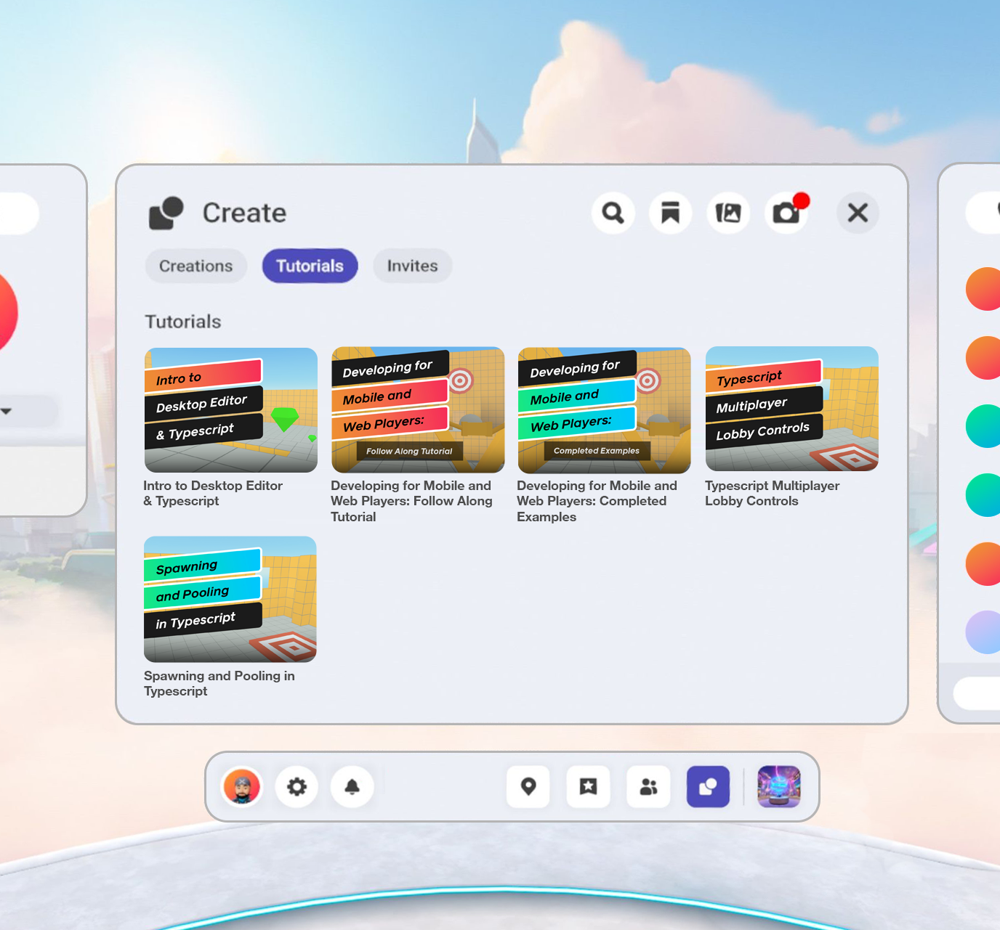

# [Access Tutorial Worlds](#access-tutorial-worlds)

You can create a copy of any of the tutorial worlds, which allows you to explore scripts, manipulate entities, and learn how the world works.

**Tip**: You can create copies from either tutorial worlds, which demonstrate one or more features, or sample worlds, which are complete play experiences.

Please complete the following steps to create a copy of a tutorial.

## [In the desktop editor](#in-the-desktop-editor)

1. Open the Meta Quest Link application.
2. Click the **Library option** in the left nav panel. Then, click the **Apps tab**.
3. Select the development environment where you wish to create your tutorial.
4. In the Creation Home screen, click the **Tutorials option** in the left nav bar.
5. Select the world of interest. 
6. The companion documentation for the world is opened for you.
7. A copy of the world is created, with you as the owner.

## [In Headset](#in-headset)

1. Go to the Create menu in your headset and click the **Tutorials tab**.
2. Select the world of interest and click **Start**. 

## [Rename world](#rename-world)

The copy of the world that you created has the same name as the name of the source tutorial world. You should rename your world.

In the desktop editor, select **Horizon menu > Rename World**.

## [Update world properties](#update-world-properties)

If needed, you can assign other properties for the world.

1. **Desktop editor**: a. From the Meta Horizon menu, select **Publish World**. b. Update the properties as needed. c. Click **Update World Details**.
2. **HW Creations web interface**: a. See: <https://horizon.meta.com/creator/worlds_all/>.

