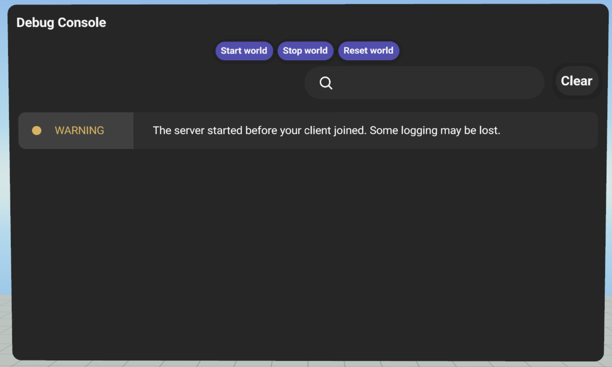
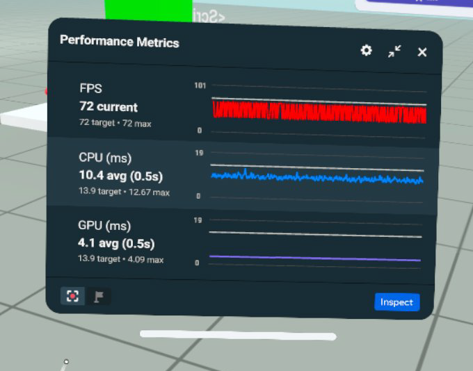

# [Developer Tools for Tutorials](#developer-tools-for-tutorials)

To assist in building out your worlds, the following tools are available.

## [Debug Console Gizmo](#debug-console-gizmo)

When you are building and refining a world, you may find it valuable to have access to the debug console while you are in headset. When the Debug Console gizmo is deployed in your world, you can see debug messages displayed on a panel in the VR environment.

You can also Start, Stop, and Reset the execution of scripts in your world while you are in headset.

Debug messages include:

- Errors generated by the server
- Errors generated in your TypeScript
- Any console messages that you log from your TypeScript

In the desktop editor, this information is displayed in the Console tab. However, it is not available in headset unless you deploy the Debug Console gizmo.

For more information, see [Introducing the Debug Console](../../../Scripting/Get%20started%20with%20TypeScript/The%20Debug%20Console.md).

## [Realtime Performance Metrics](#realtime-performance-metrics)

When you are in headset, you can review realtime performance metrics of your world running on the platform.

Through the following display, you can inspect the results to scrub performance over a recent interval, which provides greater fidelity on the data.

- **Perfetto tracing**: Click the Red button to begin a trace capture of your world. This tracing down can later be analyzed through Perfetto.
- **Performance scrubbing**: Click the Inspect button to analyze data on recent segments of activity in greater detail.

These metrics are displayed through the Utilities menu in your avatar’s wrist. This menu must be enabled.

For more information, see [Enabling the Real-time Metrics Panel](../../../Performance/Performance%20tools/Enabling%20and%20modifying%20the%20real-time%20metrics%20panel%20in%20VR.md).

