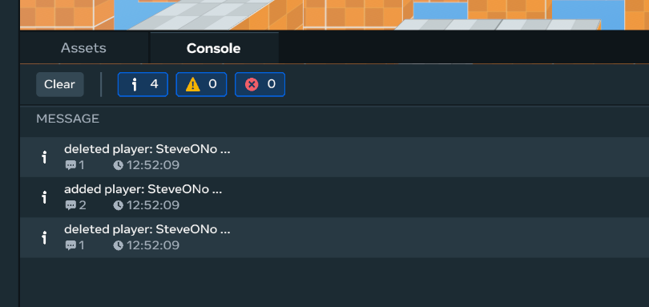

# [Test Your World](#test-your-world)

During development, you are likely to be regularly testing your world. This page outlines some approaches for testing.

## [Desktop Editor Testing](#desktop-editor-testing)

When you are building in the desktop editor, you can immediately preview the results in the application.

### [Previewing toolbar](#previewing-toolbar)

At the top of the application, you should see the following toolbar:


#### [Playback tools](#playback-tools)

The three tools on the left control playback of the simulation.

| **Tool**                                                                                                  | **Description**                                                                                                                                                                                                                                                                                                                                                                                                                                                                                                                                                                                                                                                                                                                                     |
| --------------------------------------------------------------------------------------------------------- | --------------------------------------------------------------------------------------------------------------------------------------------------------------------------------------------------------------------------------------------------------------------------------------------------------------------------------------------------------------------------------------------------------------------------------------------------------------------------------------------------------------------------------------------------------------------------------------------------------------------------------------------------------------------------------------------------------------------------------------------------- |
| Play button                                                                                               | When you press play, you enter Preview mode and optionally start the world simulation. In Preview mode, your avatar is dropped into the world at a spawn point, allowing you to explore the world to test various aspects of it. When Preview mode is launched, the `onPlayerEnterWorld` Code Block Event is triggered, which allows you to test it. Similarly, when you exit Preview mode, the `onPlayerExitWorld` event is triggered. You can also test other player-driven events in the world, such as Custom UIs, collision, navigation, and trigger-based activities. **Tip**: In the Main panel of the desktop editor, you can preview from any location. Right-click an entity or a location in the world and select **Preview from here**. |
| If you have configured preview to do so, the Play button may also launch the world simulation. See below. |                                                                                                                                                                                                                                                                                                                                                                                                                                                                                                                                                                                                                                                                                                                                                     |
| Stop button                                                                                               | The Stop button ends execution of the simulation, including script execution.                                                                                                                                                                                                                                                                                                                                                                                                                                                                                                                                                                                                                                                                       |
| Context menu                                                                                              | Open the context menu to configure previewing. See below.                                                                                                                                                                                                                                                                                                                                                                                                                                                                                                                                                                                                                                                                                           |

If you are collaborating with other people, enabling these options can be disruptive to others’ work in the same world.

| **Option**                             | **Description**                                                                                                                                         |
| -------------------------------------- | ------------------------------------------------------------------------------------------------------------------------------------------------------- |
| Auto-start simulation on preview entry | When enabled, entering Preview mode also presses the Play button.                                                                                       |
| Auto-stop simulation on preview exit   | When enabled, exiting Preview mode also presses the Stop button. When the simulation is stopped, you may lose contextual information from the playback. |

For more information, see [Preview Mode](../../../Desktop%20editor/Get%20started%20with%20Desktop%20Editor/Preview%20mode.md).

#### [Simulation tools](#simulation-tools)

| **Tool**                                                                                                                                                     | **Description**                                                                                                                                                                                                                                                                                                            |
| ------------------------------------------------------------------------------------------------------------------------------------------------------------ | -------------------------------------------------------------------------------------------------------------------------------------------------------------------------------------------------------------------------------------------------------------------------------------------------------------------------- |
| World simulation                                                                                                                                             | When world simulation is turned on, the following occurs: - Initializes the entities in the world. - Runs all active scripts in the world. When a world is first loaded in the desktop editor, the simulation is launched. The scripts continue to execute as long the simulation is playing. - Starts physics simulation. |
| When world simulation is turned off, no world scripts are executed, which allows you to explore the world with your avatar without any code-related actions. |                                                                                                                                                                                                                                                                                                                            |
| Reset button                                                                                                                                                 | The Reset button restarts the simulation from the beginning, including resetting of any runtime variables.                                                                                                                                                                                                                 |

### [Console logging](#console-logging)

In TypeScript, you can push messages through code to the Console log in the desktop editor.



#### [Example:](#example)

The added message above is pushed to the console as part of the function that responds to the player entering the world. The code looks like the following:

```typescript
console.log(`added player ${player.name.get()}`);
```

You can also issue warn and error logging:

```typescript
console.warn('Game resources at 90%!');

console.error('Cannot spawn the Terrible Turtle!');
```

Console logging is an important debugging tool in the desktop editor.

## [Testing Loop](#testing-loop)

- Review the Preview configuration controls before beginning a testing session. See previous.
- When you are building and making changes, **press the Stop button**.
- Avoid making too many changes before retesting.
- When you are ready to test:
  - **Press the Reset button** to re-initialize the simulation.
  - **Press the Play button** to begin simulation.
    - Review console messages as needed.
  - **Press the Preview mode button** to drop in and explore.
    - Review console messages as needed.
  - Be direct in what you explore.
- To stop previewing, **press ESC**. You are returned to Build mode.
- Make changes in your assets or TypeScript.
- Repeat.
- Periodically, you should test your world in VR.
- If you are developing for mobile, you should regularly test on a mobile device.

## [Testing in VR](#testing-in-vr)

**Tip**: Periodically, you should test in VR.

Testing in VR typically focuses on refinements to your world. You can verify things like:

- Entities are placed in the correct location. No unexpected gaps have been created.
- Collision volumes work as expected.
- Navigation volumes work as expected.
- Gameplay is functioning properly.
- Physics of entities and avatars works as expected.
- Overall experience is satisfying.

### [Enable Utilities Menu](#enable-utilities-menu)

In the VR headset, you can enable a set of runtime utilities in your wrist.

- In the headset, click the menu button on the left controller.
- Click the **Settings icon**.
- Click the **Utilities tab**.
- Select **Turn on utilities menu**.

The Utilities menu is now available in your avatar’s wrist when you are in VR.


### [Open Your World](#open-your-world)

- In the headset, click the menu button on the right controller.
- From the toolbar, launch your preferred development environment.
- Click the menu button on the left controller.
- In the toolbar, click the **Create button**.
- Select your world to edit.
- Your world is opened for editing. You are placed initially in Preview mode, which simulates a player exploring it.

### [Build Mode in VR](#build-mode-in-vr)

In Build mode, you can perform edits to your world while you are in the headset.

**You cannot edit TypeScript in VR.**

- To enter Build mode, pull down and hold on the right thumbstick while in VR.
- To exit Build mode and return to Preview mode, push Up on the left thumbstick.
- To exit your world, switch to Preview mode. Press the menu button on the left controller. Then, from the context menu select **Shutdown Server**. Your changes are saved, and the world is shut down to all users.

## [Testing in Mobile](#testing-in-mobile)

For more information on setting up a testing environment for mobile and web, see [Preview device](../../../Desktop%20editor/Get%20started%20with%20Desktop%20Editor/Preview%20mode.md#preview-device).

