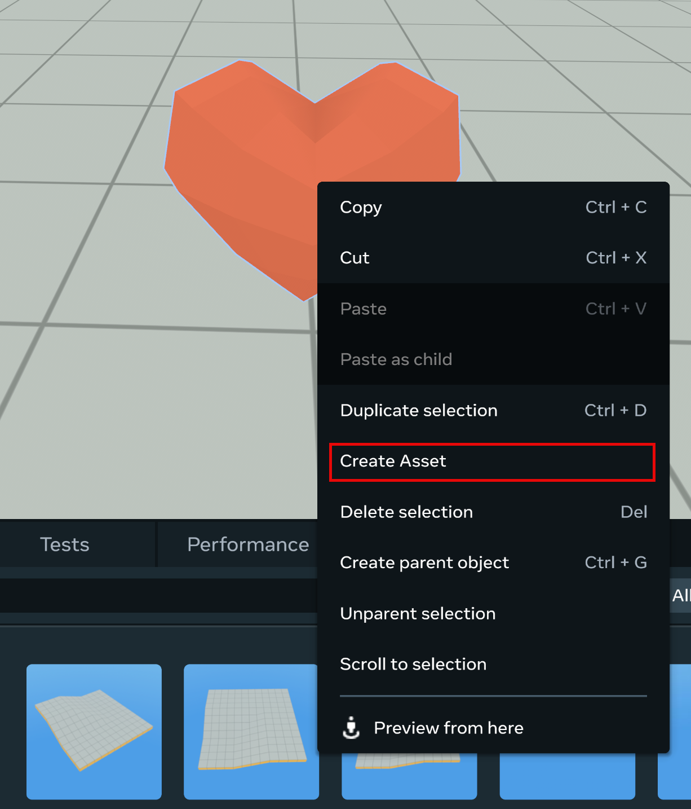
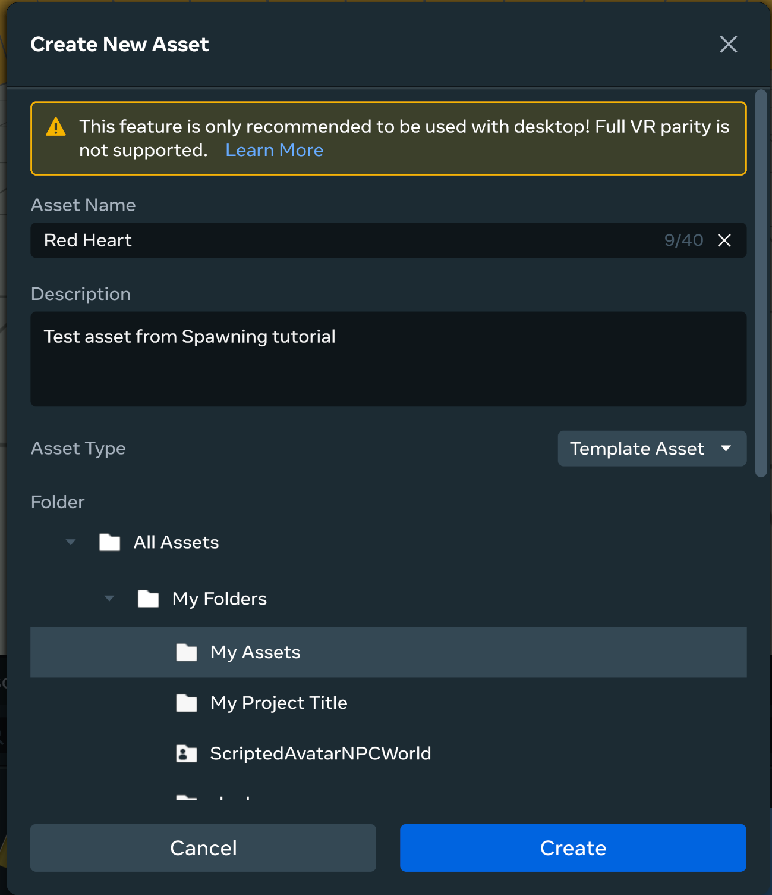
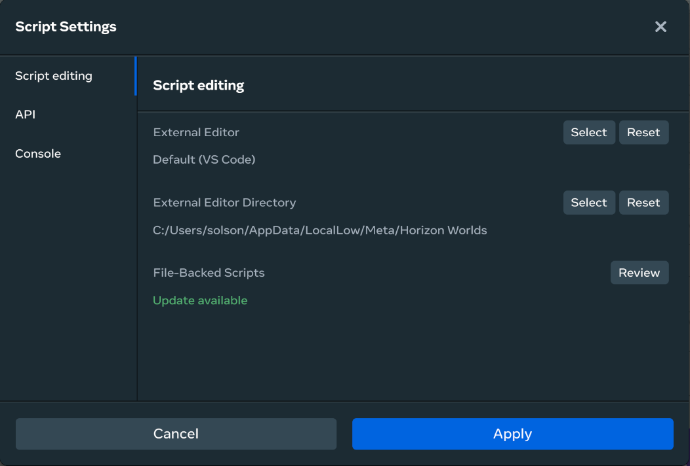

# [Use Assets from Tutorials](#use-assets-from-tutorials)

As you explore these tutorial worlds, you may find scripts, art, or other entities that you would like to use in your own worlds. Go for it!

Tutorials contain the following categories of assets:

- **Assets**: Individual entities or groups of entities in a world can be added to your personal Asset Library for use in other worlds.
- **Scripts**: You can copy scripts or parts of scripts from one world into a text editor for insertion into the scripts in other worlds.

**Note**: These worlds are non-FBS (File Backed Scripts) worlds, which means that asset templates created from these worlds are not compatible with FBS worlds.

**Note**: If you create an asset template from one of these non-FBS tutorial worlds and the template contains scripts, the scripts are included in the asset template. When you deploy an asset template into a non-FBS world, you create a separate instance of the script for each instance of the asset template, even though the scripts are identical. You can end up with many script instances to manage. More information is provided below.

## [Create Asset Templates from Entities](#create-asset-templates-from-entities)

To add an entity to your Asset Library, please complete the following steps. When finished, the entity is stored as an **asset template**. Asset templates can be added to your other worlds. Also, they can be edited as needed, and those edits can be consumed in the worlds where the template has been deployed.

1. In the desktop editor, locate the entity in the world. Select it.
2. In the Hierarchy panel, verify that you have selected all sub-entities of the entity that you wish to add to your Library.
3. Right-click the entity in the Hierarchy panel and select **Create Asset**.
4. Add a meaningful name and description for the asset.
5. Choose the appropriate folder where you would like to store the asset.

**Note**: For assets that you would like to share with your team or across multiple worlds, you should store them in a shared folder. For more information, see [Shared Folders](https://developers.meta.com/horizon-worlds/learn/documentation/desktop-editor/assets/shared-folders/).

1. Click **Create**. The asset template is created in the selected folder.

This asset template is now available for you to use in any world!

To add the asset to a world, open the Asset Library tab in the desktop editor. Locate the folder where the asset is located. Drag the asset into the world.

Asset templates can also be spawned into a world at runtime using TypeScript. For more information, see [Spawning and Pooling in TypeScript](../../Feature%20samples/Spawning%20and%20pooling%20in%20typescript/Module%201%20-%20Setup.md).

## [Use Scripts from Worlds](#use-scripts-from-worlds)

When you create a clone of a tutorial world, you can gain access to read and write the script files that power the world. These scripts can contain useful snippets or even entire systems that can be used in your own worlds.

**Note**: The tutorial worlds are built using TypeScript v2.0.0. If your world is using TypeScript v1.0.0, these scripts will not work directly in your world. Some syntax and reference fixes are required.

### [Using scripts in your worlds](#using-scripts-in-your-worlds)

Useful TypeScript from the tutorial worlds is typically entire systems that can be applied and modified for your needs. For example, you may want to use the GameManager system in your world. However, this system may be spread across multiple files, each of which has references to other files.

Below are some recommended practices for using these systems. In the files:

- Review the list of imports.
  - Imports from the Meta Horizon Worlds APIs must be included in your scripts to use the code. Be sure to verify that the imports are actually used in the current script.
  - Some import lines may be pulling in references in other script files in the world. You should review those files to determine if you need to import the entire file or some elements of them.
- Review the list of exports.
  - Entities that are exported from the script may have implications on your code.
- Review the list of events.
  - Events defined within the code need to be supported in your code.
  - Events that are referenced in the code may have an equivalent event under a different name in your code.
- Review the script properties.
  - In some cases, the script properties may refer to assets in the Asset Library or entities in the world. These references may need to be fixed in your world.
- You may want to insert test code, such as console messages into the functions and methods that you are trying to use. These can be used to assess that the system is processing data correctly.

### [Scripts as files](#scripts-as-files)

If you are using the desktop editor, scripts are stored as independent files in local storage.

**Note**: You cannot copy and paste files from one world’s directory to another. These files are not automatically picked up by the desktop editor and integrated into the world’s codebase. Instead, you must open the files and copy out the contents, pasting them into new or existing script files associated with the target world.

**Note**: These worlds are non-FBS worlds. In a non-FBS world, the option to Spawn New Gizmo from a script in the Script panel is not available. For more information, see [Tutorial Assumptions](Tutorial%20Assumptions.md).

To locate your files, please do the following:

1. In the desktop editor, open the **Scripts panel**.
2. Click the **Gear icon**.
3. In the Script Settings window, click **Script editing**.
4. Locate the value for the External Editor Directory.
5. Navigate your local environment to find this directory. Scripts for individual worlds are stored as sub-directories.

### [Scripts in asset templates](#scripts-in-asset-templates)

**Note**: Scripts in asset templates from non-FBS worlds do not behave like other assets.

When an asset template is deployed into a world, any script that is included in it is deployed as a deep copy of the original.

- The deployed script is a completely independent asset from the original script.
  - It is not a versioned instance of the original.
  - Changes made to the script in the world cannot be deployed back to the original asset.
- References related to the script may be broken:
  - The script may not be attached to the entity to which it is supposed to be attached, which is caused by the script being created as an entirely new asset.
  - When the script is re-attached, script-based properties must be defined again.

**Tip**: You may find it easier to create scripts as asset templates containing a single asset (the script). This effectively turns scripts in the Asset Library as read-only assets that can be deployed and then connected to the entities in your world.

