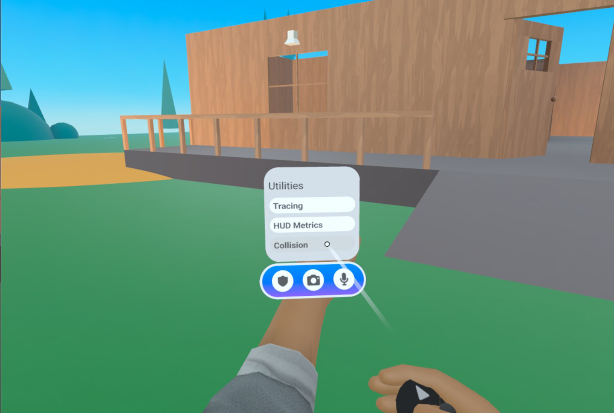
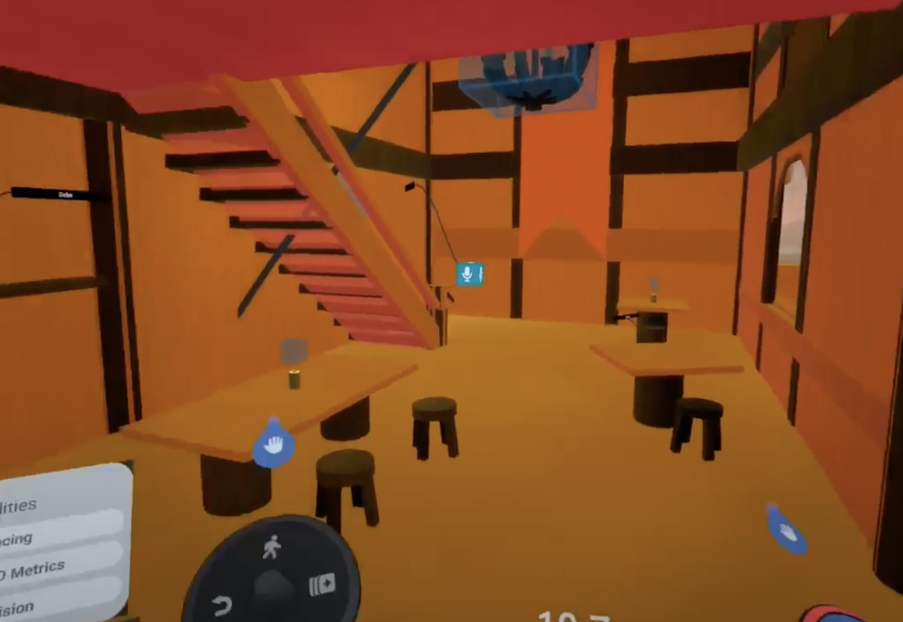
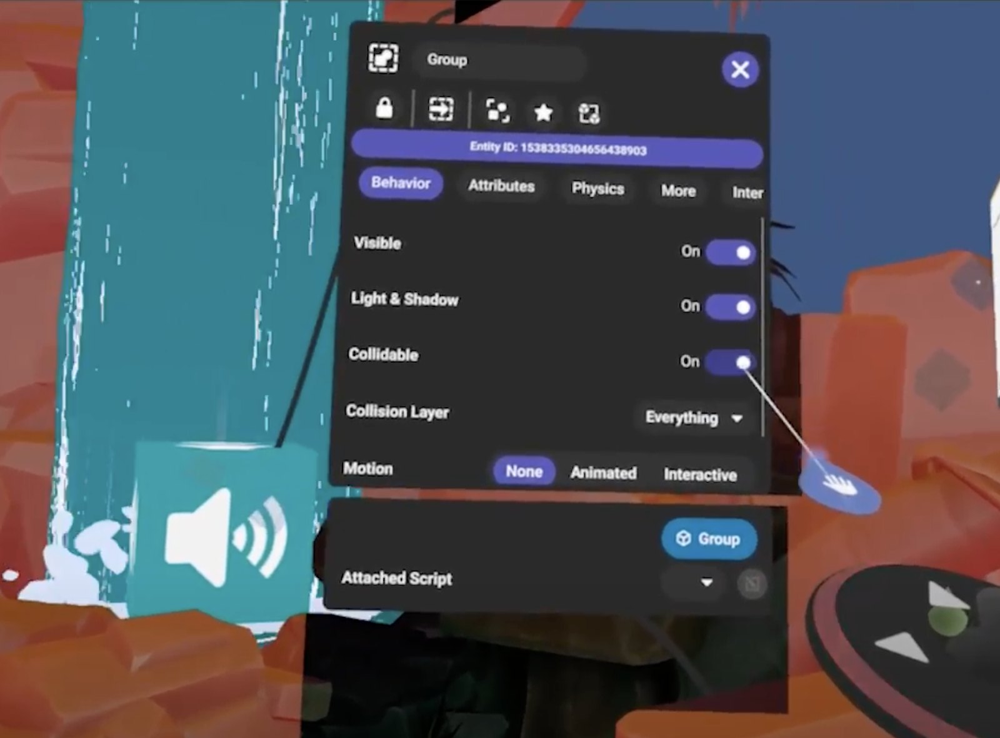

# [Collider Visualization User Guide](#collider-visualization-user-guide)

Creators can now visualize their collision meshes in VR so they can better manage collision issues, player movement and performance. Using the wearable on the wrist, it’s possible to toggle this feature to see colliders as colored meshes. Different colors distinguish the collision for static meshes vs non static meshes (rigid bodies, grabbables, etc.).

**Note:** The [Utilities menu must be enabled](../../Performance/Performance%20tools/Enable%20the%20Utilities%20menu.md) before continuing.

## [How does it work?](#how-does-it-work)

After the utilities menu is enabled. You will find the “Collision” button. Use your cursor to select the button and toggle the collision visualization.

With “Collision” turned on, your world will display collision meshes up to 50 units away. To test this out, you can open the property panel of an object and toggle the “Collidable” option and notice the collision mesh appear and disappear. Static objects will have an orange collision mesh, while dynamic objects will have a purple mesh.

Note that purple meshes for dynamic objects are a concave representation of the actual collision mesh, which may be convex instead. For example, if you have a bucket with a convex collision mesh, the purple visualization would appear concave, making it seem like you could drop objects inside even if that’s not actually possible.

## [Hints and Tips](#hints-and-tips)

This tool can be handy to investigate at a glance how players interact with the environment, for example whether the chairs around a table will block the users from reaching the table or how players can walk on objects with complex shapes.

Another use case is optimizing the performance of your world by disabling collisions on objects that can’t be reached by players. Once you have identified which areas of the world are not reachable, you can turn on collision meshes to quickly see which objects have collision meshes in the area.

