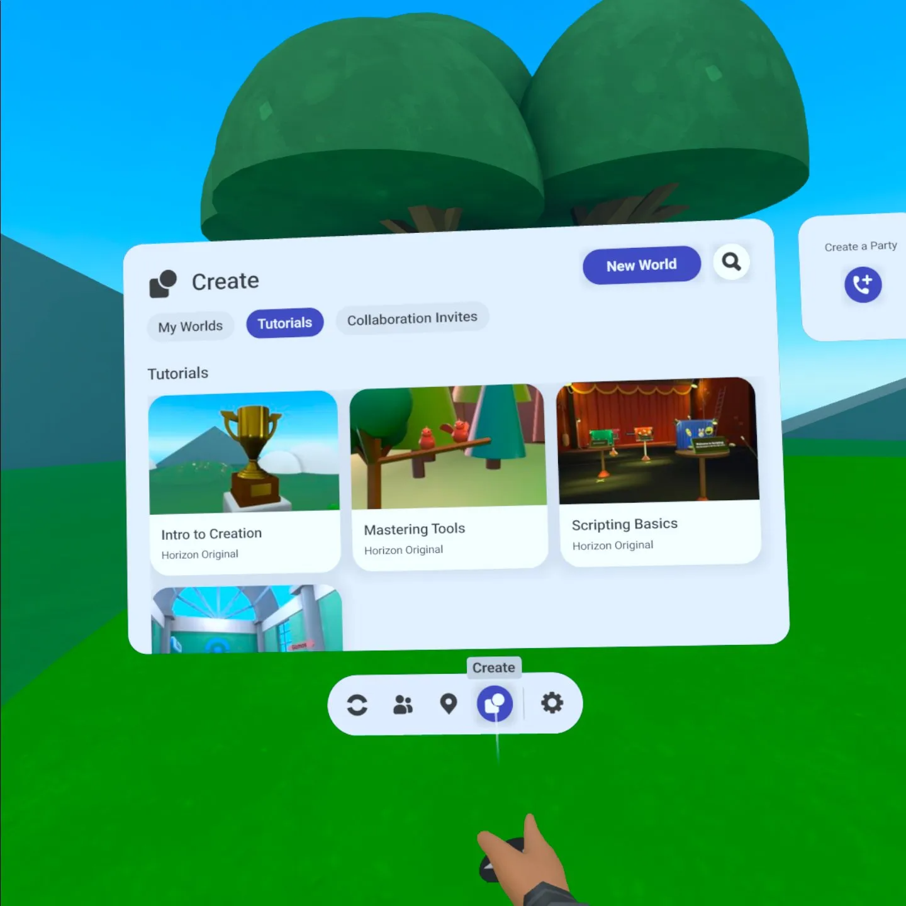

# [Create a new world in Meta Horizon Worlds](#create-a-new-world-in-meta-horizon-worlds)

To open the **Create** menu:

1. First, open your **Personal Menu**. Turn over your left wrist to open the wrist wearable and select the **Three Line** icon, or Press the recessed **Three Line** button on your left controller.
2. Next, select the **Create** tab at the bottom of the menu, fourth from the left. You are now in the **Creations** tab of the **Create** menu.

From here you can:

- See your existing worlds, if you have any.
- Create a blank new world, by selecting **New world** at the top right.
- Explore tutorial worlds by navigating to the **Tutorials**
- See invitations to collaborate on worlds with other creators by navigating to the **Invites** tab.

## [Create a new world](#create-a-new-world)

1. In the **Creations** tab, select **New world** in the top right.

2. Hover over a world icon and select **Create**.

   Select **Blank World** to start from scratch or choose an example world that comes populated with a variety of premade objects to start from.

3. If this is your first world, read the terms of service, then select **Agree** to continue.

4. Optionally, rename your world using the onscreen keyboard.

5. Select **Create**.

## [Clone a tutorial world](#clone-a-tutorial-world)

To clone a tutorial world:

1. Navigate to the **Tutorials** tab.
2. Hover over a world icon and select **Start**.

The Intro to Creation world comes with basic objects to [practice building with](Use%20your%20controllers%20in%20Build%20Mode%20of%20Meta%20Horizon%20Worlds.md). The Script Samples world comes with example scripts to help you learn how to [use code blocks](../Scripting/Use%20code%20blocks.md).

## [Start building](#start-building)

After you create a new world or clone a tutorial world, you’ll enter the unpublished world in [Preview Mode](Preview%20Mode.md). This means you can’t edit or build, and you can move around the same way you do in the rest of Worlds. Preview Mode is how others will see and interact with your world once it’s published.

To build or make any kind of edits to your world, enter [Build Mode](Use%20your%20controllers%20in%20Build%20Mode%20of%20Meta%20Horizon%20Worlds.md), by pressing **down** on the right controller’s joystick.

