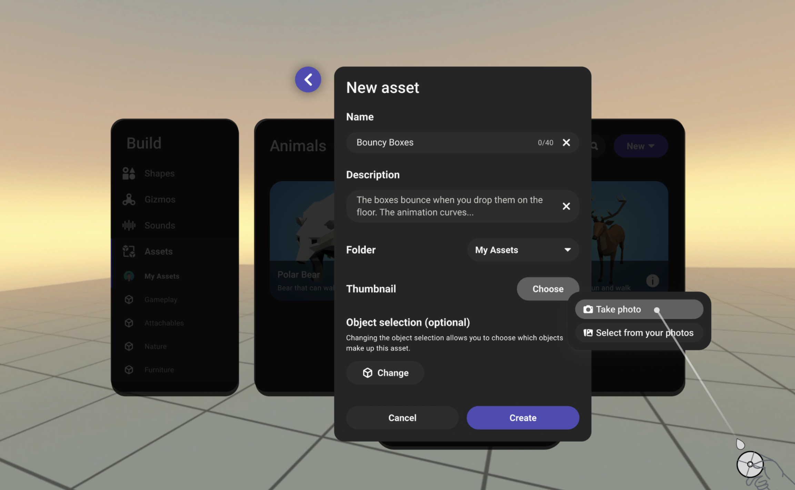
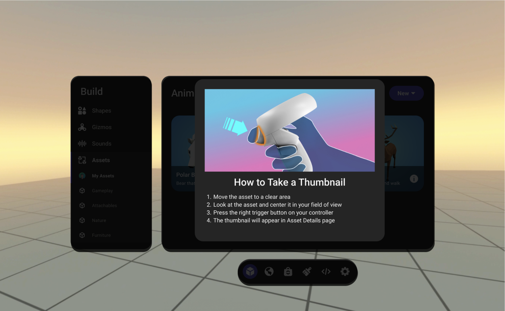
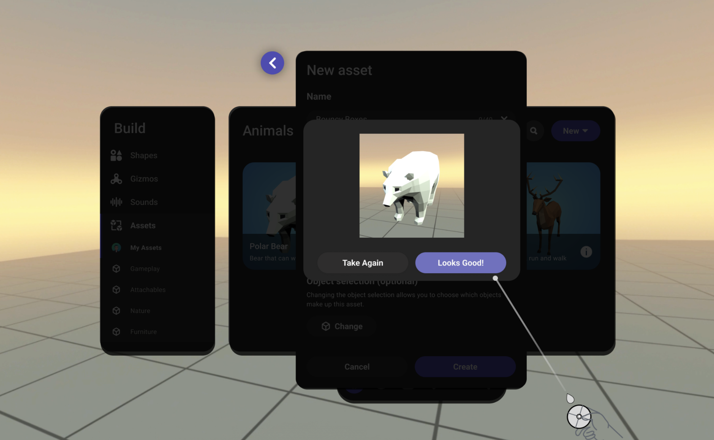
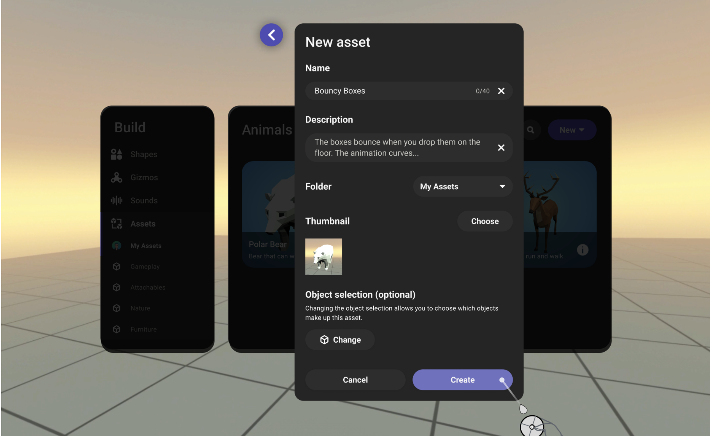

# Create an asset thumbnail with Meta Horizon Worlds

In Meta Horizon Worlds, you can create custom assets and save them to your library. When you save an asset, you must also add a thumbnail image of the asset.

## Create a thumbnail during asset creation

- Navigate to asset creation from the property panel or build menu. 
- Select **Choose** for Thumbnail and select **Take Photo**. 
- You will see an instruction modal with the following information:

  * Move the asset to a clear area
  * Look at the asset and center it in your field of view
  * Press the right trigger button on your controller
  * The thumbnail will appear in Asset Details page

  
- You will see a dashed box in your view. Ensure your asset is in the view and press the right trigger button on your controller.

  **Note**: Don’t worry about the panels in the view. They won’t be included in the thumbnail image.

  
- Check if the thumbnail image you just took looks good. If so, click **Looks Good**. If not, you can retake it by clicking **Take Again**.

  
- Click **Create** to create a new asset with the thumbnail.

  