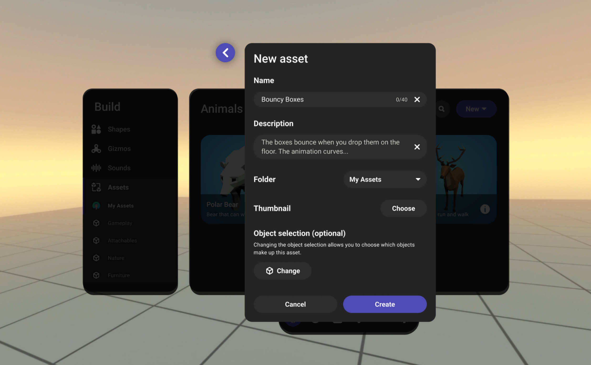
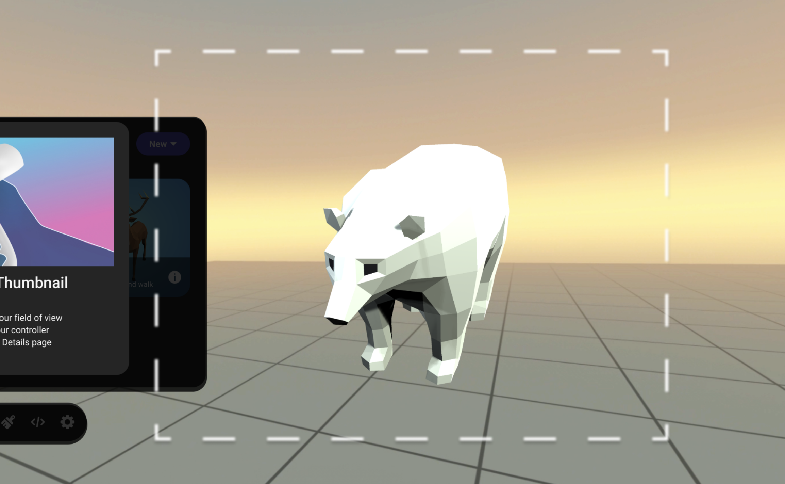

# [Create an asset thumbnail with Meta Horizon Worlds](#create-an-asset-thumbnail-with-meta-horizon-worlds)

In Meta Horizon Worlds, you can create custom assets and save them to your library. When you save an asset, you must also add a thumbnail image of the asset.

## [Create a thumbnail during asset creation](#create-a-thumbnail-during-asset-creation)

1. Navigate to asset creation from the property panel or build menu. 

2. Select **Choose** for Thumbnail and select **Take Photo**. 

3. You will see an instruction modal with the following information:

   - Move the asset to a clear area
   - Look at the asset and center it in your field of view
   - Press the right trigger button on your controller
   - The thumbnail will appear in Asset Details page

   

4. You will see a dashed box in your view. Ensure your asset is in the view and press the right trigger button on your controller.

   **Note**: Don’t worry about the panels in the view. They won’t be included in the thumbnail image.

   

5. Check if the thumbnail image you just took looks good. If so, click **Looks Good**. If not, you can retake it by clicking **Take Again**.

   

6. Click **Create** to create a new asset with the thumbnail.

   

