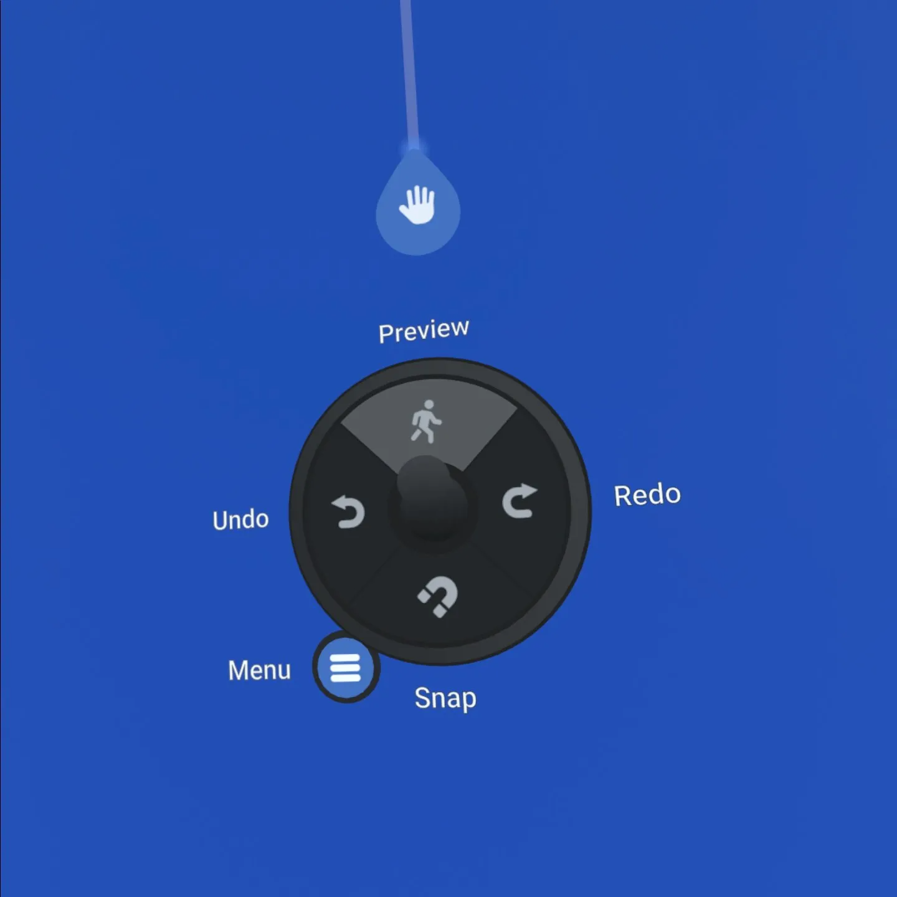
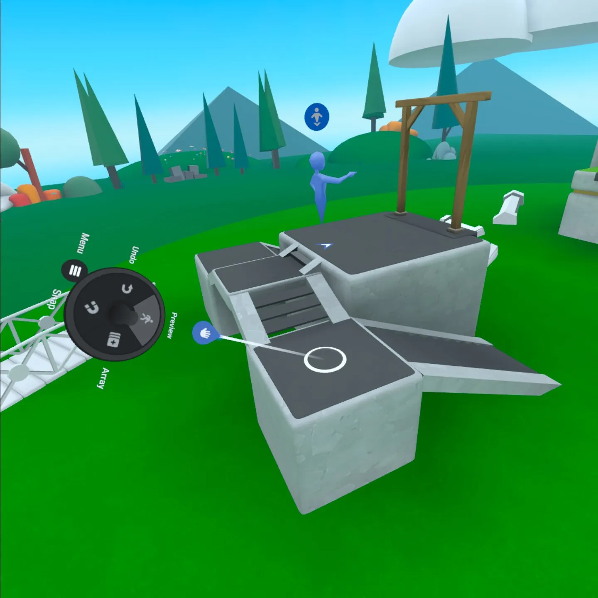

# [Preview Mode](#preview-mode)

Preview Mode is a way for creators test a world without publishing it and while remaining in the editable version of the world.

**Note**: There are two ways for a world creator to access a world: the editable version and the published version. When visiting your published world, you won’t be able to edit it. When editing your world, only people you invite to collaborate will be able to join you.

## [Enter Preview Mode](#enter-preview-mode)

In Build Mode, press **up** one time on the left thumbstick to enter Preview Mode. This will teleport your avatar you to the world’s spawn point.

Alternatively, you can press and hold **up** on the left thumbstick. A line with a circle on the end will appear. When you release the left thumbstick, you will enter preview mode at the circle’s location.

